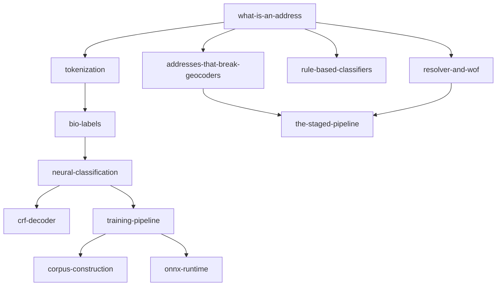

# Concept deep dives

This track has one article per concept. The articles are independent — read them in any order. If you are new to Mailwoman, read [`understanding/`](../understanding/README.md) first.

## Suggested reading order

A useful order if you want to follow the data and code from input to output:

1. [What is an address?](./what-is-an-address.md) — the data model
2. [Addresses that break geocoders](./addresses-that-break-geocoders.md) — failure modes worth knowing
3. [Tokenization](./tokenization.md) — splitting strings into tokens
4. [Rule-based classifiers](./rule-based-classifiers.md) — the Mailwoman v1 approach
5. [BIO labels](./bio-labels.md) — how the neural model marks spans
6. [Neural classification](./neural-classification.md) — what a transformer encoder does
7. [CRF decoder](./crf-decoder.md) — fixing structurally-invalid label sequences
8. [Training pipeline](./training-pipeline.md) — from corpus to model file
9. [Corpus construction](./corpus-construction.md) — how the training data is built
10. [ONNX runtime](./onnx-runtime.md) — running the model in production
11. [Resolver and Who's On First](./resolver-and-wof.md) — turning labels into coordinates
12. [The staged pipeline](./the-staged-pipeline.md) — synthesis: failures mapped to a six-stage runtime

## Dependency map

Some concepts assume others:

You can short-circuit: if you know what a transformer is, skip directly to [CRF decoder](./crf-decoder.md). If you want a tour of the training side, jump to [Training pipeline](./training-pipeline.md).

## Article shape

Each article is about 5–10 minutes to read, with:

- A short motivation: why this concept matters in Mailwoman.
- An explanation that defines its terms on first use.
- A diagram where structure helps (built with [mermaid](https://mermaid.js.org/)).
- A short code-or-data example.
- Pointers into the source code for readers who want to go further.
- A "See also" list.
