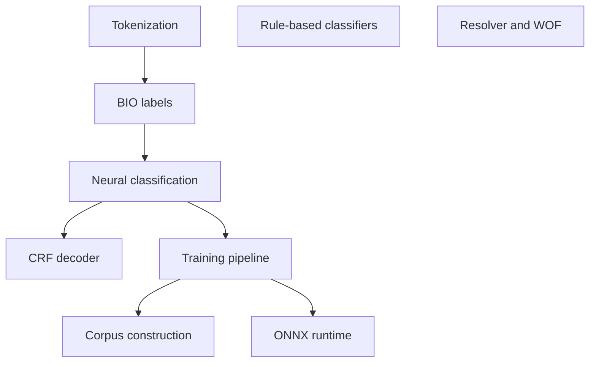

# Concept deep dives

This track has one article per concept. The articles are independent — read them in any order. If you are new to Mailwoman, read [`understanding/`](../understanding/README.md) first.

## Suggested reading order

A useful order if you want to follow the data and code from input to output:

1. [Tokenization](./tokenization.md) — splitting strings into tokens
2. [Rule-based classifiers](./rule-based-classifiers.md) — the Mailwoman v1 approach
3. [BIO labels](./bio-labels.md) — how the neural model marks spans
4. [Neural classification](./neural-classification.md) — what a transformer encoder does
5. [CRF decoder](./crf-decoder.md) — fixing structurally-invalid label sequences
6. [Training pipeline](./training-pipeline.md) — from corpus to model file
7. [Corpus construction](./corpus-construction.md) — how the training data is built
8. [ONNX runtime](./onnx-runtime.md) — running the model in production
9. [Resolver and Who's On First](./resolver-and-wof.md) — turning labels into coordinates

Additional articles:

- [Joint decoding walkthrough](./joint-decoding-walkthrough.md) — how the reconciler picks coherent interpretations
- [Reconcile empty-parse bonus](./reconcile-empty-parse-bonus.md) — handling the "model gives up" failure mode
- [Synthetic corpus validation](./synthetic-corpus-validation.md) — how we validate LLM-generated training data
- [DeepSeek reasoning budget](./deepseek-reasoning-budget.md) — the adversarial corpus generation pipeline
- [Staged pipeline contract](./staged-pipeline-contract.md) — implementer-facing TypeScript contracts

Articles moved to [`understanding/`](../understanding/README.md) in May 2026:

- [What is an address?](../understanding/the-problem/what-is-an-address.md) — now at Tier 1 position 8
- [Addresses that break geocoders](../understanding/why-its-hard/addresses-that-break-geocoders.md) — now at Tier 1 position 9
- [The knowledge ladder](../understanding/our-approach/the-knowledge-ladder.md) — now at Tier 1 position 14
- [The staged pipeline](../understanding/our-approach/the-staged-pipeline.md) — now at Tier 1 position 15

## Dependency map

Some concepts assume others:

You can short-circuit: if you know what a transformer is, skip directly to [CRF decoder](./crf-decoder.md). If you want a tour of the training side, jump to [Training pipeline](./training-pipeline.md).

## Article shape

Each article is about 5–10 minutes to read, with:

- A short motivation: why this concept matters in Mailwoman.
- An explanation that defines its terms on first use.
- A diagram where structure helps (built with [mermaid](https://mermaid.js.org/)).
- A short code-or-data example.
- Pointers into the source code for readers who want to go further.
- A "See also" list.
