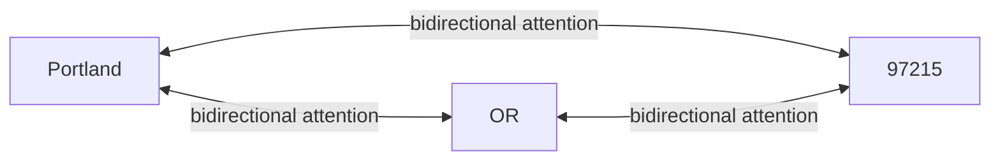

# Attention and bidirectional context

The neural classifier's encoder is a 6-layer transformer with bidirectional
self-attention. This article unpacks what that means for address parsing —
specifically the operator's question from
[How the model reasons](./how-the-model-reasons.md):
"are the right-side discovered placetypes influencing the left-side specificity?"

The short answer: **yes, but it's not directional. Every token influences every
other token in both directions through all six attention layers.**

## What attention actually computes

Each transformer layer computes, for every token position `t`:

```
hidden_t = sum over all positions s of (attention_weight_{t,s} * value_s)
```

Where `attention_weight_{t,s}` measures how relevant the token at position `s`
is to the token at position `t`. Computed via the standard scaled-dot-product
attention: `softmax(query_t · key_s / sqrt(d))`.

This is **bidirectional**: position `t` attends to ALL positions (including
positions both before and after itself), not just earlier ones. There's no
causal mask — this is a BERT-style encoder, not GPT-style.

The transformer stacks 6 of these attention layers. After 6 layers, a token's
hidden state has been informed by every other token's information through
multiple rounds of mixing.

## What this looks like for an address

For `Portland, OR 97215`:



At layer 1, `Portland`'s hidden state is computed using attention weights
that include `OR` and `97215`. The attention head learns (during training)
that the presence of a 2-letter all-caps token (`OR`) and a 5-digit token
(`97215`) is structurally relevant to the locality decision.

By layer 6, the mixing has propagated multiple times. `Portland`'s
representation encodes not just "this is a word that could be a locality"
but "this is a word in a sequence where the following tokens have the
shape of a US state abbreviation + ZIP code, so the locality
interpretation is strongly supported."

The same happens in reverse. `OR`'s representation is informed by
`Portland`'s — it learns that being preceded by a locality-shaped token
is structurally consistent with the region interpretation.

## Why bidirectional matters here

Address parsing requires global coherence. Consider:

| Input                                       | First-token reading              |
| ------------------------------------------- | -------------------------------- |
| `Portland, OR 97215`                        | `Portland` = locality            |
| `Portland Trail Blazers, Phoenix, AZ 85003` | `Portland` = venue (team name)   |
| `5th Portland Street, Boston, MA 02101`     | `Portland` = part of street name |

The same first token (`Portland`) gets three different labels. The
discriminator is what comes AFTER. A unidirectional model (left-to-right
RNN, GPT-style) sees only what's already been processed when it gets to
`Portland`. A bidirectional encoder sees everything.

The CLOSEST formal analog in classical NLP is conditional random fields
with bidirectional LSTM features. The transformer encoder is the modern
generalization — more expressive attention patterns, deeper layer stacking,
better scaling with more data.

## Attention as a soft, learned grammar

What's emergent in the attention weights is essentially a soft, learned
grammar — but expressed as continuous-valued weights, not categorical
production rules. The model learns:

- "When a token is followed by a 2-letter all-caps token, give that 2-letter
  token weight in the locality decision."
- "When a 5-digit token appears, treat it as a postcode candidate and weight
  the adjacent tokens accordingly."
- "When a token matches a libpostal street-typing affix (Ave, St, Rd), the
  adjacent name token's interpretation should consider street."

Nobody hand-writes these rules. The attention weights learn the patterns,
distilled from the training distribution's co-occurrence statistics.

## What this CAN'T do (compositional limits)

The encoder has a max sequence length (128 tokens in v0.6.x). Addresses
longer than that get truncated, losing potential context.

Attention is also expensive at the limit: 128 tokens × 128 positions × 6 heads
× 6 layers = quadratic in seq_len. The v0.5.0 + work made
hardware-validated choices about head/layer counts to fit the throughput
budget on the A100. Making the model "deeper" or "wider" would need more
GPU per inference call, which has a downstream UX cost (browser inference
takes longer, larger model files to download).

There's also a representation-capacity limit. The hidden state is 384
dimensions. Six attention heads divide that into 64-dim per head. Subtle
distinctions (Manhattan-vs-Brooklyn-vs-Queens-vs-Bronx for "borough"
classification, say) might compress into the same neighborhood of activation
space and be confused.

## What this CAN do that v0 couldn't

The v0 rule-based parser computes per-token classifications independently
and then reconciles via solvers. Each classifier looks at the token's
features in isolation; solvers handle cross-token coherence.

The encoder's bidirectional attention does this all at once. There's no
distinction between "what does this token look like in isolation" and
"how does this token fit with its neighbors" — those are folded together in
the attention computation. The result is more general: the model can
handle co-occurrence patterns the rule writers didn't anticipate.

The cost is that you can't easily debug WHY the model made a particular
decision. v0's classifier + solver chain produces an interpretable
decomposition. The encoder produces a hidden state vector. The architecture
docs (see
[corpus-poisoning-vulnerability.md](./corpus-poisoning-vulnerability.md))
make this trade-off explicit: more general competence, less
interpretability, susceptibility to corpus-poisoning that more constrained
architectures wouldn't have.

## See also

- [How the model reasons](./how-the-model-reasons.md) — the central pipeline
  doc this article expands
- [FST priors as shallow fusion](./fst-priors-as-shallow-fusion.md) — what
  external world knowledge gets added to the encoder's emissions
- [Viterbi and BIO validity](./viterbi-and-bio-validity.md) — what happens
  AFTER the encoder's per-token emissions are computed
- [Corpus poisoning vulnerability](./corpus-poisoning-vulnerability.md) — the
  downside of empirical learning at this scale
