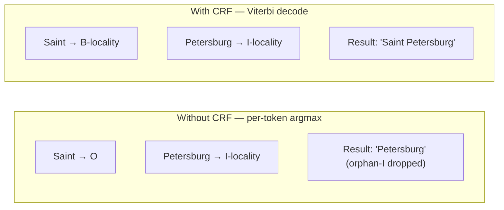

# BIO labels

BIO labelling is the trick that lets a token classifier (which decides one token at a time) emit **spans** (groups of consecutive tokens that mean one thing together). It is the standard approach for sequence labelling tasks in NLP — Named Entity Recognition, part-of-speech tagging, address parsing.

This article explains the scheme, why it works, and a failure mode that Mailwoman v3.0.0 specifically fixes.

## The scheme

Each token gets exactly one label. The label is either:

- **`O`** — the token is **outside** any tagged span.
- **`B-X`** — the token is the **beginning** of an `X` span.
- **`I-X`** — the token is **inside** a continuing `X` span.

So a 3-token "Saint Petersburg, FL" labelled correctly looks like:

```
Saint          → B-locality
Petersburg     → I-locality
,              → O
FL             → B-region
```

The span "Saint Petersburg" is signalled by one `B-locality` followed by one `I-locality`. The decoder reconstructs the span by walking the labels: when it sees `B-X`, it starts a new span; while it keeps seeing `I-X` with a matching tag, it extends the span; on `O` or a different tag, it closes the span.

## The full Mailwoman vocabulary

Mailwoman v3.0.0 uses 21 BIO labels:

| label                                          | example token                          |
| ---------------------------------------------- | -------------------------------------- |
| `O`                                            | `","`, `"in"`                          |
| `B-country`, `I-country`                       | `"United"` `"States"`                  |
| `B-region`, `I-region`                         | `"New"` `"York"` (state, when verbose) |
| `B-locality`, `I-locality`                     | `"Saint"` `"Petersburg"`               |
| `B-dependent_locality`, `I-dependent_locality` | `"Greenpoint"`                         |
| `B-postcode`, `I-postcode`                     | `"10118"`, `"75008"`                   |
| `B-subregion`, `I-subregion`                   | `"Brooklyn"`                           |
| `B-cedex`, `I-cedex`                           | `"CEDEX"` `"08"` (FR-specific)         |
| `B-venue`, `I-venue`                           | `"Wrigley"` `"Field"`                  |
| `B-street`, `I-street`                         | `"5th"` `"Ave"`                        |
| `B-house_number`, `I-house_number`             | `"350"`, `"10"` `"bis"`                |

10 tags × `{B-, I-}` + `O` = 21 labels. The neural model's final classifier layer has 21 outputs and the model picks the highest-probability label for each token.

In code:

```ts
const STAGE2_TAGS = [
	"country",
	"region",
	"locality",
	"dependent_locality",
	"postcode",
	"subregion",
	"cedex",
	"venue",
	"street",
	"house_number",
]
const STAGE2_BIO_LABELS = ["O", ...STAGE2_TAGS.flatMap((t) => [`B-${t}`, `I-${t}`])]
```

(The first 7 tags — through `cedex` — are the original "Tier 1" coarse vocabulary; the last 3 are the "Tier 2" expansion added in v3.0.0. Historically called "Stage 1/2" — see PHASE_2_training.md for the terminology note.)

## The orphan-I problem

Here is where BIO labelling gets interesting. A naive token classifier picks the highest-probability label for each token independently. This produces sequences like:

```
Saint    → O                        ← the model wasn't sure, picked O
Petersburg → I-locality             ← the model was confident, picked I-locality
```

The result is structurally **invalid**. An `I-locality` is by definition "inside a locality span", and the previous token is not in a locality span. There is no `B-locality` to be inside of. This is called an **orphan-I**.

What happens when the decoder reconstructs the span? Depending on how it handles the orphan-I:

- **Strict mode** — drop the orphan. "Saint Petersburg" becomes "Petersburg" (a 1-token locality starting at Petersburg). This is the "Saint Petersburg → Petersburg" bug visible in Mailwoman v0.2.0.
- **Forgiving mode** — treat the orphan-I as a `B-X`. "Saint Petersburg" becomes two adjacent localities. Worse.

Neither is what the data actually wants. The data wants `B-locality, I-locality`.

## How Mailwoman v3.0.0 fixes this

The fix is the **CRF decoder** — see [CRF decoder](./crf-decoder.md) for the full story. In short:

- During training, the CRF learns a transition matrix between every pair of labels. Some transitions are pinned to negative infinity: `O → I-X` is impossible, `B-X → I-Y` (where `X ≠ Y`) is impossible.
- During decoding, the CRF runs the **Viterbi algorithm**: find the highest-probability sequence of labels that obeys every transition rule. The orphan-I is structurally excluded.

The result: a model that is uncertain about "Saint" between `O` and `B-locality` will still produce a structurally valid sequence at decode time. "Saint Petersburg" comes out as one locality span.



## A subtlety the v3.0.0 ship caught

The training-time CRF and the production-time decoder must agree. v3.0.0 trained with CRF and evaluated with CRF Viterbi, so the eval reports the structurally-valid metrics. But the JavaScript runtime in `@mailwoman/neural` still uses per-token argmax. The "Saint Petersburg" win is therefore only half-real today — the underlying probabilities are better (because the model learned with the CRF as a structural prior), but the runtime decoding does not exploit them fully.

v0.4.0 ([issue #116](https://github.com/sister-software/mailwoman/issues/116)) ports the Viterbi loop to JavaScript and exports the transition matrix in the ONNX bundle.

## The other reason BIO works well

BIO labels are simple enough that:

- **The model architecture stays small.** No special span-prediction heads. Just a per-token classifier.
- **Training data is easy to generate.** Given `(raw, components)` from a corpus adapter, you align each component's text to its tokens and emit `B-` for the first token and `I-` for the rest.
- **Evaluation is straightforward.** Compare predicted spans to gold spans; compute precision, recall, F1 per tag.

This pattern is one of the most-tested approaches in NLP. CoNLL-2003 (the canonical Named Entity Recognition benchmark) uses BIO. CoNLL-2000 (chunking) uses BIO. Every modern NER tool exposes BIO-style output as the default. Mailwoman inheriting this standard means our training data is interoperable and our evaluation tooling is familiar.

## Where this lives in the code

- **Label vocabulary:** `corpus-python/src/mailwoman_train/labels.py` (`STAGE2_BIO_LABELS`, `ACTIVE_BIO_LABELS`)
- **TypeScript mirror:** `core/types/component.ts` (`BIO_LABELS`)
- **Training-time alignment:** `corpus/src/align.ts` (turns `(raw, components)` into per-token BIO labels)
- **Inference-time decoding:** `neural/decoder.ts` (per-token argmax today; Viterbi in v0.4.0)
- **CRF transition mask:** `corpus-python/src/mailwoman_train/crf.py` (`build_bio_transition_mask`)

## See also

- [CRF decoder](./crf-decoder.md) — the structural-validity layer
- [Tokenization](./tokenization.md) — what gets labelled
- [Training pipeline](./training-pipeline.md) — how BIO labels become training data
