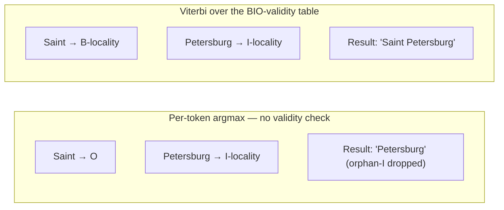

# BIO labels

BIO labelling is the trick that lets a token classifier (which decides one token at a time) emit **spans** (groups of consecutive tokens that mean one thing together). It is the standard approach for sequence labelling tasks in NLP — Named Entity Recognition, part-of-speech tagging, address parsing.

This article explains the scheme, why it works, and a failure mode (the orphan-I) that motivated the decode-time fix covered in [How Mailwoman parses an address](./how-mailwoman-parses-an-address.mdx#decoding-a-valid-sequence-and-building-the-tree). For the full walkthrough of a parse, start there; this page is the deep dive on the label space itself.

## The scheme

Each token gets exactly one label. The label is either:

- **`O`** — the token is **outside** any tagged span.
- **`B-X`** — the token is the **beginning** of an `X` span.
- **`I-X`** — the token is **inside** a continuing `X` span.

So a 3-token "Saint Petersburg, FL" labelled correctly looks like:

```
Saint          → B-locality
Petersburg     → I-locality
,              → O
FL             → B-region
```

The span "Saint Petersburg" is signalled by one `B-locality` followed by one `I-locality`. The decoder reconstructs the span by walking the labels: when it sees `B-X`, it starts a new span; while it keeps seeing `I-X` with a matching tag, it extends the span; on `O` or a different tag, it closes the span.

## The full Mailwoman vocabulary

The current active set (Stage 3, shipped since v0.6.0) has 16 component tags, each split into `{B-, I-}` plus one shared `O` — 16 × 2 + 1 = 33 BIO labels, matching `neural-weights-en-us/model-card.json`'s `num_labels: 33`:

| label                                          | example token                          |
| ---------------------------------------------- | -------------------------------------- |
| `O`                                            | `","`, `"in"`                          |
| `B-country`, `I-country`                       | `"United"` `"States"`                  |
| `B-region`, `I-region`                         | `"New"` `"York"` (state, when verbose) |
| `B-locality`, `I-locality`                     | `"Saint"` `"Petersburg"`               |
| `B-dependent_locality`, `I-dependent_locality` | `"Greenpoint"`                         |
| `B-postcode`, `I-postcode`                     | `"10118"`, `"75008"`                   |
| `B-subregion`, `I-subregion`                   | `"Brooklyn"`                           |
| `B-cedex`, `I-cedex`                           | `"CEDEX"` `"08"` (FR-specific)         |
| `B-venue`, `I-venue`                           | `"Wrigley"` `"Field"`                  |
| `B-street`, `I-street`                         | `"5th"` (the street's base name)       |
| `B-house_number`, `I-house_number`             | `"350"`, `"10"` `"bis"`                |
| `B-street_prefix`, `I-street_prefix`           | `"SE"` (directional, before the name)  |
| `B-street_suffix`, `I-street_suffix`           | `"St"`, `"Ave"` (the street type)      |
| `B-unit`, `I-unit`                             | `"Apt"` `"3"`                          |
| `B-po_box`, `I-po_box`                         | `"PO"` `"Box"` `"4"`                   |
| `B-intersection_a`, `I-intersection_a`         | `"5th"` `"Ave"` (first cross street)   |
| `B-intersection_b`, `I-intersection_b`         | `"42nd"` `"St"` (second cross street)  |

The neural model's final classifier layer has 33 outputs; the model picks a score for every label at every position (an [emission](./how-mailwoman-parses-an-address.mdx#scoring-every-piece)), and the decoder — not raw per-token argmax — turns those scores into a label sequence.

In code:

```ts
const STAGE3_TAGS = [
	"country",
	"region",
	"locality",
	"dependent_locality",
	"postcode",
	"subregion",
	"cedex",
	"venue",
	"street",
	"house_number",
	"street_prefix",
	"street_suffix",
	"unit",
	"po_box",
	"intersection_a",
	"intersection_b",
]
const STAGE3_BIO_LABELS = ["O", ...STAGE3_TAGS.flatMap((t) => [`B-${t}`, `I-${t}`])]
```

The last 6 tags — `street_prefix` through `intersection_b` — are the Stage 3 expansion, shipped in v0.6.0: decomposing the monolithic `street` tag into prefix/base/suffix and adding `unit`, `po_box`, and paired intersection tags. `labels.py` keeps the earlier Stage 1 and Stage 2 vocabularies (7 and 10 tags) defined alongside Stage 3 so historical checkpoints and eval reports can still be diffed against older label sets — but Stage 3 is what every current training config and shipped model uses.

## The orphan-I problem

Here is where BIO labelling gets interesting. A naive token classifier picks the highest-probability label for each token independently. This produces sequences like:

```
Saint    → O                        ← the model wasn't sure, picked O
Petersburg → I-locality             ← the model was confident, picked I-locality
```

The result is structurally **invalid**. An `I-locality` is by definition "inside a locality span", and the previous token is not in a locality span. There is no `B-locality` to be inside of. This is called an **orphan-I**.

What happens when the decoder reconstructs the span? Depending on how it handles the orphan-I:

- **Strict mode** — drop the orphan. "Saint Petersburg" becomes "Petersburg" (a 1-token locality starting at Petersburg). This is the "Saint Petersburg → Petersburg" bug visible in Mailwoman v0.2.0.
- **Forgiving mode** — treat the orphan-I as a `B-X`. "Saint Petersburg" becomes two adjacent localities. Worse.

Neither is what the data actually wants. The data wants `B-locality, I-locality`.

## How Mailwoman fixes this

The fix is decode-time, not learned. A fixed **BIO-validity table** pins the impossible transitions — `O → I-X`, `B-X → I-Y` where `X ≠ Y` — to negative infinity, and the **Viterbi algorithm** searches for the highest-scoring label sequence that respects the table, rather than picking each token's label independently. The orphan-I is structurally excluded: there's no valid path through it.

The result: a model that is uncertain about "Saint" between `O` and `B-locality` will still produce a structurally valid sequence at decode time. "Saint Petersburg" comes out as one locality span. See [CRF decoder](./crf-decoder.mdx) for why this is narrower than a full learned CRF, and what that page's name still refers to.



## The other reason BIO works well

BIO labels are simple enough that:

- **The model architecture stays small.** No special span-prediction heads. Just a per-token classifier.
- **Training data is easy to generate.** Given `(raw, components)` from a corpus adapter, you align each component's text to its tokens and emit `B-` for the first token and `I-` for the rest.
- **Evaluation is straightforward.** Compare predicted spans to gold spans; compute precision, recall, F1 per tag.

This pattern is one of the most-tested approaches in NLP. CoNLL-2003 (the canonical Named Entity Recognition benchmark) uses BIO. CoNLL-2000 (chunking) uses BIO. Every modern NER tool exposes BIO-style output as the default. Mailwoman inheriting this standard means our training data is interoperable and our evaluation tooling is familiar.

## Where this lives in the code

- **Label vocabulary:** `corpus-python/src/mailwoman_train/labels.py` (`STAGE3_BIO_LABELS`, `ACTIVE_BIO_LABELS`)
- **TypeScript mirror:** `core/types/component.ts` (`BIO_LABELS`)
- **Training-time alignment:** `corpus/src/align.ts` (turns `(raw, components)` into per-token BIO labels)
- **Inference-time decoding:** `neural/viterbi.ts` (`buildBIOTransitionMask`, `viterbi`) — see [CRF decoder](./crf-decoder.mdx)

## See it in action

import { DemoEmbedProvider } from "@site/src/contexts/DemoEmbed"
import { PipelineExplorer } from "@site/src/components/PipelineExplorer/PipelineExplorer"

<DemoEmbedProvider sqljsBaseURL="/mailwoman/sqljs">
	<PipelineExplorer />
</DemoEmbedProvider>

Expand the **BIO labels** section to see the word-level BIO label breakdown for a live parse.

## See also

- [How Mailwoman parses an address](./how-mailwoman-parses-an-address.mdx) — the full parse this label space plugs into
- [CRF decoder](./crf-decoder.mdx) — the structural-validity layer
- [Tokenization](./tokenization.mdx) — what gets labelled
- [Training pipeline](./training-pipeline.mdx) — how BIO labels become training data
