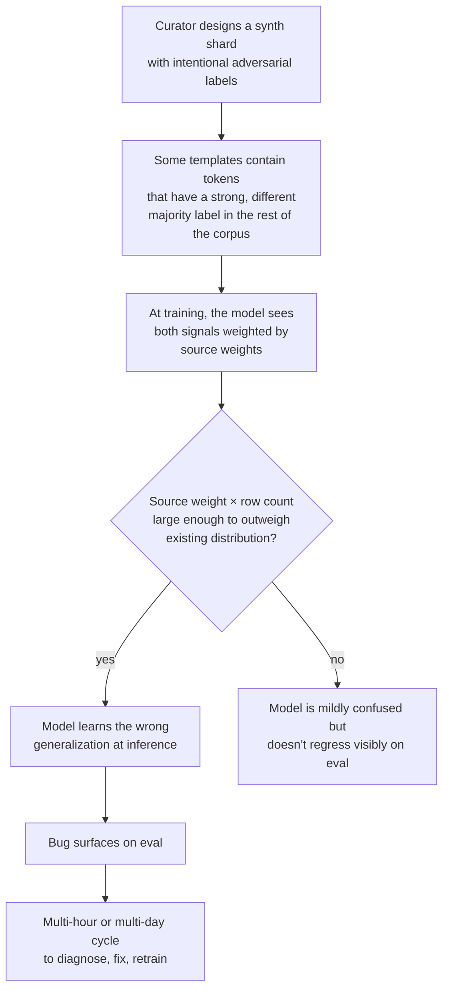

# Corpus poisoning vulnerability

The empirical-learner nature of the neural parser
([see "How the model reasons"](./how-the-model-reasons.mdx)) means it learns
exactly what we tell it. Including the things we accidentally tell it. This
doc captures the lesson from v0.6.2's "5th Avenue Theatre" incident and the
preventative architecture that landed in v0.6.3.

The honest framing: **the model has essentially no built-in protection against
corpus poisoning. Protection lives at the corpus-curation layer.**

## What happened

The v0.6.2 corpus rebalance added a `synth-no-street` shard with 122K rows.
35% of those rows were "venue-adversarial" templates — venues whose names
contain street-typing tokens (`Wall Street Industries`, `5th Avenue Theatre`,
`Memorial Drive Medical Center`). These were intentional counter-examples
to teach the model that `Street`/`Avenue`/`Drive` are not always street tags
— sometimes they're just part of a venue name.

The design was sound. The execution had a bug. Two of the 30 hand-curated
venue names happened to start with `<digit><ordinal>` patterns:

- `5th Avenue Theatre`
- `7th Street Bistro`

At training, the labels on these rows were:

```
5th  Avenue  Theatre  ,  Boston  ,  MA  02101
B-venue  I-venue  I-venue  O  B-locality  O  B-region  B-postcode
```

The model saw `5th` labeled `B-venue` approximately 5,000 times across the
shard (35% of 100K rows × ~14% containing digit-ordinal patterns). The rest
of the corpus has `5th` labeled `B-house_number` approximately 30,000 times
(in addresses like `5th Avenue, Portland, OR 97214`).

Despite the corpus's strong house_number majority, the venue training was
enough to confuse the model's interpretation of `5th` at inference. The
v0.6.2 step-100K eval showed `house_number` recall dropping 5pp (79.0% →
74.0%) — the only remaining gate violation after the corpus rebalance.

The bug wasn't caught pre-training. It was caught
[at the v0-vs-neural harness](../evals/2026-05-28-v0-vs-neural-harness.mdx)
and [at the per-tag gate](../evals/2026-05-29-v0.6.2-100k-eval.mdx) AFTER the
model trained, after we'd already paid the GPU cost.

## Why the architecture is susceptible

The encoder is an empirical learner. Every labeled token in the training
corpus is ground truth as far as it's concerned. It does not — and cannot —
distinguish:

- "This token is labeled venue because it's in a synthetic adversarial
  sub-distribution"
- "This token is labeled venue because it's universally a venue token"

If 35% of training data says `5th = venue prefix` and 65% says
`5th = house_number`, the model averages the signals weighted by the source
weights in the training config. The fact that 5K instances came from a
synthetic counter-example shard does not propagate to the encoder — to the
encoder it's just 5K more gradient steps saying "5th is sometimes venue."

What was supposed to protect against this:

1. **Bidirectional context** — the encoder sees `5th Avenue Theatre, Boston, MA`
   vs `5th Avenue, Portland, OR` and SHOULD learn the contextual discrimination.
   This works only if the encoder has enough capacity AND enough varied examples.
   It turned out 5K instances of `5th = venue` was sufficient to outweigh the
   natural house_number signal across the rest of the corpus.
2. **Source weighting** — we can downweight a shard but we can't tell which
   shard a behavior came from. The eval surfaces the symptom; we work
   backward to the cause.
3. **FST priors at inference** — they boost specific tokens but don't fix the
   trained baseline. If the model has internalized "5th = venue," a
   QueryShape prior nudging toward house_number gets canceled by the
   encoder's strong prior in the wrong direction.
4. **Eval gates** — caught the regression after the fact. Not preventative.

None of these are pre-training preventatives. They're either learned
behaviors that turned out insufficient, or post-hoc checks that fire after
the model is trained.

## The general failure mode

Any synthetic shard whose label distribution diverges meaningfully from the
existing corpus is a poisoning candidate. The 5th Avenue case is one
instance of a broader pattern:



The bigger the shard, the higher the weight, the wider the damage.
Synth shards in v0.6.x range from 30K to 122K rows at weights up to 2.0 —
plenty of gradient mass to overwrite parts of the model's learned
distribution.

## What we now have: corpus linter v1

`scripts/lint-corpus-shard.ts` (landed 2026-05-29 per DeepSeek turn 9 design).
Pre-training preventative for this class of failure. Five v1 checks:

### 1. Token-label distribution outliers

For each token in the new shard, compare the shard's majority label to the
corpus's majority label. Flag when:

- Corpus has a confidently-established majority (> 66%)
- Shard's majority label differs
- Both have non-trivial counts (shard ≥ 50, corpus ≥ 200)

Catches "5th labeled venue when corpus labels it house_number."

### 2. Label-vacuum tokens

Tokens labeled with a tag that has zero instances in the corpus for that
token, despite the token being well-represented (corpus count ≥ 100,
shard count ≥ 20).

Catches "shard introduces a new (token, label) association that's
completely novel." Stronger signal than distribution shift — we're
introducing rather than rebalancing.

### 3. Bigram-label collisions

Identical token bigram in shard and corpus, but with different majority
label-bigrams. Both have count ≥ 10.

Catches `5th Avenue` labeled `[B-venue, I-venue]` in shard while corpus
labels it `[B-house_number, B-street]`. Same surface text, different
structural reading.

### 4. Anti-pattern rules (data-driven)

Regex + forbidden-labels matchers from `scripts/lint-rules.json`. Knowledge
of specific dangerous patterns lives in data, not code:

- `^\d+(?:st|nd|rd|th)$` → forbidden as `B-venue`, `B-locality`, etc.
- `^[A-Z]{2}$` → forbidden as non-admin tags
- `^\d{5}$` → forbidden as non-postcode non-house-number

Adding a new dangerous pattern is a data change, no code touch.

### 5. Basic sanity

Truncated rows (tokens.length !== labels.length), all-O shards (>90% of
rows entirely O-labeled — contributes no signal).

## How it gates

Report + acknowledgment, not block. The linter always produces a
structured report. MANIFEST entries for flagged shards need an explicit
`lint_acknowledged: true` field for training to consume them. The linter
exit code is 1 on any error so CI/build pipelines can gate.

This is stronger than "warn" (can't be ignored) but less aggressive than
"block" (legitimate adversarial training data passes with human sign-off).

## Retro-test on the actual v0.6.2 poisoning

Ran the linter against the original v0.6.2 synth-no-street shard (the one
with `5th Avenue Theatre` and `7th Street Bistro`):

```
Errors: 19
  distribution-outlier: 2     (Main, St)
  label-vacuum: 15            (Maple, Broadway, 61, Market, Main, Pine, ...)
  anti-pattern-rule: 2        (5th, 7th — both labeled B-venue 1300+ times)
Warnings: 0
Exit: 1
```

Counterfactually: had this linter existed in late May, the 5th/7th anti-
pattern rule would have fired BEFORE training. The legitimate adversarial
venues (Maple Street Bakery, Broadway Theatre, etc.) would have been
flagged as label-vacuum, but the human reviewer would have acknowledged
those as intentional. The 5pp house_number regression would not have shipped.

Ran the same linter against the filtered v0.6.3 shard (5th/7th removed):

```
Errors: 24 (all label-vacuum + distribution-outlier on INTENTIONAL adversarial venues)
Anti-pattern violations: 0  ← the filter works
```

The label-vacuum and distribution-outlier flags on the filtered shard are
all on intentional adversarial venue tokens. A human reviewer marks
`lint_acknowledged: true` for these with a note like "intentional
adversarial venue training; digit+ordinal patterns removed."

## What's not in v1 (deferred per DeepSeek)

These are real failure modes that v1 doesn't catch:

- **Per-source provenance drift** — a shard from `source: openaddresses`
  with label distributions inconsistent with other openaddresses shards.
  Requires per-source baseline stats.
- **Synthesizer drift** — same `source` + same raw → diverging labels
  between shards. Indicates the synthesizer changed.
- **Label-distribution shift** — a shard where one tag accounts for 40%
  of labels when the corpus average is 8%. Skews the model's tag-level
  priors.
- **Weight-composition auditing** — a shard's effective weight × row count
  exceeding e.g. 30% of total corpus weight. Magnifies any other risk.
- **Token hygiene** — tokens with mixed scripts, replacement characters,
  zero-width joiners. Encoding errors hiding in the data.
- **Tokenizer-aware boundary checks** — BIO labels that are
  well-formed at the whitespace-token level but inconsistent after
  SentencePiece subword tokenization.

The v1 surface catches the `5th Avenue Theatre` class of failure. The v2
items address broader corpus-integrity surfaces; defer until they cost us
a release.

## The lesson

The architecture is fundamentally susceptible to poisoning because it's
empirical. We can't fix that at the model layer without making the model
less powerful. We CAN add a corpus-curation layer that audits what we're
teaching, separately from the model that learns it.

The 5th Avenue incident is the canary, not the bug. The vulnerability
existed since the model started training. We got lucky that the failure
mode was caught by an eval we happened to run. Future synthetic shards
will hit the same class of risk unless the linter sits in front of them.

## See also

- [How the model reasons](./how-the-model-reasons.mdx) — the architecture
  context that makes this vulnerability inevitable
- [Street-supplement architecture](./street-supplement-architecture.mdx) —
  the recipe v0.6.x has been iterating on, which is corpus-design heavy
- [v0.6.2 step 100K eval](../evals/2026-05-29-v0.6.2-100k-eval.mdx) — the
  empirical surfacing of the 5th Avenue regression
- [2026-05-28 night-2 postmortem](../evals/2026-05-28-night-2-postmortem.mdx) —
  the earlier postmortem that triggered the v0.6.x work
