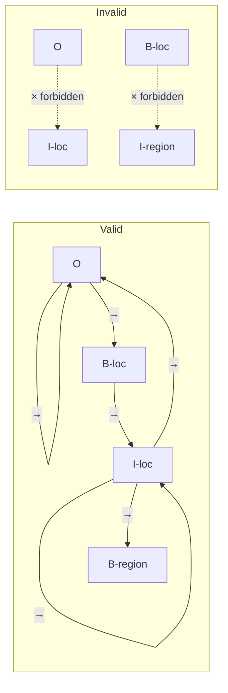

# CRF decoder

A **Conditional Random Field (CRF)** is a structured-prediction layer that sits on top of a per-token classifier and finds the best **whole-sequence** assignment of labels, subject to learnable transition rules between consecutive labels.

Mailwoman added a CRF decoder in v3.0.0 to solve the [orphan-I problem](./bio-labels.md#the-orphan-i-problem) — the "Saint Petersburg → Petersburg" clipping bug.

## Why a CRF, not just argmax

Without a CRF, the model picks the highest-probability label at each position independently. Because the labels are picked independently, the resulting sequence can be structurally invalid (an `I-locality` with no preceding `B-locality`, for example).

A CRF fixes this by:

1. Learning a **transition score** for every pair of adjacent labels. Some transitions can be pinned to negative infinity, making them impossible. Mailwoman pins all the BIO-invalid transitions (`O → I-X`, `B-X → I-Y` where tags differ, `B-X → I-X` valid, etc.).
2. At decode time, finding the **highest-scoring whole sequence** — not the highest-scoring sequence of individual choices. This is the **Viterbi algorithm**.

The result: every sequence the model can emit is structurally valid. There is no `I-X` without a matching `B-X` before it.

## A worked example

Input: `"Saint Petersburg, FL"`. The model's per-token outputs (raw softmax probabilities) might look like:

| token        | B-locality | I-locality | B-region | I-region | O    |
| ------------ | ---------- | ---------- | -------- | -------- | ---- |
| `Saint`      | 0.40       | 0.10       | 0.05     | 0.00     | 0.45 |
| `Petersburg` | 0.20       | 0.65       | 0.05     | 0.00     | 0.10 |
| `,`          | 0.00       | 0.00       | 0.00     | 0.00     | 1.00 |
| `FL`         | 0.05       | 0.00       | 0.90     | 0.00     | 0.05 |

**Per-token argmax** picks the best label at each position: `O, I-locality, O, B-region`. This is invalid because `O → I-locality` is forbidden. A strict decoder drops "Saint", yielding `"Petersburg"` as the locality.

**CRF Viterbi** instead searches for the best whole sequence. The transition `O → I-locality` is impossible, so the Viterbi search rules out any sequence containing it. The next-best candidates:

- `B-locality, I-locality, O, B-region` — score 0.40 × 0.65 × 1.00 × 0.90 = **0.234**
- `O, B-locality, O, B-region` — score 0.45 × 0.20 × 1.00 × 0.90 = **0.081**

The first wins. "Saint Petersburg" comes out as one locality span, even though the model was uncertain about "Saint".

## The transition mask

Mailwoman's BIO transition mask is built from these rules:

- **`X → O`** is always valid (any tag can transition to "outside").
- **`X → B-Y`** is always valid (any tag can start a new entity).
- **`X → I-Y`** is valid only if `X` is `B-Y` or `I-Y` (the previous tag must be a matching `B-` or `I-`).
- **Sequence start → `I-X`** is invalid (cannot start on inside-tag).

Invalid transitions are set to `-inf` in the transition matrix. The transition mask is a **frozen** parameter — never updated during training — so the structural rules are guarantees, not hopes.



## What the CRF learns

On top of the frozen structural mask, the CRF has **learnable** transition scores. These are not yes/no — they are real-valued. The model learns patterns like:

- `B-postcode` after `B-region` is common in US addresses (`"NY 10118"`).
- `B-locality` after `B-locality` is rare unless separated by `O` (a comma).
- `B-house_number` at the start of the sequence is much more common than at the end.

These soft priors get baked into the transition matrix during training. They help the Viterbi search prefer sequences that look like real addresses.

The matrix is small: 21 × 21 + 21 + 21 = 483 learnable scalars (the transition matrix plus start- and end-transition vectors). Negligible compared to the encoder's 8.87 million parameters.

## How training works with a CRF

Without a CRF, the loss is **cross-entropy per token**: for each position, compare the model's softmax over labels to the gold label, and average. The model is rewarded for getting each position right on its own.

With a CRF, the loss is **negative log-likelihood of the gold sequence under the CRF**:

```
loss = -log P(gold_sequence | emissions)
     = -log(score(gold) / sum-over-all-paths(score(path)))
```

The numerator is easy: just look up the score the CRF gives the gold sequence. The denominator requires summing over all possible sequences, which the **forward algorithm** does efficiently in O(seq_len × num_labels²) time.

Backpropagation through the forward algorithm trains both the encoder weights AND the CRF transition scores. The encoder is encouraged to emit per-token outputs that, combined with the CRF transitions, give the gold sequence the highest score.

## The v3.0.0 instability

Mailwoman v3.0.0 shipped with the CRF, but training was harder than expected. The agent who shipped it documented the issue at length:

- The CRF's NLL is **per-sequence and unbounded** — its magnitude is O(sequence length × log num_labels), roughly 10–100 per training example.
- The per-token cross-entropy is **per-token and log-bounded** — roughly 3 per token at random init, dropping to under 1 with training.
- Summing the two at equal weight let CRF gradients dominate CE gradients, destabilizing training.

The v3.0.0 fix was to hand-weight the CRF NLL down: `loss = ce + 0.05 × crf_nll`. This worked but was fragile — four iterations of LR/weight tuning before training stayed stable past warmup.

v0.4.0 ([issue #116](https://github.com/sister-software/mailwoman/issues/116)) replaces the hand-weight with **per-token CRF NLL normalization** — dividing the CRF loss by the sequence length. The two terms then have comparable magnitudes naturally, and the hand-tuning goes away.

## The runtime gap (and why it's only half a fix today)

The CRF is used during training and during the evaluation script. Both run in Python with PyTorch. The production runtime is JavaScript, and JavaScript currently does **per-token argmax**, not Viterbi.

This means:

- The model's emissions (the per-token probabilities) are better than they would be without the CRF, because the encoder was trained to produce emissions that work well with the CRF.
- But the runtime is not exploiting the trained transition matrix.
- The "Saint Petersburg" win on the live demo is partial — better than v0.2.0 (because emissions improved) but not as good as a Viterbi decode would be.

v0.4.0 ports the Viterbi loop to JavaScript and exports the transition matrix as part of the ONNX bundle. This is one of the simpler items in the v0.4.0 plan but it has outsized impact for the visible behaviour.

## Where this lives in the code

- **CRF implementation:** `corpus-python/src/mailwoman_train/crf.py` (`LinearChainCRF`, ~250 lines, hand-rolled to match the encoder's hand-rolled style)
- **Transition mask construction:** `build_bio_transition_mask` in the same file
- **Training-time use:** `corpus-python/src/mailwoman_train/model.py` (`MailwomanCoarseEncoder.forward` computes both CE and CRF NLL when in training mode)
- **Inference-time use (Python):** `MailwomanCoarseEncoder.predict` calls `crf.viterbi_decode`
- **Inference-time use (JavaScript):** not yet — see v0.4.0

## See also

- [BIO labels](./bio-labels.md) — the labels the CRF operates over
- [Neural classification](./neural-classification.md) — the encoder whose outputs the CRF decodes
- [Training pipeline](./training-pipeline.md) — where the CRF's transition scores get learned
