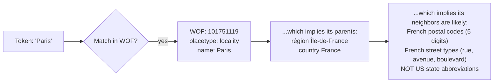
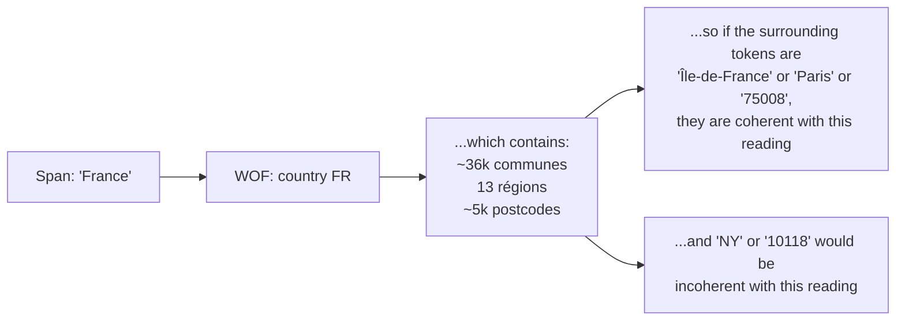
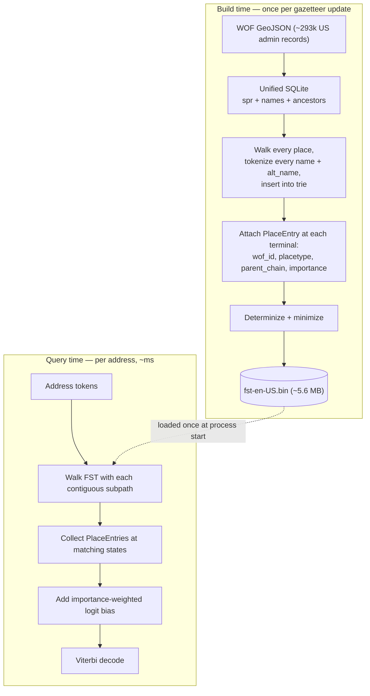
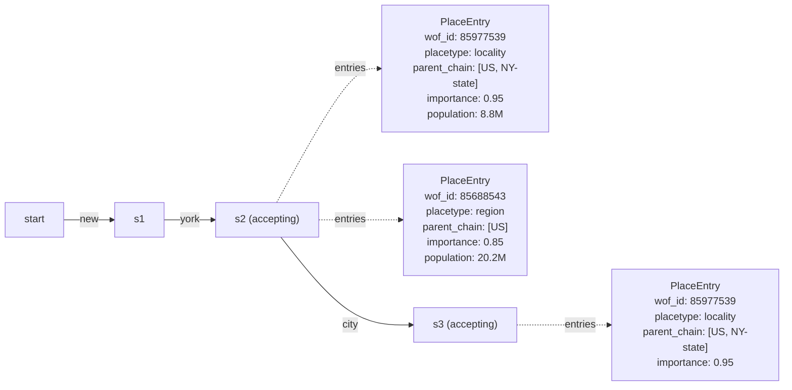
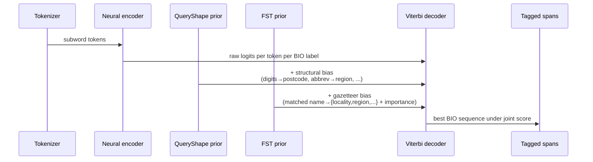
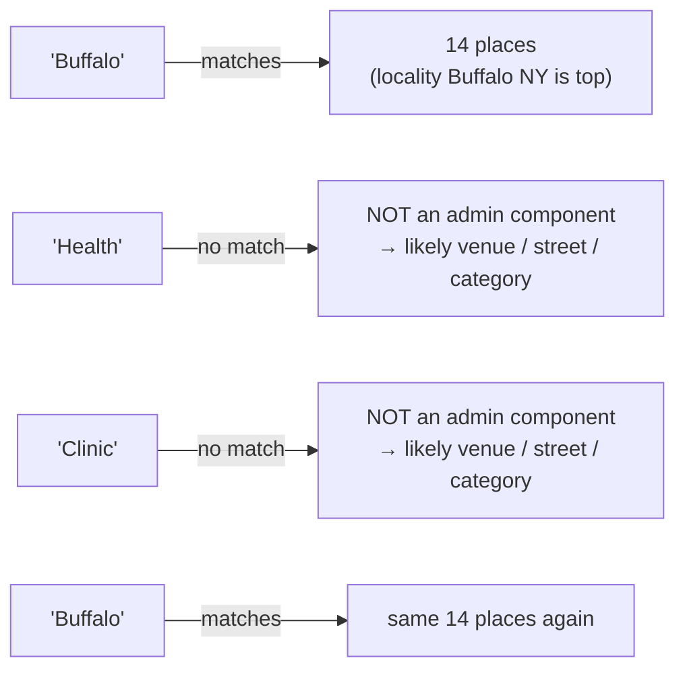
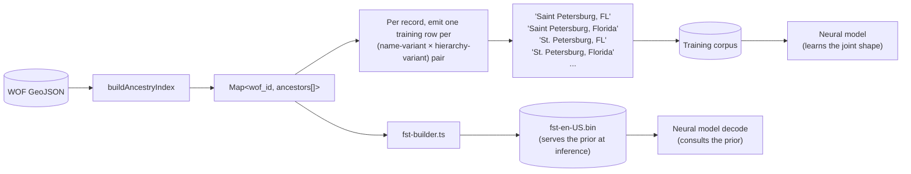
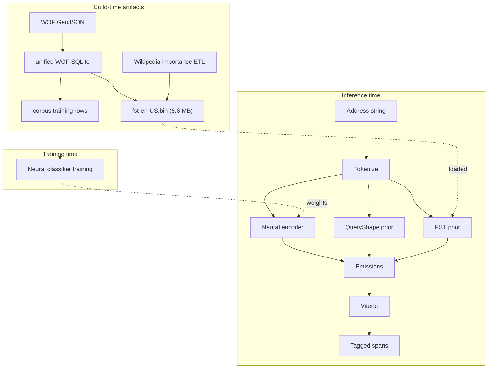

# FST gazetteer prior

The FST (finite-state transducer) gazetteer prior is the structure that lets the neural classifier benefit from everything Who's On First already knows. The neural model knows grammar; the gazetteer knows places. The FST is the bridge — pre-computed at build time so the classifier can consult it at inference time without paying gazetteer-lookup costs per token.

This article explains the idea behind it, the build-time vs query-time split that makes it cheap, and how it slots into the rest of the pipeline. It's also the reference for what's actually wired into production: `mailwoman parse` builds this admin FST from a WOF SQLite database and threads it through `createRuntimePipeline`. The mechanism generalizes past admin data — the same shallow-fusion pattern speech recognition uses to blend a learned model with world knowledge at decode time; see [FST priors as shallow fusion](./fst-priors-as-shallow-fusion.mdx) for that framing and for the street-morphology FST, which exists but isn't wired into the runtime pipeline yet.

## "If you knew this, you'd know that..."

Most of what's hard about address parsing is that any given span is ambiguous in isolation. `Paris` is a city in France, a town in Texas, and a town in Ontario. `Washington` is a state, a federal district, and twenty-something cities. The model can't decide what `Paris` _is_ until it knows what's around it.

But the gazetteer has a structural shortcut: places live in a hierarchy. If you know a token sequence matches a known city, you also know the country, the region, and (often) the county that contains it. That's a chain of implications you can compute once, write down, and look up later.



That last step — "which implies its neighbors are likely" — is the payoff. The neural model sees a single token and predicts a tag from local context. The FST gives it a _prior_ that says "if `Paris` is the city in France, then the next thing is much more likely to be `France` than `TX`." Confident model predictions stay confident. Uncertain ones get nudged toward the gazetteer-consistent reading.

Read the same diagram the other way — from a _less specific_ span to its plausible _children_ — and you get the second framing of the idea:



Both directions are the same fact: WOF stores hierarchy edges, and that hierarchy constrains the joint reading of an address. The FST is the data structure that makes those constraints cheap to query.

## Two clocks: build time and query time

The trick of the FST is that it splits the work into two clocks. The expensive clock runs once. The cheap clock runs per address.



The asymmetry is deliberate. Build time pays the cost of "enumerate every valid place-name path through the hierarchy." Query time is just trie walking — O(tokens × branching), not O(gazetteer size). The FST encodes the cross-product so the runtime doesn't have to compute it.

Shipped numbers for the US admin FST:

| Stage                               | Cost            |
| ----------------------------------- | --------------- |
| Build (from unified SQLite)         | 2.7 s           |
| Build (from raw GeoJSON, 293k recs) | 43 s            |
| Binary size                         | 5.57 MB         |
| Load at startup                     | ~10 ms          |
| Query per address                   | sub-millisecond |

The binary is small enough to ship to a browser. The `/demo` page loads a 9 MB FST in parallel with the ONNX model and uses both at inference time — no server-side gazetteer call.

## What's inside the FST

Each accepting state — a state where a complete place name ends — carries one or more `PlaceEntry` records. Multiple entries per state are the norm, not the exception: `"New York"` accepts as _both_ the city and the state.



The FST never picks between interpretations. It hands the neural model and the Viterbi decoder _all_ of them, weighted by importance, and lets the joint decode resolve the ambiguity using surrounding context.

The `parent_chain` is the critical piece of structure. It's how a match on `"Brooklyn"` becomes evidence that the next token _should_ be one of `{New York, NY, US, 11201, 11202, ...}` — anything coherent with that chain — rather than an unrelated place like `Houston`.

## How the prior composes with the rest of the pipeline

The FST does not replace the neural classifier. It composes with it as an additive bias on the emission logits, alongside the QueryShape structural prior. The decoder is still Viterbi; the FST just changes the numbers it sees.



The math is the unsurprising sum:

```
finalEmissions[t][label] = rawLogits[t][label]
                         + queryShapeBias[t][label]
                         + fstBias[t][label]
```

Two design choices matter here:

1. **Additive, not multiplicative.** A confident model prediction (large positive logit) drowns out a weak prior. A weak model prediction (near-zero logit) is where the prior gets to vote. This is the same shallow-fusion idea modern speech recognizers use to blend an acoustic model with a language model.
2. **Capped at 3.0 logits.** Even with a 1.0 Wikipedia importance score, the bias can't move the decoder more than ~3 logits. The model can always overrule the gazetteer when the input clearly contradicts it ("Paris, TX" overrides the France prior on `Paris` because the context makes it obvious).

### Worked example: "Washington, DC"

This is the case the prior was originally designed to fix. Per-token argmax used to mislabel `Washington` as `B-region` because the model had seen `Washington (state)` more often than `Washington (DC)` in training.

| Signal                                                                                | Bias on B-locality for `Washington` |
| ------------------------------------------------------------------------------------- | ----------------------------------- |
| Raw neural logit                                                                      | (small, uncertain)                  |
| QueryShape: `DC` is a region abbreviation, so the preceding span should be a locality | +2.0                                |
| FST: `Washington` matches locality WOF:85633793, importance 0.815                     | +0.815 × 3.0 = +2.45                |
| **Sum**                                                                               | **+4.45 over B-region**             |

The Viterbi decoder now has overwhelming evidence to pick the locality reading. None of the model's parameters changed — the prior just supplied the world knowledge the model was missing.

## Negative evidence is the second payoff

The FST's most underappreciated property is what happens when a token _doesn't_ match. Walking off a prefix is a strong signal that the token is **not** an admin component.



For `"Buffalo Health Clinic, Buffalo"`, the FST tells the decoder: the first `Buffalo` _could_ be a locality, but the next two tokens _can't_ be. That's enough for the decoder to read the whole `Buffalo Health Clinic` span as a venue, with the trailing `Buffalo` as the actual locality.

This is information the gazetteer always had. Before the FST, the model had to learn it from corpus statistics. Now it's an explicit emission bias the model gets for free.

## The corpus side: hierarchy chains as training data

The FST is the _inference-time_ expression of the idea. The _training-time_ expression is in the corpus pipeline. The same WOF hierarchy that becomes the FST's `parent_chain` field is also what `corpus/src/wof-json.ts` consumes via `buildAncestryIndex`, and what `corpus/src/adapters/wof-admin-json/adapter.ts` uses to emit training rows.



The same upfront enumeration of hierarchy chains feeds both sides. The corpus side bakes the chain into the training distribution so the model sees plausible (city, region, country) tuples in their canonical forms. The FST side keeps the chain accessible at inference for the cases the model can't memorize. One build-time enumeration pays off at both training time and query time.

## Wikipedia importance, not population

Inside the `PlaceEntry`, the `importance` field is what scales each match's logit bias. Using raw population would give the wrong answer for some of the most common queries: Washington state (7.6M) would outrank Washington DC (678K) despite DC being overwhelmingly the more common referent of "Washington" in addresses.

The FST uses Wikipedia importance scores from [Nominatim's methodology](https://nominatim.org/release-docs/latest/customize/Importance/): `log(total_links) / log(max_links)`, normalized to \[0, 1\].

| Place                    | Population | Wikipedia importance |
| ------------------------ | ---------- | -------------------- |
| Washington DC (locality) | 678K       | 0.815                |
| Washington (state)       | 7.6M       | 0.764                |
| New York City (locality) | 8.8M       | 0.950                |

The importance scores are computed once, in a separate ETL pass, and joined into the unified SQLite before the FST builder runs. The two-signal split (importance for ranking, population for tie-breaking and resolver scoring) has its own [dedicated article](./importance-vs-population.mdx).

## Where this fits in the bigger picture



The FST is one node in a longer pipeline of cached work. The unified SQLite is a cache of the GeoJSON repos. The FST is a cache of the SQLite. The Wikipedia importance file is a cache of dump statistics. Each cache turns a slow operation done many times into a fast operation done once. The reason the runtime is small enough to ship to a browser is that none of those upfront costs are paid in the hot path.

## What the FST does not do

- **It does not resolve.** It tells the classifier which spans _could_ be places. Producing a single canonical place ID + coordinates is the resolver's job (see [Resolver and Who's On First](./resolver-and-wof.mdx)).
- **It does not carry individual street names.** This FST ships admin-only (countries, regions, localities, postcodes). A gazetteer of specific street names (`"5th Avenue"`, `"Rue de Rivoli"` as named entities) would add ~3-5M unique names and require metro-area sharding for the browser; still tracked as Phase 2+ in [`FST_GAZETTEER_LM.md`](../plan/reference/FST_GAZETTEER_LM.mdx). That's a different, much smaller thing from the street-**morphology** FST — generic street-type vocabulary (`avenue`, `road`, `rue`), not specific names — which does exist; see [FST priors as shallow fusion](./fst-priors-as-shallow-fusion.mdx#the-morphology-fst) for what it covers and its current wiring status.
- **It does not override the model.** The bias is additive and capped. If the model is confident the input says "Paris, TX," the FST prior on French Paris doesn't change the outcome.

## See it in action

import { DemoEmbedProvider } from "@site/src/contexts/DemoEmbed"
import { FSTWalker } from "@site/src/components/FSTWalker/FSTWalker"

<DemoEmbedProvider sqljsBaseURL="/mailwoman/sqljs">
	<FSTWalker input="New York, NY 10001" />
</DemoEmbedProvider>

## See also

- [FST gazetteer LM (reference)](../plan/reference/FST_GAZETTEER_LM.mdx) — implementation phases, design decisions, locale strategy, size estimates
- [Resolver and Who's On First](./resolver-and-wof.mdx) — the parser/resolver split and the WOF SQLite distribution this is built from
- [Importance vs population](./importance-vs-population.mdx) — why Wikipedia importance, not population, is the right weighting signal
- [How the model reasons](./how-the-model-reasons.mdx) — the transformer + Viterbi decoder the prior plugs into
- [BIO labels](./bio-labels.mdx) — the per-token label space the prior biases
- [WOF data pipeline](./wof-data-pipeline.mdx) — how the unified SQLite the FST is built from comes together
