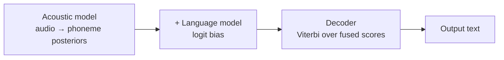
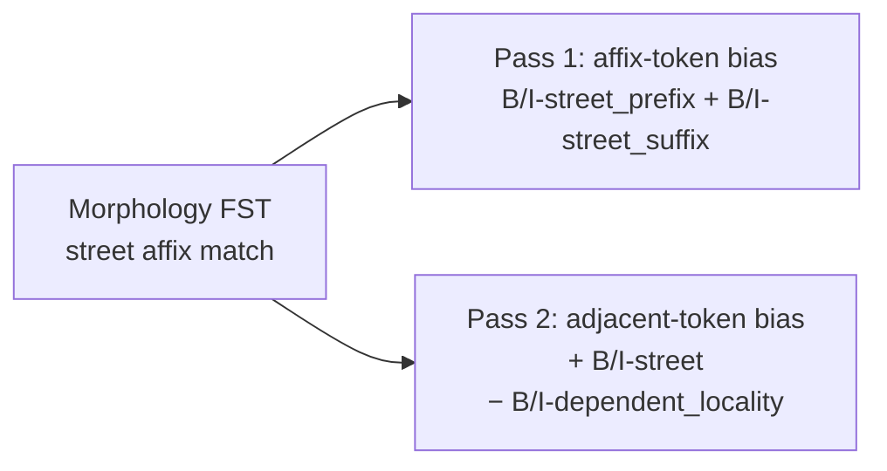
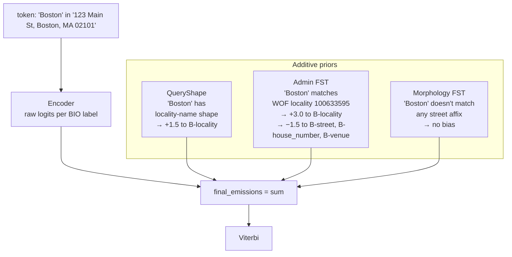

# FST priors as shallow fusion

The neural classifier doesn't know what `Boston` is. It knows that the
token-sequence `Boston` has appeared `N` times in training data labeled as
`B-locality`, and it builds a probability distribution accordingly. That's
fine until the model encounters something it's never seen — a town the
training corpus didn't cover, a venue with locality-shaped name fragments,
a foreign address pattern.

The FST priors fix this by giving the model world knowledge at inference
time. They're an instance of **shallow fusion** — the same architectural
pattern modern automatic speech recognition uses to blend acoustic models
with language models. This article explains the shallow-fusion analogy and
how the two FSTs in mailwoman (admin + morphology) compose with the
encoder's emissions.

## The shallow-fusion pattern

Speech recognition has the same shape of problem: a learned model
(acoustic → phoneme sequences) needs world knowledge (which phoneme
sequences are real words / valid sentences) it didn't learn from data
alone. The solution that works in production: compute the acoustic
model's posterior over phoneme sequences, ADD a logit bias from an
independent language model, decode the combined distribution.



The acoustic model is the data-driven learner. The language model is the
world-knowledge source. They compose additively: the LM's bias amplifies
acoustic decisions consistent with valid words and suppresses ones that
aren't. Neither replaces the other — the acoustic model handles novel
words the LM doesn't have, the LM handles ambiguous audio the acoustic
model can't disambiguate alone.

## The mailwoman mapping

| Speech recognition              | Mailwoman                                    |
| ------------------------------- | -------------------------------------------- |
| Acoustic model (DNN over audio) | Neural encoder (transformer over tokens)     |
| Pronunciation lexicon (FST)     | Admin FST (token sequences → WOF placetypes) |
| Language model (n-gram or RNN)  | Morphology FST (street affixes → BIO labels) |
| Shallow fusion at decode time   | Additive emission biases at Viterbi time     |

The math is the same. Per-token emissions from the encoder get additive
logit biases from each prior, then Viterbi decodes the combined
distribution:

```ts
final_emissions = encoder_logits + queryShape_bias + admin_fst_bias + morphology_fst_bias
viterbi_path = viterbi(final_emissions, transitions_mask)
```

The biases are capped at 3.0 logits (per the
[FST gazetteer prior](./fst-gazetteer-prior.mdx) design). A confident
encoder decision (raw logit > 5) is not overridden by a 3-logit bias.
But when the encoder is uncertain (raw logit ~0), a 3-logit positive
bias is decisive.

## The admin FST

Pre-computed at build time from the WOF SQLite gazetteer. For each
WOF placetype (`country`, `region`, `county`, `locality`, `borough`,
`neighbourhood`, `postalcode`, `campus`, `dependency`) and each
country in scope, every place name is tokenized and inserted into a
trie. Terminal states carry `PlaceEntry` records:

```
PlaceEntry {
  wofID,          // unique place ID in WOF
  placetype,      // 'locality' | 'region' | ...
  name,           // canonical name
  parentChain,    // [country_id, region_id, ...] for context
  importance,     // Wikipedia-based ranking [0..1]
  lat, lon
}
```

At inference, the matcher walks token sequences through the trie. When
a sequence ends at an accepting state, the prior generates a positive
bias toward the matching placetype's BIO labels (`B-locality` for a
locality match, etc.) AND a negative bias against competing tags on
those same tokens (`B-street`, `B-house_number`, `B-venue`).

The full design is in
[FST gazetteer prior](./fst-gazetteer-prior.mdx). Key constants:

- 3.0 logit cap
- Suppression on `B/I-street`, `B/I-house_number`, `B/I-venue` for matched admin tokens
- Suppression scale 1.5x

## The morphology FST

Built later (v0.6.3 work). Reads libpostal's `street_types.txt`
dictionaries — 60 locales, ~1700 canonical street-typing affixes
(`Street`, `Avenue`, `Road`, `Boulevard`, `Lane`, `rue`, `Calle`,
`Straße`, etc.) — and indexes them in a trie. Variants of the same
canonical (`avenue|av|ave|aven|...`) all point to the same `PlaceEntry`
with `placetype: "street_affix"`.

The prior is a TWO-pass bias:



For `5th Avenue` in a real US address (where the user typed it as part of
an address, not a venue name):

- Pass 1: `Avenue` matches the morphology FST. Bias `Avenue` toward
  `B-street_suffix` AND `B-street_prefix` (we don't know position
  without context; the encoder + adjacent-token bias decide).
- Pass 2: `5th` (the adjacent token before `Avenue`) gets a positive
  bias toward `B-street` AND a NEGATIVE bias against
  `B-dependent_locality`.

The negative-bias-on-adjacent is the load-bearing piece. It's what
prevents the v0.6.1-style dep_loc hallucinations: when synth-street
training pushed the model toward "decompose mode," the morphology
prior at inference says "the token next to an affix is street-shaped,
not dep_loc-shaped." See
[street-supplement-architecture.md](./street-supplement-architecture.mdx)
for the layered design.

## What additive bias means in practice

The bias is added to the encoder's raw logit BEFORE softmax. This is
log-space addition, which is multiplication in probability space:

```
P(label | token) ∝ exp(encoder_logit + bias)
                 = exp(encoder_logit) × exp(bias)
```

A bias of +3.0 multiplies the candidate label's probability by
`exp(3.0) ≈ 20×`. A bias of -3.0 divides by 20×. The decoder's Viterbi
pass then normalizes across labels per position and picks the best
global sequence.

This is fundamentally different from masking. Masking sets a label's
probability to zero (or very close); the model can't recover from it.
Additive bias is soft — the encoder's strong opinion can still override
a wrong bias if the evidence is clear enough.

## When the priors compose (not conflict)



For `Boston`, the encoder probably already has high `B-locality` logit
from training (it's seen `Boston` labeled that way many times). The
priors reinforce that decision and suppress alternatives. The Viterbi
pass picks `B-locality` confidently.

For `Avenue` (in `5th Avenue, Portland`), the encoder has moderate
`B-street_suffix` logit. Admin FST adds nothing. Morphology FST adds
strong positive bias toward `B-street_suffix`. The decision becomes
confident.

For `Riverside` (in `Riverside Garden Center, Boston`), the encoder has
multiple plausible interpretations — could be a venue name, could be a
locality. Admin FST checks: `Riverside` is a known WOF locality, but
the next token (`Garden`) doesn't continue the locality match — so the
FST walks off. No positive bias. The encoder's training signal
(`Riverside Garden Center` was labeled venue in training data) wins.

The priors don't fight the encoder. They contribute orthogonal
evidence; the encoder is the final arbiter when the evidence is clear.

## When priors disagree

Both priors can fire on the same token with opposing biases. Consider
`Park` in `Park Avenue` (street) vs `Park Avenue Dental` (venue, with
"Park Avenue" as part of the venue name):

- Encoder learns from training data which interpretation is more
  common in which context.
- Morphology FST sees `Avenue` matches (street affix) and biases
  adjacent `Park` toward `B-street`.
- Admin FST sees `Park Avenue` matches no WOF place — no bias from
  admin side.

In `Park Avenue, NY`: encoder + morphology bias both point to street.
Output: street.

In `Park Avenue Dental, Boston`: encoder's "venue context" signal
(from the trailing `Dental, Boston`) is strong enough to overcome the
morphology bias. The output is venue. The morphology bias makes the
decision closer, but the encoder wins.

This is the soft-fusion property at work. The priors push but don't
dictate.

## See also

- [How the model reasons](./how-the-model-reasons.mdx) — the central
  pipeline doc this expands
- [Attention and bidirectional context](./attention-and-bidirectional-context.mdx) — what the encoder is doing at the layer below the priors
- [FST gazetteer prior](./fst-gazetteer-prior.mdx) — the admin FST in
  full detail, with worked Washington-DC example
- [Street-supplement architecture](./street-supplement-architecture.mdx) —
  the layered street-side prior design
- [WOF hierarchy gap](./wof-hierarchy-gap.mdx) — why the admin FST alone
  isn't enough at the street layer
