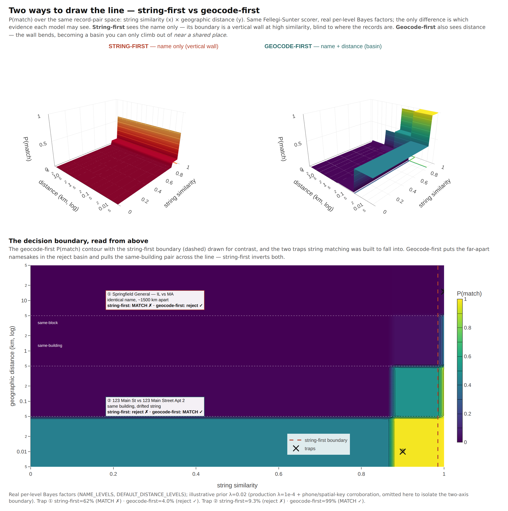

# Geocode-first record matching — the thing that imploded, and why it won't again

Mailwoman started as the answer to a record-matching problem, not a parsing one.
The original job was unglamorous: a pile of clinics receiving federal and state
funding, arriving as SQLite dumps, CSV exports, and hand-keyed spreadsheets, and
a question — _which of these registered entities already got money, which are
eligible and didn't, and which are the same clinic typed three different ways?_
Normalize, geocode, drop it into QGIS, see who's covered, build the lead list.

The pipeline imploded on the matching. Pelias and libpostal weren't good enough
at the parse, which is what spawned mailwoman's v0 TypeScript rewrite and then
the neural pivot. But the parse was only ever the on-ramp. The thing we never
shipped was the matcher — the part that decides two messy records are the same
real-world entity. This page is the strategy for finally building it, and the
one idea that makes it tractable now when it wasn't then.

## What it is

The matcher is **a calibrated, geocode-first entity-resolution layer**: it
resolves every record to a coordinate and a hierarchy first, then links records
by _where they are_ and _who they are_ — not by how their address strings happen
to be spelled.

Every clause earns its place:

- **Entity resolution.** The classical problem — blocking, pairwise matching,
  clustering into canonical entities. Not a new field; a very old, very
  well-theorized one (Fellegi & Sunter, 1969).
- **Geocode-first.** The address becomes a point before it becomes a match
  feature. This is the whole bet, and it's the reason this version won't implode.
- **Calibrated.** Every link carries a probability, every threshold a stated
  precision/recall trade, and the ambiguous middle is _abstained_ to review
  rather than guessed. The same discipline that runs the geocoder.

## Why it imploded — and what changed under it

The v0 matcher was **string-first**: classify the address into components, slot
them into templates, compare the strings. Strings are the wrong key for
addresses, and there's a single fact that proves it. `Jyllandsgade 15` and
`Jyllandsgade 75` differ by one character — Levenshtein similarity **0.963** —
and they are **650 metres apart** (Isaj et al., SSTD 2019). String similarity has
the wrong _topology_: it pulls different buildings together and pushes spellings
of the same building apart. A matcher built on it spends its life drowning in
false pairs and missing real ones, and ours did.

_Both surfaces are `P(match)` over the same record-pair space — string similarity
(x) against geographic distance (y) — scored by the **same** Fellegi-Sunter model
([below](#the-foundation-fellegi-sunter-without-labels)) with the **real** per-level
Bayes factors (`NAME_LEVELS`, `DEFAULT_DISTANCE_LEVELS`); the only difference is
which evidence each model may see. **String-first** sees the name alone — a
vertical wall at high similarity, blind to where the records are. It fuses
namesakes 1500 km apart (① `Springfield General` IL vs MA) and splits a
same-building pair whose string drifted (② `123 Main St` vs `123 Main Street Apt
2`). **Geocode-first** also sees distance — the wall becomes a basin you climb out
of only near a shared place, and it inverts both verdicts the right way. The
geography levels carry the heaviest evidence by design (±9.45 bits at the
same-building grain vs ±6.32 for an exact name), which is why the boundary bends
with distance rather than with spelling. (Prior λ is illustrative here to keep the
boundary visible; production runs λ=1e-4 with phone and spatial-key corroboration
this two-axis slice omits. Generator:
`scripts/record-matcher/viz/geocode-first-surface.ts`.)_

What changed is that mailwoman is now a **geocoder with calibrated confidence.**
Every record can become a rooftop coordinate (± calibrated metres) plus a
Who's-on-First hierarchy plus structured components, each with a confidence. That
hands you matching keys with the _right_ topology:

- **the coordinate / situs point / H3 cell** — the same building gets the same
  key, regardless of how the street was abbreviated;
- **the WOF ancestry** — spelling-invariant blocking by locality and region,
  because you're keying on resolved IDs, not text;
- **structured components with confidence** — you compare field-by-field, and you
  _know which fields to trust_.

You never match on the formatted string. You match on the resolved place. The
lossy-template problem doesn't get solved — it stops existing.

## Entity resolution is three problems, not one

The reason ER "implodes" is that people treat it as one giant problem. It's
three, and naming them _is_ the architecture (Binette & Steorts, 2022; Papadakis
et al., 2021):

1. **Block** — generate candidate pairs cheaply, because comparing all pairs is
   O(n²) and a million records is a trillion comparisons. This is where geography
   does its heaviest lifting.
2. **Match** — score a candidate pair: are these the same entity? This is the
   calibrated decision layer.
3. **Cluster** — pairwise scores are _not transitive_ (A~B at 0.6 and B~C at 0.6
   does not make A~C a match), so a separate stage closes pairs into canonical
   entities. Skip it and your "entities" quietly fracture or fuse (Dedupe; the
   non-transitivity is essential, not a footnote).

Upstream of all three is **canonicalize**: parse the name, sanitize the org name,
geocode the address, normalize the phone and email. That's mostly salvage — the
old `isp-nexus` contact/organization/postal bones, re-pointed at mailwoman's
geocoder.

## The foundation: Fellegi-Sunter, without labels

The matcher's core is the classical probabilistic-linkage model, and it's the
right core for one decisive reason: **it trains without labeled data.** The
Expectation-Maximization estimate of its parameters breaks the chicken-and-egg
paradox — you need known matches to learn the model, but finding matches is the
whole problem — by iterating _predict which pairs match_ → _re-estimate from those
predictions_, exploiting that true matches agree on most fields and non-matches
don't (Winkler 1988; Splink).

That property is the answer to why the first attempt died. Messy clinic CSVs come
with **no ground truth.** A supervised matcher has nothing to learn from on day
one. Fellegi-Sunter gives you a _calibrated_ matcher anyway, and its scores are
interpretable by construction: a total match weight is a prior plus a sum of
per-field log-Bayes-factors (`M = M_prior + Σ log₂(mᵢ/uᵢ)`), so every decision is
attributable to the fields that drove it. You can _read_ why two records linked.
The match-weight threshold is the single precision/recall knob, with a
clerical-review band in the middle for the ambiguous — the abstain zone,
the same move the geocoder makes when its radius blows up.

## Geography is the blocking key — the bet, and its tax

Using geographic proximity as the _primary_ block is documented, production-proven
practice. Spatial cell-joins (geohash/H3/S2) or distance-bounded quadtrees group
co-located records so only plausible pairs are ever scored. Grab collapsed ~30
trillion candidate pairs to a tractable set with a single level-6 geohash join
(Gao & Widdows, 2020); Geo-ER blocks on `name-sim ≥ 0.6 AND distance ≤ 2 km`,
keeping the distance bound deliberately loose so large entities whose registered
coordinates wander — parks, campuses, airports — still survive into scoring
(Balsebre et al., WWW 2022).

Distance then re-enters at the **scoring** stage, two ways, and both help:

- **Bucketed**, as ordinary Fellegi-Sunter comparison levels — "within X m" /
  "within Y m" / "farther", each with its own learned m/u (Splink's
  `DistanceInKMAtThresholds`). Simplest to calibrate; the proven default.
- **Continuous**, as a numeric feature — measurably stronger (Geo-ER beats
  text-only matching by 2.7–7.2% F1, with the _largest_ gains where the address
  text is sparse, and it generalizes across regions far better than a text model).

Our bet — the part nobody has published — is doing this on a parser and geocoder
we _own and calibrate_, so the matcher can condition on the geocode's own stated uncertainty.
And there is a tax, which we pay openly. Geocoder error is large, heavy-tailed,
and non-Gaussian, with a hard urban→rural gradient (street-interpolation median
~38 m urban, ~201 m rural; Cayo & Talbot, Zimmerman et al.). Two rules fall out:

1. **Distance buckets are density-aware.** A 50 m "same building" bucket is right
   downtown and far too tight in the country. Mailwoman knows the density context;
   the matcher uses it.
2. **Geocode quality weights the evidence.** Two records sharing a _rooftop_ point
   is strong agreement; two sharing an _interpolated street centroid_ is weak; two
   sharing a _PO-box or multi-unit_ coordinate is barely location agreement at all.
   This is not a new idea we have to invent — NAACCR's cancer-registry geocoder
   already propagates exactly this (interpolation type, feature-match geography,
   PO-box/rural-route flags, a Match/Review/Non-Match triage). It maps cleanly onto
   our situs → interp → admin tier cascade and conformal radii. We have the quality
   class already; the matcher just has to spend it.

Calibrate the thresholds against mailwoman's _own_ measured error distribution,
not the literature's older-geocoder constants. Our rooftop tier is tighter; the
shape of the lesson holds, the numbers are ours to measure.

## Where a model earns its place

The classical core is the v1. Models are selective levers bolted on where the
evidence says they pay — never the foundation:

- **Org-name embeddings** for fuzzy blocking and similarity. Regex can't see
  `Comcast Cable Communications LLC` ≈ `Xfinity` (a DBA) or survive OCR noise; an
  embedding + ANN index can. Embedding/ANN blocking earns its keep _specifically_
  on noisy, textual fields — not as a blanket replacement (DeepBlocker).
- **A gradient-boosted matcher** over the comparison vector once labels exist. A
  tree over `{distance, name-sim, street-sim}` already clears ~90% matched-class F1
  in production (Grab) — a strong, interpretable upgrade from hand-weights, not a
  neural moonshot. **This one is shipped, and on by default**: a pure-Node
  gradient-boosted tree over the agreement pattern plus the over-merge interaction
  (co-located × name-disagree), trained on the NPPES NPI-truth set. It beat the
  Fellegi-Sunter core by ~5pp dedup F1 held-out within a state and by ~+22pp on
  states it never trained on (TX→CA, TX→NY), cutting the co-located over-merge — so
  it earns the default slot, shipped with a calibrated link threshold (its logit
  isn't in FS-weight units). The model is NPPES/US-trained; for a very different
  domain, A/B it or drop back to the hand-weighted core with
  `resolveEntities({ learnedScorer: false })`. One sharp caveat we measured: the GBT
  is calibrated for **dedup** — where "same address, different name" means distinct
  co-located providers, so it's trained to _reject_ that. **Cross-dataset link
  discovery is the opposite objective** — that same pattern is the prototypical
  signal of one facility under different operational names across sources — so the
  cross-dataset and reconciliation flows pin the FS core (`learnedScorer: false`),
  where recall, not over-merge precision, is what matters. Same model, opposite
  objective: pick the scorer by the question you're asking.
- **An LLM in the gray zone, never on the easy 95%.** Framed as in-context
  _clustering_ rather than all-pairs classification, an LLM cuts API calls ~5× and
  improves quality (LLM-CER, 2025). Spend it only on the clerical-review band the
  calibrated scorer abstained on.
- **An LLM for ingest.** The messy-data reality — "it came as a SQLite dump" — is
  where an LLM is cheaply excellent: read a header row plus a few
  samples, infer the column→field mapping, cache it. One call per _source schema_,
  not per row. The most painful onboarding step, deleted.

## Four rules, carried over

The four rules the geocoder already lives by govern the matcher too:

- **Configuration dominates the model.** Across ~40,000 pipeline configs, F1 spans
  nearly the full [0,1] range, and cheap sampling-based auto-tuning recovers >95%
  of an exhaustive search in under 100 trials (AutoER, 2025). So we build a
  _tunable_ matcher and a small tuner — we do not chase one perfect model.
- **Calibrate, then abstain.** A link is a probability; the ambiguous middle goes
  to review, not to a coin flip.
- **Grade the pipeline against truth, never a stage in isolation.** The reconcile
  regression taught this the hard way. Match quality is measured on linked
  entities versus reality, not on a scorer's pairwise F1.
- **No silent caps.** When blocking drops a region or a tier, say so. A matcher
  that silently never compares two records reads as "no match found" — the most
  dangerous lie an ER system can tell.

## The address-frequency lever needs a corpus

Two records at the same address might be the same clinic — or two of the forty
providers who share a hospital campus. The matcher's strongest precision lever is
**inverse-address-frequency**: down-weight a shared address by how many distinct
entities sit on it, so a lonely address is strong evidence of identity and a
crowded one is nearly none. It's on by default.

But rarity is only meaningful against a population. The lever counts how often each
address appears across the records you hand it — so when you dedupe a _whole_
dataset, the input is the corpus and it just works. Hand it a thin sample and
there's nothing to be rare against: every address looks unique, the signal
flattens, and you quietly fall back to baseline. The fix is cheap — the frequency
table is a parse-free string scan, no geocoding — so when you're matching a slice,
build the table over the full source and pass it in. The one thing you can't do is
conjure rarity from a single record with nothing to compare it to.

## The layers

| Workspace               | Job                                                                                   |
| ----------------------- | ------------------------------------------------------------------------------------- |
| `@mailwoman/formatter`  | The inverse of the parser: components → idiomatic localized string + a canonical key. |
| `@mailwoman/record`     | The record schema (person / organization / address) + per-field normalizers.          |
| `@mailwoman/match`      | Block (geo-first) → score (Fellegi-Sunter) → cluster (centroid-linkage).              |
| `@mailwoman/address-id` | A resolved address → a stable `state.cell.hash` primary key — the deterministic join. |
| _the application_       | Ingest → normalize → geocode → match → cluster → export to GeoJSON / QGIS / leads.    |

The formatter is the small foundation — it's also the piece this whole thread
started as, before we understood it was one component of a matcher. The record
layer is salvage. The match layer is the part that imploded last time, now
standing on coordinates instead of strings. The address-id is the cheap certainty
beside the probabilistic match: when two records resolve to the same place _and_
share a canonical address, they collapse on a deterministic key — no scoring, no
threshold — and the matcher spends its effort only on the messy rest.

## Why you can't find the comparable project

The literature has spatial entity resolution, and it has calibrated probabilistic
linkage, and it has neural address parsing — as three separate fields with three
separate citation graphs. What it does not have is one system that owns the parser,
owns the geocoder, calibrates both, and then feeds that calibrated location,
uncertainty and all, into a Fellegi-Sunter matcher as a quality-weighted
feature. That's either a moat or a warning, and the only way to learn which is to
build it and grade it against real clinic data. That's the work.
