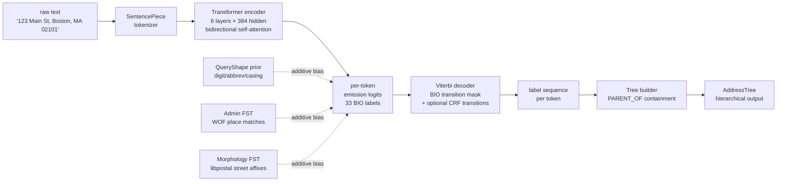
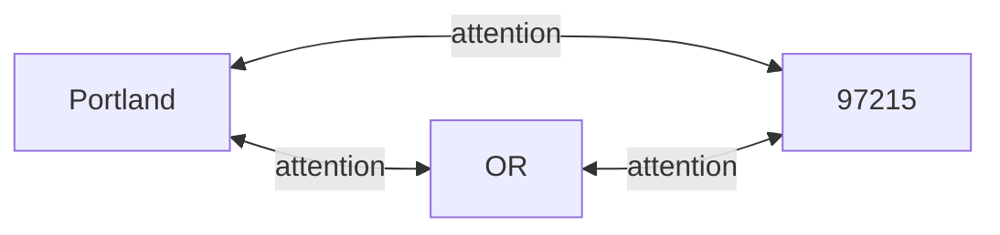
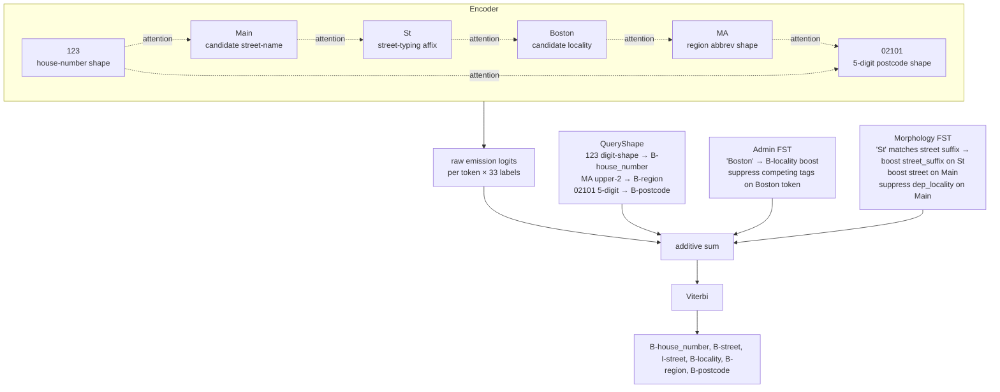

# How the model reasons

What kind of computation does mailwoman's neural parser do? When it looks at
`123 Main St, Boston, MA 02101` and produces `house_number=123, street="Main St",
locality=Boston, region=MA, postcode=02101`, what's the chain of reasoning behind
each label?

This doc lays out the central theory in one place. It exists because the answer
is genuinely interesting and surprisingly hard to pin down — it's not a
context-free grammar, not a context-sensitive grammar, not pure pattern matching,
not "the model just figures it out." It's a layered transducer with soft-fusion
priors, and that distinction has practical consequences for everything from
training-corpus design to inference performance.

## Pipeline at a glance



Six stages. Steps 1, 2, 3, and 6 are deterministic transformations. Steps 4
(the additive priors), 5 (Viterbi), and the encoder itself are where the
interesting reasoning happens.

## The encoder is a transducer, not a grammar

The closest formal analogy is a **neural conditional random field**: a
transformer encoder produces per-token emission distributions, additive priors
adjust those distributions with world knowledge, and a Viterbi pass over the
adjusted distributions finds the best valid label sequence. This is the same
shallow-fusion pattern modern speech recognizers use to blend an acoustic
model with a language model.

It is **not** a context-free grammar. v0 mailwoman (the rule-based ancestor)
was closer to one — each rule classifier fires independently on token features,
and solvers reconcile globally. The neural model doesn't enumerate productions;
it learns continuous-valued biases where each token's interpretation depends
on every other token via attention weights.

It is **not** a context-sensitive grammar either. CSG would require explicit
context-conditioned rules. The neural model learns soft, probabilistic,
context-dependent biases without explicit grammar rules.

The right framing: **the model is a learned soft transducer over the full
input, anchored by world-knowledge priors, with structural validity enforced
by Viterbi.**

## Where context-sensitivity actually lives

When the operator asks "are the right-side discovered placetypes influencing
the left-side specificity?" — yes, in three different places:

### 1. The encoder's bidirectional self-attention

Every token's hidden state is computed via attention over every other token.
This is the strongest form of context-sensitivity in the pipeline.

For `Portland, OR 97215`:



The hidden state for `Portland` is computed with attention weights that include
`OR` and `97215`. Conversely, `OR`'s hidden state attends back to `Portland`.
They co-evolve through the encoder's 6 layers. By the time the emission logits
are produced at the final layer, `Portland`'s "is this a locality?" probability
has been informed by the presence of state-shaped and postcode-shaped tokens
adjacent to it.

This isn't left-to-right or right-to-left. It's all-to-all.

### 2. The FST priors

The admin FST matches token sequences against Who's On First place names.
When `Boston` is recognized as a WOF locality, the prior boosts B-locality on
the matched span — and **suppresses** competing tags like B-street,
B-house_number, B-venue on those same tokens. This is "if you knew the world
knows this is a place, here's negative evidence against the alternatives."

The morphology FST does the symmetric thing for street-typing affixes. When
`Avenue` matches the libpostal street-types dictionary, the prior boosts
B/I-street_suffix on `Avenue` AND boosts B/I-street on the adjacent name
token AND suppresses B/I-dependent_locality on the adjacent name token.

The priors are **additive logit biases** capped at 3.0 logits, composed with
the encoder's emissions via `addEmissionMatrix`:

```ts
final_emissions = encoder_logits
                + queryShape_bias
                + admin_fst_bias
                + morphology_fst_bias
```

This is the shallow-fusion architecture. The encoder is the "acoustic model."
The FSTs are the "language models." Each provides an independent view of
what each token IS; their sum decides what each token GETS classified as.

### 3. The Viterbi decoder

Once the per-token emission distributions are fixed, Viterbi finds the
best label SEQUENCE under the BIO transition mask. BIO grammar says: `I-X`
can only follow `B-X` or another `I-X`; you can't go from `B-locality` to
`I-region`. The Viterbi enforces this globally — once a token's label is
chosen, the next token's label space is constrained.

This is structural context-sensitivity at the label level. The encoder's
per-token decision for `OR` doesn't just depend on `OR`'s context; it
depends on whether the previous token was labeled `B-locality` (in which
case `I-locality` is a candidate but B-region is too) or labeled something
else.

If learned CRF transitions are present (v0.6.4+ with `crf_fp32=true`), those
add a learned probabilistic preference for certain label-pair transitions on
top of the structural mask.

## How street recognition specifically works

For `123 Main St, Boston, MA 02101`:



The encoder's representation of `Main` is built knowing it's between something
that looks like a house-number and something that looks like a street suffix.
That alone gives the encoder a soft signal that `Main` is street-name-shaped.
The admin FST contributes nothing for `Main` (it's not a WOF place). The
morphology FST sees `St` matches and biases `Main` toward `street` (positive)
and away from `dependent_locality` (negative). The sum at `Main`'s position
is dominated by `B-street`. Viterbi chooses the best valid sequence and the
output is what you'd expect.

## What this means for "where do streets begin and end"

The model output is per-token BIO labels. A span begins at the first token
that gets a `B-X` label, and ends at the last token that gets `I-X` before
something else. The boundary is implicit in the BIO sequence, not produced
by a separate "boundary detection" head.

This has consequences. **The model can't have a strong opinion about
boundaries without a strong opinion about labels.** Boundary confusion is
always downstream of label confusion. When `Am Nordkanal 11` (a German
address) gets parsed as a single 3-token street span, it's because the
encoder doesn't have strong enough corpus signal to know that `11` should
be `B-house_number` — not because some boundary classifier failed.

## How this differs from v0

The v0 rule-based parser is closer to a noisy CFG. Each token gets a stack
of classifications from independent classifiers (`HouseNumberClassifier`,
`StreetSuffixClassifier`, `WhosOnFirstClassifier`, etc.). Solvers
(`ExclusiveCartesianSolver`, `MultiStreetSolver`,
`HouseNumberPositionPenalty`, ...) reconcile the stack globally and produce
a ranked list of solutions.

That works well for inputs that fit the rules' coverage. It fails on
inputs that don't. The
[v0-vs-neural harness eval](../evals/2026-05-28-v0-vs-neural-harness.md)
showed v0 at 100% on its own test suite and neural at 14.4% — the v0 rules
are tuned hard to those tests, and the neural is solving a more general
problem with less precision.

But also: the neural model is sometimes BETTER on adversarial inputs that
break v0's assumptions. The falsehoods catalog shows neural winning on
`8 Seven Gardens Burgh` (number-in-street-name) and `R 5, 6-13 Mannheim`
(grid address). v0's rules force a street-shaped reading on these and
get it wrong; the neural correctly stays silent on the components it
can't interpret.

The difference is generalization. v0 has a small competence space with
high reliability inside it. Neural has a large competence space with
softer reliability, anchored by the priors where world knowledge exists.

## The central theory, distilled

**Learn soft, probabilistic, context-dependent token-label biases from
corpus statistics. Anchor them to world knowledge via additive
gazetteer-prior biases. Enforce structural validity via Viterbi over BIO
labels. Project the validated sequence into the hierarchical schema via
deterministic containment rules.**

Each piece has a role:

- **The encoder** learns "what does the surrounding context say about
  this token?" It's the soft, learned, contextual layer.
- **The QueryShape prior** says "what does the token's shape say about
  itself?" Token-local structural features.
- **The admin FST** says "what does the world's gazetteer say about
  this token sequence?" External world knowledge, gazetteer-derived.
- **The morphology FST** says "what does this token's morphology say
  about it being a street-typing affix?" Linguistic structure.
- **Viterbi** says "what's the best globally-valid label sequence given
  all the above?"
- **The tree builder** says "what hierarchical structure does this
  label sequence project into?"

The encoder is necessary but not sufficient. The FST priors anchor the
soft learning in world knowledge. Without them, the model has only
corpus statistics and hopes the training distribution covered the input.
With them, the model gets explicit positive and negative evidence at
inference time that grounds its decisions.

The four-layer street-supplement architecture documented in
[street-supplement-architecture.md](./street-supplement-architecture.md)
extends this with progressively richer street-side priors (morphology →
candidacy → identity → schema). Each layer adds a different kind of
evidence to the additive-bias sum.

## See also

- [Street-supplement architecture](./street-supplement-architecture.md) — the
  layered design that fills the
  [WOF hierarchy gap](./wof-hierarchy-gap.md) at the street level
- [FST gazetteer prior](./fst-gazetteer-prior.md) — the admin FST in detail
- [BIO labels](./bio-labels.md) — the per-token label space
- [Neural classification](./neural-classification.md) — earlier explanation
  of the pipeline (this doc supersedes it as the central theory)
- [Corpus poisoning vulnerability](./corpus-poisoning-vulnerability.md) — what
  the architecture's empirical-learner nature means for training-data risk
