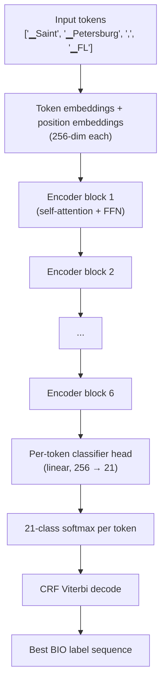

# Neural classification

The neural classifier is a small **transformer encoder** that reads an address as a sequence of tokens and emits one [BIO label](./bio-labels.md) for each token. This article explains what a transformer encoder is, what makes Mailwoman's specific model the shape it is, and what the model is and is not capable of.

## What a transformer encoder does

A transformer encoder takes a list of input tokens and produces a list of output **vectors** (one per token). Each output vector is a numerical representation of "what this token means in the context of the whole sequence".

This is different from older models that processed tokens one at a time. The defining trick of the transformer is **self-attention**: every token gets to look at every other token in the sequence, and learn how much each one matters to its own representation.

Take this input: `"Saint Petersburg, FL"`. After tokenization (let's pretend each word is one token), the encoder receives 4 tokens. Before the encoder runs, each token's representation is just its embedding (a look-up vector from a learned table). After the encoder runs:

- `"Saint"` has been updated to know it is right next to `"Petersburg"`.
- `"Petersburg"` has been updated to know it is preceded by `"Saint"`.
- `"FL"` has been updated to know there is a `","` between it and the locality.

The classifier head on top then takes each updated vector and predicts a BIO label for that token. Because the vector for `"Saint"` knows about `"Petersburg"`, the model can label `"Saint"` as `B-locality` (a locality that continues into the next token).

## The Mailwoman model geometry

Mailwoman's encoder is intentionally small. Real-world geocoding does not need a model with billions of parameters; the task is narrow.

| dimension           | value         | what it controls                                             |
| ------------------- | ------------- | ------------------------------------------------------------ |
| hidden size         | 256           | width of each token's vector                                 |
| layers              | 6             | how many times the self-attention + feed-forward pair stacks |
| attention heads     | 4             | how many parallel attention computations per layer           |
| feed-forward dim    | 1024          | width of the inner feed-forward layer                        |
| max sequence length | 128           | longest input the model can see                              |
| total parameters    | ~8.87 million | the file size proxy                                          |

For comparison: GPT-3 has 175 billion parameters, BERT-base has 110 million. Mailwoman's encoder is about 1/12 the size of BERT-base. We do not need more; address parsing is not a problem that scales with model size beyond a certain point.

The CRF layer at the bottom is covered in [CRF decoder](./crf-decoder.md).

## Why we hand-rolled the encoder block

Most teams use `transformers.BertForTokenClassification` from Hugging Face. Mailwoman doesn't. The reason is hardware: the lab's training GPU is an AMD Radeon 780M (gfx1103 architecture). Two specific incompatibilities forced a hand-rolled implementation:

1. **Flash-attention crashes on this GPU.** The Hugging Face default attention kernel is `flash` or `mem-efficient`, both of which crash on gfx1103 in bf16 mode. We force `math` SDPA (the slowest but most compatible kernel) and never use the fused attention path.
2. **`nn.TransformerEncoderLayer`'s fused forward hangs at batch ≥ 128.** Same root cause — fused kernels for transformer blocks make assumptions the gfx1103 firmware does not honour. We use individual `nn.MultiheadAttention` + `nn.LayerNorm` + linear FFN ops instead.

The result is a hand-rolled `MailwomanCoarseEncoder` class in `corpus-python/src/mailwoman_train/model.py`. The arithmetic is identical to BERT-base's encoder block; only the implementation differs. The cost is some readability; the benefit is the model trains at all on the hardware we have.

## Self-attention in 90 seconds

The math of self-attention is genuinely simple. For each token, the encoder:

1. Computes three vectors from the token's representation: a **query** `Q`, a **key** `K`, and a **value** `V`. These come from three learned linear projections.
2. Computes a similarity score between this token's query and every token's key: `score[i, j] = Q[i] · K[j]`.
3. Normalizes the scores into a probability distribution via softmax across `j`.
4. Computes the output for token `i` as a weighted sum of the values: `output[i] = sum over j of softmax_score[i, j] · V[j]`.

The "attention" is the softmax probabilities: each token decides how much attention to pay to every other token, and updates its own representation accordingly. **Multi-head** attention runs this computation in parallel several times (4, in Mailwoman) and concatenates the results — each "head" can learn to attend to different patterns (e.g. one head learns positional patterns, another learns punctuation-related patterns).

The feed-forward layer that follows each attention layer is a straightforward 2-layer MLP applied independently to each token. It does the per-token transformation that attention does not.

## What this model is capable of

- **Context-aware labelling.** Multi-word components ("Saint Petersburg"), tokens that look like multiple things ("Buffalo"), and components in unusual orders all work because the encoder sees the whole sequence.
- **Graceful handling of typos and casing.** Subword tokenization plus distributed representations mean "Pennsyvana Ave" is not completely unfamiliar to the model.
- **Locale-specific patterns.** Trained on en-US + fr-FR data, the model has internalized the conventions of both.

## What this model is not capable of

- **Generating text.** This is an **encoder-only** model. It cannot write addresses; it can only label them.
- **Cross-locale generalization.** A model trained on en-US + fr-FR addresses will not parse Japanese addresses well. Each new locale needs its own training run and its own weights package.
- **Free-text understanding.** "I live near the corner of 5th and Main, just past the Starbucks" is conversational, not address-shaped. The model is trained on structured addresses and will struggle with prose.
- **Resolving.** The model labels parts of a string. It does not look anything up. That job belongs to the [resolver](./resolver-and-wof.md).

## Where this lives in the code

- **Model implementation:** `corpus-python/src/mailwoman_train/model.py` (`MailwomanCoarseEncoder`)
- **Training entry point:** `corpus-python/src/mailwoman_train/train.py`
- **Inference (TypeScript):** `neural/classifier.ts`, `neural-web/web-onnx-runner.ts` (browser path)
- **The exported model file:** `packages/neural-weights-en-us/model.onnx` (about 25 MB int8-quantized)

## See also

- [BIO labels](./bio-labels.md) — what the model outputs
- [CRF decoder](./crf-decoder.md) — what sits on top of the encoder
- [ONNX runtime](./onnx-runtime.md) — how the model runs in production
- [Training pipeline](./training-pipeline.md) — how the model gets its weights
