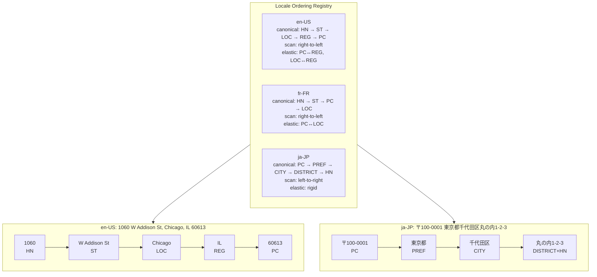

# Positional constraint propagation

An address is an ordered hierarchy. Every US address, regardless of formatting, respects one ordering constraint:

```
house_number → street → [unit | venue] → locality → region → country → postcode
```

You will never see `Main St 123 Chicago`. You will never see `IL Chicago`. The ordering is the invariant — formatting is surface variation.

This invariant is a constraint propagation engine. Given one confirmed classification (say, the resolver confirms "Chicago" as a locality at position N), the constraint propagates in both directions: backward (position N-1 cannot be region, country, or postcode — it must be street, house number, unit, or venue) and forward (position N+1 cannot be street or house number — it must be region, country, or postcode). Each confirmed component narrows the classification space for its neighbors.

A span knows what it is by knowing what the spans around it cannot be. See [The knowledge ladder](../understanding/our-approach/the-knowledge-ladder.md) for how this principle distributes across the pipeline stages.

## The right-to-left scan model

Think of the system as a Turing machine that scans the address from broadest to most precise. In US addresses, the broadest components (postcode, region) are on the right. The machine starts there and propagates constraints leftward:

```mermaid
flowchart RL
    subgraph step5["Step 1: rightmost span"]
        s5s["Surface: 5 digits"]
        s5v["→ POSTCODE (0.95)"]
    end

    subgraph step4["Step 2: constraint propagates left"]
        s4s["Surface: 2-letter uppercase"]
        s4p["Position: before postcode → region ✓"]
        s4v["→ REGION (0.90)"]
    end

    subgraph step3["Step 3: constraint propagates left"]
        s3s["Surface: alpha, FST match"]
        s3p["Position: before region → locality ✓"]
        s3v["→ LOCALITY (0.85)"]
    end

    subgraph step2["Step 4: constraint propagates left"]
        s2s["Surface: 'St' suffix + directional"]
        s2p["Position: before locality → street ✓"]
        s2v["→ STREET (0.90)"]
    end

    subgraph step1["Step 5: constraint propagates left"]
        s1s["Surface: pure digits"]
        s1p["Position: before street → house_number ✓"]
        s1v["→ HOUSE_NUMBER (0.90)"]
    end

    step5 -->|"confirms"| step4
    step4 -->|"constrains"| step3
    step3 -->|"constrains"| step2
    step2 -->|"constrains"| step1
```



At each step, classification is the product of **surface form** (regex, FST lookup, format patterns) and **positional constraint** (what CAN appear here given what is confirmed to the right). Where they agree, confidence is high. Where they conflict, surface form wins — the positional constraint prunes impossible types but does not override unambiguous evidence.

:::warning Where it breaks
`Washington, WA` scans right-to-left: "WA" confirms as region. The positional constraint says "preceding span is sub-region: locality, street, or venue." The FST matches "Washington" as both locality (DC, importance 0.815) and region (WA state, importance 0.764). Surface form + FST importance pick DC — **wrong.** The region-aware locality guard fixes this: it checks "does the candidate text match the confirmed region's full name?" and suppresses the locality bias when it does. Surface form wins when unambiguous; positional constraint wins when surface form is ambiguous.
:::

## Sequence elasticity

The canonical ordering is a law, but human input is sloppy. People flip the state and ZIP code. They omit the locality. They put the postcode first. The system needs tolerance for common transpositions without treating them as errors.

**Sequence elasticity** measures how far a component can move from its canonical ordinal position before incurring a confidence penalty:

- **Free transpositions:** adjacent swaps within the same administrative level. `Chicago IL 60613` and `Chicago 60613 IL` are both valid — postcode and region are adjacent in the canonical order and people swap them constantly. Zero penalty.
- **Elastic deformation:** non-adjacent swaps. `IL 60613 Chicago` puts the region before the locality — 2 slots of displacement. Confidence penalty proportional to distance.
- **Structural violation:** impossible sequences regardless of displacement. A house number after a postcode is never valid in any locale. Hard veto.

The system does not need to enumerate every valid ordering. It needs a canonical ordering per locale and a penalty function for displacement from that ordering. v0 had this in `HouseNumberPositionPenalty` and `PostcodePositionPenalty` — locale-gated, hand-tuned confidence penalties for components appearing in unexpected positions.

## Locale ordering registry

The scan direction and canonical order are locale-specific. The system adapts by defining three properties per locale:



The three properties:

1. **Canonical order** — the expected component sequence from most specific to broadest. Determines which components are "before" and "after" each other.
2. **Scan direction** — derived from canonical order. Always scan FROM the broadest components TOWARD the most specific. US scans right-to-left. JP scans left-to-right.
3. **Elasticity bounds** — which adjacent swaps are free, which cost confidence, which are forbidden. Locale-specific because conventions differ: US freely swaps postcode and region, while JP addresses are rigidly ordered.

## Where this lives in code

The Turing machine model is not a single stage. It is the principle that multiple stages implement:

| Concept                       | Implementation                                | Stage |
| ----------------------------- | --------------------------------------------- | ----- |
| Rightmost component detection | QueryShape postcode/region detection          | 2     |
| Leftward constraint bias      | QueryShape locality prior (+2.0)              | 3     |
| Gazetteer constraint          | FST prior (importance-weighted)               | 3.5   |
| Structural sequence veto      | CRF transition mask (B-loc → I-street = -inf) | 4     |
| Gap-filling from constraints  | Grouper-audit (provisional nodes)             | 4.5   |
| Hierarchy confirmation        | WOF resolver (concordance scoring)            | 6     |

No stage owns the full constraint propagation. Each stage applies one facet of it. The principle emerges from their composition — which is why the staged pipeline contract matters: break a stage's contract and the constraint chain breaks with it.

## See also

- [The knowledge ladder](../understanding/our-approach/the-knowledge-ladder.md) — where this principle fits in the layer taxonomy
- [FST gazetteer prior](./fst-gazetteer-prior.md) — how gazetteer matches produce emission biases
- [CRF decoder](./crf-decoder.md) — how BIO sequence constraints enforce structural validity
- [The staged pipeline](../understanding/our-approach/the-staged-pipeline.md) — why the stages are composed this way
