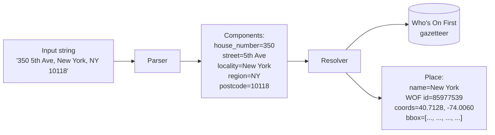

# Resolver and Who's On First

**Parsing** answers "what kind of thing is each part of this string?". **Resolving** answers "where is the resulting place?". They are different jobs and Mailwoman keeps them apart on purpose.

This article explains what the resolver does, why we use [Who's On First](https://whosonfirst.org/) as the gazetteer, and the design of the SQLite distribution that powers both the server-side and browser-side resolvers.

## The two-step model

Splitting the responsibility:

- **The parser** is locale-aware and structure-aware. It does not need to know that "New York" is a place. It needs to know that "New York" is being used as a locality.
- **The resolver** is data-driven. It does not need to understand grammar. It needs a fast index that maps "New York" + "NY" + "10118" to a single canonical place.

This split is also what lets the parser and resolver evolve independently. The parser can be retrained without touching the gazetteer. The gazetteer can be updated without retraining the parser.

## Why Who's On First

[Who's On First](https://whosonfirst.org/) (WOF) is an open gazetteer maintained by SFO Museum. It covers ~30 million places worldwide with stable IDs, polygon geometries, hierarchical relationships, and multi-language names.

Reasons Mailwoman picked WOF:

- **Open licence (CC-BY 4.0).** Compatible with Mailwoman's own AGPL licence.
- **Stable IDs.** A place's WOF ID does not change when its name changes or its borders shift. This is essential for cross-referencing.
- **Hierarchy.** Every place has a parent (Brooklyn → Kings County → NY → US). Useful for resolving ambiguous queries.
- **Multi-language names.** Each place has a primary name plus translations and historical names. "Munich" / "München" / "Monaco di Baviera" all resolve to the same WOF ID.
- **Used by Pelias.** Mailwoman inherited the choice from Pelias's design.

The WOF data is published as GeoJSON files (one per place), which is great for archival but slow for inference. Mailwoman uses the **SQLite distribution** ([data.geocode.earth/wof/dist/sqlite/](https://data.geocode.earth/wof/dist/sqlite/)) prepared by the Pelias team — same data, but in a single indexed SQLite database that responds to queries in microseconds.

## What the resolver does

Given the parsed components, the resolver:

1. **Builds a query** prioritizing the most-specific available component. Postcode > locality > region. A `(postcode=10010)` query is more specific than `(locality=New York)` which is more specific than `(region=NY)`.
2. **Runs a candidate search** against the WOF SQLite database, optionally using full-text search on the locality name. The result is a ranked list of candidate places.
3. **Scores candidates** using signals like population (more populous places rank higher), match strength (exact match beats fuzzy match), and component agreement (if both the postcode and the locality match the same WOF place, that's a strong signal).
4. **Returns the top candidate** plus its bounding box and coordinates.

The candidate-search step is where the indexes pay off. Mailwoman's WOF distribution has:

- A **FTS5 full-text index** on names with prefix-query support ("New Yo\*" matches "New York").
- An **R\*Tree spatial index** for proximity queries (which places are near these coordinates?).
- A **column index on `wof:population`** for population-weighted ranking.
- **Multi-shard support** so different subsets (postcodes, localities, countries) can live in separate database files.

These were shipped through Phase 4 of the implementation plan; see [PHASE_4_resolver.md](../plan/phases/PHASE_4_resolver.md) and its subphase files for the details.

## The slim distribution for browsers

The full WOF SQLite database is about 1.5 GB. That is too large to ship to a browser.

Mailwoman built a **slim distribution** for the browser demo:

- **Top 1,000 US localities** by population.
- **All US postcodes** (~42,000 entries).
- Just the columns the resolver actually uses (name, parent IDs, coordinates, bounding box, population).
- Output: ~35 MB compressed, ~80 MB uncompressed.

The slim build is generated by `corpus/scripts/build-wof-slim.ts` and the demo loads it via `@mailwoman/resolver-wof-wasm` (which wraps `sqlite-wasm`).

The full distribution is what the server-side resolver uses; the slim is what the browser uses. Both expose the same query API.

## The 22% postcode placeholder problem

Worth knowing because it has bitten Mailwoman's eval scores: WOF ships placeholder lat/lon `(0, 0)` for about 22% of US postcodes. The data quality is on WOF's roadmap to fix but the placeholders are real today.

Mailwoman's resolver drops any candidate whose coordinates are `(0, 0)` from results. The demo's `FailureDiagnostic` panel surfaces this case explicitly when a postcode-only query returns no usable hits ("WOF ships placeholder lat/lon for ~22% of US postcodes — known issue").

## What the resolver does not do

- **Address-point lookup.** Given `"350 5th Ave, New York"`, the resolver returns the centroid of New York City, not the precise rooftop of 350 5th Ave. Rooftop-precision geocoding requires a different dataset (commercial address-point databases) and is out of scope for the open Mailwoman pipeline.
- **Reverse geocoding.** "What place is at coordinates (40.7128, -74.0060)?" is a separate query shape. The R\*Tree index supports it but the public Mailwoman API does not expose a reverse-geocode endpoint today.
- **Routing.** "How do I get from A to B?" is a graph problem on the road network, not a gazetteer query.

## Where this lives in the code

- **Server resolver:** `resolver-wof-sqlite/` (uses `better-sqlite3`)
- **Browser resolver:** `resolver-wof-wasm/` (uses `@sqlite.org/sqlite-wasm`)
- **Slim builder:** `corpus/scripts/build-wof-slim.ts`
- **Demo integration:** `docs/src/pages/demo/index.tsx` (the cascade + the `FailureDiagnostic` panel)
- **Phase plan:** [PHASE_4_resolver.md](../plan/phases/PHASE_4_resolver.md) + subphases

## See also

- [What is an address?](../understanding/the-problem/what-is-an-address.md) — the components the resolver receives
- [How it works now](../understanding/our-approach/how-it-works-now.md) — where the resolver fits in the live demo flow
