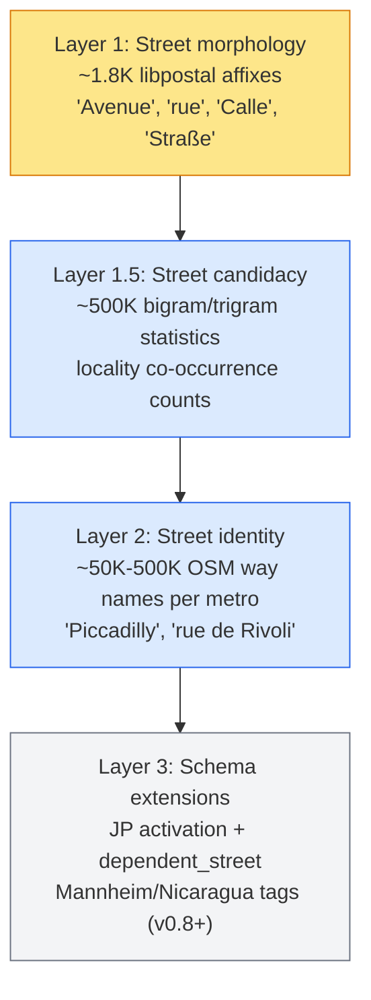

# Street-supplement architecture

This is the design reference for the work that fills the [WOF hierarchy gap](./wof-hierarchy-gap.md). It synthesizes the architectural decisions reached during the v0.6.1 postmortem and the subsequent design consult. Code in `neural/`, `resolver-wof-sqlite/`, and `core/` refers back here; this article tells you why each piece looks the way it does.

The high-level shape: WOF's placetype hierarchy stops at `address` and has no street node. Mailwoman's tag schema promises a street layer but the inference-time prior (the FST gazetteer) does not back it. Four layers fill the gap, plus a fifth piece (brand FST) and a sixth (locality-conditional gating) sit alongside them. Each layer addresses a different vacuum; they don't substitute.

## The four layers



Each layer's contribution is additive and non-overlapping. Examples:

| Input string | Layer 1 (morphology) | Layer 1.5 (candidacy) | Layer 2 (identity) |
|---|---|---|---|
| `Elm Avenue` | matches "Avenue" affix → adjacent "Elm" → street | "elm_avenue" has high locality co-occurrence | (not needed) |
| `Piccadilly Lane` (novel) | matches "Lane" affix → "Piccadilly" → street | "piccadilly_lane" has moderate co-occurrence | (not in OSM) |
| `Piccadilly` (no suffix) | no signal | "piccadilly" has London co-occurrence | direct match in London FST |
| `Plein 1944` | no signal | "plein_1944" has Nijmegen co-occurrence | direct match in NL FST |
| `Health Clinic` | matches no street affix | zero locality co-occurrence → strongly NOT street | (not in OSM as a street) |

Layer 4 (brand FST for franchise venues) is parallel, not subordinate. Layer 5 (locality-conditional hierarchy gating) is meta — it modulates which layers are active per country.

## Schema storage: flat ComponentTag, not WOF emulation

Mailwoman's tag schema lives in two files:

- `core/types/component.ts` — `ComponentTag` TypeScript discriminated union
- `core/decoder/containment.ts` — `PARENT_OF: Partial<Record<ComponentTag, ComponentTag[]>>` child→parent map

**This stays the source of truth.** A tempting alternative is to store our extensions in WOF placetype JSON format (`wof:id`, `wof:name`, `wof:role`, `wof:parent`) so tooling that already consumes WOF placetypes works transparently. That alternative is rejected:

1. **Ontology mismatch.** WOF placetypes answer "what kind of geographical feature is this?" Mailwoman component tags answer "what role does this span play in an address?" `street` is not a placetype — it's a linear feature with no WOF identity. `house_number` is not a place at all. `unit` is a building subdivision, not a feature.
2. **ID-space fragility.** WOF issue #246 explored adding `lane`, `block`, `parish`. Any "private" ID range is a latent collision with a future WOF allocation.
3. **TypeScript exhaustiveness.** The `ComponentTag` discriminated union forces the compiler to flag every code path that doesn't handle every tag. Runtime-loaded JSON has no such guard, and the schema will evolve.
4. **DAG direction.** WOF's `wof:parent_id` and mailwoman's `PARENT_OF` both encode child→parent, but WOF format has no native "valid children" field — you'd compute it from parents anyway, which is what `PARENT_OF` already does.

When tooling needs WOF-format output (the `wof tree` command, external consumers), use a serialization shim:

```ts
function toWofPlacetypeProjection(tag: ComponentTag): {
  wof_id: number          // Mailwoman-reserved 2_000_000_000+ range
  wof_name: string
  wof_role: PlacetypeRole // common / common_optional / optional
  wof_parent_ids: number[]
}
```

The shim is one-direction — WOF placetype JSON never feeds back into the schema definition. The `2_000_000_000+` ID range is 32-bit unsigned above any realistic WOF allocation.

## Component containment decisions

The current containment map (`core/decoder/containment.ts`) was built incrementally and reflects pre-WOF-gap thinking. Three changes lock in from the design consult:

### Intersection restructure (deferred — not zero-risk after all)

Current: `street → [intersection_a, intersection_b]` (both intersection_a and intersection_b parent directly to street).

Proposed: `street → intersection → [intersection_a, intersection_b]` mirroring WOF's `intersection` placetype.

**Initially framed as zero-risk during the design consult. On verification it isn't.** Two problems:

1. **BIO dim coupling.** `ComponentTag` is the BIO label space — adding `intersection` extends `BIO_LABELS` from 33 to 35 entries, which doesn't directly match v0.6.0/v0.6.1 weight output dim. This part is sidestep-able via tail-append (the same trick `STAGE1_BIO_LABELS` → `STAGE2_BIO_LABELS` already uses): existing 33-dim weights still index-align with the first 33 labels, and the new B-intersection/I-intersection labels at the tail simply never get argmaxed.
2. **PARENT_OF rewiring breaks current behavior, even with tail-append.** If `intersection_a/b` no longer parent to `street`/`locality` and the model can't emit `intersection` proposals (no training labels for it), then `intersection_a/b` fall through to root. The existing containment carries real parsing semantics that the rewrite would lose.

The right path: defer the intersection restructure to v0.7+ when the new tag can be properly added to the training corpus + golden set + retrained model bundle. Until then, the current flat `intersection_a/b → street` containment stays — it's a known limitation but not a regression vector.

This is a useful reminder: schema changes that look like "just one line in PARENT_OF" interact with the model output dim and the labeled corpus. The architecture-doc-then-code-then-verify loop caught the issue before code landed.

### Private mailbox folds into unit

`#PMB 456` is structurally identical to `#Apt 4` — a designator inside a delivery address. No new tag. The synthesizer that produces po-box training data already handles PMB variants in its surface forms.

### Dependent street is a real gap

`6 Elm Avenue, Runcorn Road, Birmingham` (Royal Mail dependent-street format) cannot be expressed with the current schema. Adding `dependent_street` is v0.7+ scope, gated on UK PAF corpus availability. Containment: `street → dependent_street` (a street contains an optional dependent street).

### Venue + po_box stay as siblings

`CULLEN INSULATION INC, POBOX 3211 FARGO ND 58108`: venue is the addressee, po_box is the delivery endpoint. The containment should NOT make po_box a venue-parent. Both remain siblings under locality; the resolver cross-references them at lookup time.

## Locality-conditional hierarchy gating

Different countries use mutually-incompatible address grammars:

- US/UK/AU: `[number] [street] [city] [state] [postcode]`
- FR/DE/IT: `[number] [street-type] [street-name] [postcode] [city]` — front-descriptor
- JP: `[prefecture] [municipality] [district] [block] [sub_block]` — no streets
- NL compact: `Gondel 2695` — street and number fused
- Mannheim grid: `R 5, 6-13` — block-row-range, no street

The model must condition tagging on which grammar applies. **The mechanism: admin FST country resolution + `addressing-conventions.json` data file.**

The admin FST already resolves country at Viterbi time — `PlaceEntry.parentChain` includes country. The convention lookup is a per-country mask applied to emission and transition biases:

```json
{
  "JP": {
    "primary_tags": ["prefecture", "municipality", "district", "block", "sub_block"],
    "street_tags": [],
    "building_tags": ["building_number", "building_name"],
    "postcode_position": "before_city"
  },
  "US": {
    "primary_tags": ["street", "house_number"],
    "street_tags": ["street_prefix", "street", "street_suffix"],
    "building_tags": ["unit"],
    "postcode_position": "after_state"
  },
  "default": "..."
}
```

When the convention's `street_tags` is empty (Japan), the transition mask suppresses `B/I-street_prefix`, `B/I-street`, `B/I-street_suffix`. When the convention specifies `postcode_position: "before_city"`, transition probabilities are biased to expect postcode tokens before locality tokens.

Rejected alternatives:

- **Multi-hot locale flag on input.** Too coarse — "US" contains urban street, rural route, and PO-only conventions.
- **Speculative parsing** (try JP grammar, then US, compare scores). Multiplicative latency. At 50ms × 10 candidates = 500ms/address.
- **Hierarchy data in PlaceEntry.** Makes the FST carry two ontologies (place identity + address grammar). Category error.

Country-level granularity is the right v0.7 scope. Within-country variations (US urban vs rural) are v0.8+.

## Layer specifications

### Layer 1: Street morphology FST

**Data source:** `core/data/libpostal/dictionaries/{60 locales}/street_types.txt`, pipe-delimited surface forms per line (e.g. `avenue|av|ave|aven|avenu|avn|avnu|avnue`).

**Schema:** Extend `PlacetypeId` in `resolver-wof-sqlite/fst-types.ts` with `"street_affix"`. Update `PLACETYPE_ORDER` in BOTH `resolver-wof-sqlite/fst-serialize.ts:38` AND `resolver-wof-sqlite/fst-deserialize-web.ts:23` — they're duplicated by design and silent corruption otherwise.

**Build:** `resolver-wof-sqlite/street-morphology-fst-builder.ts` walks all `street_types.txt` files, normalizes each variant token, inserts into trie. Determinize + minimize via existing FST builder primitives. Output: `fst-street-morphology.bin` (~100KB).

**Inference:** `neural/street-morphology-prior.ts` — two-pass bias function:

1. **Pass 1.** For each token that matches an affix entry, bias toward `B/I-street_prefix` (if affix is locale-prefix-position) or `B/I-street_suffix` (if locale-suffix-position).
2. **Pass 2.** For each matched affix span, identify the adjacent name-token (preceding for suffix-position, following for prefix-position). Bias adjacent token toward `B/I-street` AND **away from** `B/I-dependent_locality`. The negative bias is the load-bearing piece — it closes the vacuum identified in the [v0.6.1 failure mechanism](../evals/2026-05-28-night-2-postmortem.md).

**Wiring:** Add `fstStreetMorphology?: FstMatcherLike` to `ParseOpts` in `neural/classifier.ts`. Apply via `addEmissionMatrix` after the existing admin FST bias. Same 3.0-logit cap.

**Locale handling:** Build a single combined FST containing all locales — the morphology data is small enough (60 locales × ~30 affix lines × ~5 variants = ~9K entries) that per-locale sharding is unnecessary. Position (prefix vs suffix) is encoded in the `PlaceEntry` payload, not derived per-entry at query time.

### Layer 1.5: Street candidacy lookup

**Data source:** Existing training corpus (OpenAddresses + WOF + synth shards). Not external OSM — distributional consistency with what the model was trained on matters more than data-source independence.

**Build:** One-pass scan over training-corpus bigrams and trigrams. For each n-gram, count distinct localities (keyed by WOF `wof_id` to avoid Springfield-style conflation) where the n-gram appears adjacent to a labeled locality span.

**Output format:** Flat `(ngram → count)` lookup table, compact binary or compressed JSON, ~500K entries.

**Inference:** `neural/street-candidacy-prior.ts` — for each bigram and trigram in the input token sequence, look up the count, scale to a bias magnitude (sigmoid or log-scale), apply as a third emission-bias matrix via `addEmissionMatrix`. Same integration shape as morphology.

**Cold-token fallback:** Unknown n-grams produce zero candidacy signal — fall through to Layer 1 heuristics.

**Status:** Spec'd, not built. Lands after Layer 1 results inform whether candidacy buys additional headroom.

### Layer 2: Street identity FST

**Data source:** OSM way names. First POC is NYC-only (~50K street names) to validate the pipeline:
- OSM way → `(name, parent_locality_id)` pair extraction
- Dedup across boroughs (Brooklyn vs Manhattan have streets with the same name)
- Parent-chain assignment from WOF locality IDs

**Build:** Reuse existing `fst-builder.ts` infrastructure. `PlacetypeId` extends with `"street"`. Same `PlaceEntry` shape as admin places — `wof_id` synthesized from the OSM way ID, `parentChain` pointing to the WOF locality.

**Inference:** Reuses Layer 1's `fstStreetMorphology` integration point (same `addEmissionMatrix` call, different binary). Layer 2 supersedes Layer 1's role for streets the FST knows about; Layer 1 stays active for novel street suffixes the FST doesn't.

**Scoping:** Per-metro sharding. NYC POC validates the approach; metro expansion is gated on POC results.

**Status:** v0.7+. Multi-shift work — OSM extraction, dedup, parent-chain assignment, metro packaging.

### Layer 3: Schema extensions

**For Japan (activation, not addition):** The schema already has `prefecture`, `municipality`, `district`, `block`, `sub_block`, `building_number`, `building_name` declared in `core/types/component.ts` and in `PARENT_OF`. They're inactive — no golden-set entries, no training. The work is:

1. JP corpus adapter (ingest Japanese address data, likely from OpenAddresses-JP or government sources)
2. JP golden-set entries (~200-500 labeled JP addresses)
3. JP model training (likely a separate `@mailwoman/neural-weights-ja-jp` bundle)
4. JP-specific FST (Japanese place names + Japanese block-level data)

No new tags needed. The locality-conditional gating (above) is what activates them in inference.

**For Mannheim grid, Nicaragua landmarks, dependent_street:** New tags needed. v0.8+ scope.

### Layer 4: Brand FST (franchise venues)

**Status:** Resolver-side concern, not parser-side. The parser keeps classifying brand-name spans as `venue`. A brand FST — structurally identical to the street identity FST — maps known brand names → venue-confidence boosts at resolver lookup time.

**Brand-alias problem:** McDonald's = Macca's = マクド = McDo = Mek. These are not translations — they're co-referential aliases. The brand FST entries should encode alias-equivalence at build time so the resolver matches any variant.

**No `venue_chain` tag.** A chain instance is a specific venue, not a new component type. Schema unchanged.

See [`docs/articles/understanding/exotic-poi/franchise-queries.md`](../understanding/exotic-poi/franchise-queries.md) for the user-facing problem statement.

### Human-factor confidence penalty

**Status:** Parallel to all the FST work, lives downstream of Viterbi.

**Module:** `neural/confidence-penalty.ts` — pure function over `(span, rawText) → penalty`. Pattern penalties:

- Missing comma between city/state
- Inconsistent casing within a span
- Ambiguous abbreviations (`CA` for California vs `ca.` for "circa")
- Mixed scripts within a span

Applied to span-level confidence scores only. Zero contamination of emission or transition layers — the model's logits stay unmodified. This is calibration-side, not classification-side.

## Sequencing

| Phase | Layers | Time horizon |
|---|---|---|
| v0.6.x polish | Layer 1 build + golden-set eval | 1 shift (done) |
| v0.6.2 retrain | Negative-example corpus augmentation + Layer 1 prior at inference | 1-2 shifts |
| v0.6.x continued | Layer 1.5 if v0.6.2 leaves residual hallucinations | 1 shift |
| v0.7.0 | Locality-conditional gating + JP activation + Layer 2 NYC POC | 3-4 shifts |
| v0.7.x | Layer 2 metro expansion, Layer 4 brand FST | per-metro / per-brand |
| v0.8+ | Mannheim grid, Nicaragua landmarks, dependent_street | scope work |

**Important caveat from the 2026-05-28 Layer 1 eval:** Layer 1 alone, applied as a decoder-only
fix on v0.6.1 weights, does NOT suppress v0.6.1's 1066 dep_locality hallucinations. The
mechanism works monotonically (hallucinations drop as the dep_locality penalty is strengthened)
but the model's overconfidence on synth-street-induced predictions is too high for any practical
decoder-time bias to flip. **Layer 1's correct deployment is alongside a v0.6.2 retrain that
includes O-tagged street slots in the corpus** — the prior provides additive inference-time
anchoring on a better-trained backbone. The infrastructure landed in v0.6.x polish is the right
scaffolding for that retrain. Full eval data:
[Layer 1 eval (2026-05-28)](../evals/2026-05-28-layer-1-morphology-fst.md).

The intersection restructure is a free win — orthogonal to layers, can land any shift.

## See also

- [WOF hierarchy gap](./wof-hierarchy-gap.md) — the original observation that motivated this design
- [FST gazetteer prior](./fst-gazetteer-prior.md) — the existing admin FST infrastructure that Layer 1/1.5/2 extend
- [FST gazetteer LM reference](../plan/reference/FST_GAZETTEER_LM.md) — Phase 2 (streets) is the Layer 2 implementation plan
- [Falsehoods about street names](../understanding/why-its-hard/falsehoods-streets.md) — catalog of edge cases each layer addresses
- [Franchise and brand queries](../understanding/exotic-poi/franchise-queries.md) — Layer 4 user-facing context
- [v0.6.1 error analysis](../evals/v0.6.1-error-analysis.md) — empirical regression that surfaced the gap
- [2026-05-28 night-shift postmortem](../evals/2026-05-28-night-2-postmortem.md) — postmortem that triggered this design consult
