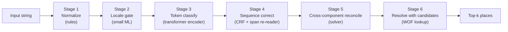

# The staged pipeline

Reading [Addresses that break geocoders](./addresses-that-break-geocoders.md) makes one thing obvious: no single model handles every failure class well. Different failures want different fixes. Some want preprocessing rules, some want a small classifier, some want a transformer, some want a resolver that returns candidates instead of pretending to be sure.

This article sketches the runtime as **six stages**, three of which are learned (ML) and three of which are deterministic. The current Mailwoman ships stages 3, half of 4, the solver portion of 5, and a thin 6 — stages 1, 2, and the second-pass piece of 4 are still ahead of us.

## The picture

The interfaces between stages matter as much as the stages themselves. Each handoff is a typed boundary that can be evaluated, versioned, and rolled back independently.

## Stage 1 — Normalize (deterministic)

**What it does.** Takes the raw input string and applies a fixed sequence of normalisation rules: Unicode NFC, case folding (locale-aware where applicable), abbreviation expansion, whitespace collapse, punctuation normalisation.

**Failures it owns.**

- Tokenization and whitespace traps ([#3 in the failure catalogue](./addresses-that-break-geocoders.md#3-tokenization-and-whitespace-traps)) — `"12 1/2 Main St"` and `"12½ Main St"` collapse to a canonical form before the tokenizer sees them.
- Unicode/transliteration encoding half ([#6](./addresses-that-break-geocoders.md#6-unicode-and-transliteration-traps)) — NFC ensures the resolver does not miss `"São"` because the input was NFD-encoded.

**Today.** Scattered hooks inside the tokenizer and various adapter pre-processors. No single named stage with its own interface.

**Future.** A `Normalizer` interface with a public `normalize(input: string, locale?: string): NormalizedString` that any caller (parser, resolver, eval harness) can use. The output type carries the original string alongside the normalized one so character-offset reconstruction still works.

## Stage 2 — Locale gate (small ML)

**What it does.** Looks at the normalized input and decides which downstream weights to load and which normalisation rules to keep applying. The decision could be a tiny character-level classifier ("Latin / Cyrillic / CJK / Arabic / mixed?") followed by a per-script locale guess.

**Failures it owns.**

- Unicode/transliteration script-handling ([#6](./addresses-that-break-geocoders.md#6-unicode-and-transliteration-traps)) — picks the right tokenizer and weights for the script.
- Language-switch hybrids ([#7](./addresses-that-break-geocoders.md#7-language-switch-hybrids)) — when the input mixes scripts, the gate either picks a hybrid-trained weights package or falls back to a multi-locale ensemble.

**Today.** Missing. The consumer's API call specifies the locale; if they pick wrong, the wrong weights load.

**Future.** A small fast model (~100 KB) that reads the first 200 characters of input and emits a locale tag plus a confidence. Below a threshold, fall back to ensembling across multiple locales' weights — expensive but correct.

## Stage 3 — Token classify (transformer encoder)

**What it does.** The current Mailwoman model. Subword tokenizer + 6-layer transformer encoder + 21 BIO output head per token. Detailed in [Neural classification](./neural-classification.md).

**Failures it owns.**

- Street/locality collisions ([#4](./addresses-that-break-geocoders.md#4-streetlocality-collisions)) — the encoder sees the whole sequence and learns that `"Paris"` near `"Cafe"` is part of a venue, while `"Paris"` between `","` and `"Ontario"` is a locality.

**Today.** Shipped at v3.0.0. The model is small (~9M parameters) and that is by design. Address parsing is not a problem where bigger LLMs help.

**Future.** Larger context window (today 128 tokens; 256 would cover longer addresses without truncation), more locales, continued corpus expansion. The model itself does not need to fundamentally change — it needs better data and better decoding.

## Stage 4 — Sequence correct (CRF + span re-reader)

**What it does.** Two sub-pieces:

- **CRF** ([CRF decoder](./crf-decoder.md)) — enforces BIO structural validity at decode time. Today.
- **Span re-reader** — when stage 3 emits a span with low confidence, or two overlapping high-confidence proposals, re-run the encoder on that span alone with extra structural conditioning (the neighbouring labels as additional context). Adds new alternatives rather than narrowing existing ones — graceful-failure-friendly. Future.

**Failures it owns.**

- Ambiguous locality names ([#1](./addresses-that-break-geocoders.md#1-ambiguous-locality-names)) — the re-reader gives the model a second look at `"Paris"` with structural priors that the next token is a region/country.
- Repeated admin names ([#2](./addresses-that-break-geocoders.md#2-repeated-admin-names)) — BIO structure + re-reader together handle `"New York, New York"` as two adjacent localities.
- Numeric chaos ([#5](./addresses-that-break-geocoders.md#5-numeric-chaos)) — the CRF prevents structurally-impossible label combinations; the re-reader can revisit `"12345 123rd St"` after the rest of the sequence is labelled.

**Today.** CRF runs at training time and at Python eval time; JavaScript runtime uses per-token argmax. v0.4.0 ([issue #116](https://github.com/sister-software/mailwoman/issues/116)) ports Viterbi to JavaScript. The span re-reader is not built.

**Future.** The re-reader can be a fine-tuned head on the same encoder (cheap) or a small dedicated model (more expensive, higher ceiling). Either way it stays additive: it can only propose new alternatives, never delete existing ones. Constraint-based, not narrowing.

## Stage 5 — Cross-component reconcile (solver, deterministic today)

**What it does.** Takes the union of proposals from rule classifiers and the neural classifier and picks the best **self-consistent set of components**. "Self-consistent" means: spans don't overlap, components agree where they should (postcode hint matches region hint), and the total confidence is maximised.

**Failures it owns.**

- The consistency portion of numeric chaos ([#5](./addresses-that-break-geocoders.md#5-numeric-chaos)) — when `"12345"` could be a house number or a postcode, the solver picks based on what makes the rest of the sequence consistent.
- The hybrid-policy decision in general ([Rule-based classifiers](./rule-based-classifiers.md#how-rule-classifiers-and-the-neural-classifier-coexist)) — for each component, the policy registry says whose proposal wins.

**Today.** Hand-coded in TypeScript, lives in the v1 solver. Works fine.

**Future.** Could be learned (a tiny reranker) but probably should not be. Rule-based solvers are explainable and easy to debug; the current implementation is not the bottleneck.

## Stage 6 — Resolve with candidates (deterministic + retrieval)

**What it does.** Takes the final component bundle and queries the WOF gazetteer. Returns a ranked list of candidates, not a single point.

**Failures it owns.**

- Administrative nightmares ([#8](./addresses-that-break-geocoders.md#8-administrative-nightmares)) — `"Springfield"` with no region produces 41 candidates. The honest answer is to surface the list, not pretend one is correct.

**Today.** [Resolver and Who's On First](./resolver-and-wof.md) does one ranked result and a `FailureDiagnostic` panel for empty cases. Returning a candidate list is a small API change away.

**Future.** Top-k API with explicit "we are not sure which" responses. Consumers that need a single point can pick the top candidate; consumers that need to disambiguate (UI workflows, batch tools) get the alternatives.

## Why six stages and not one

A monolithic model that does everything would be:

- harder to evaluate (one number to track instead of six)
- harder to debug (a regression somewhere is a regression everywhere)
- harder to roll back (one model version, no per-stage fall-backs)
- harder to ship to constrained environments (every consumer pays the full cost)

Six stages give us a different shape:

- each stage owns one or two failure classes; eval reports can attribute regressions
- each stage has its own model card (or "this stage is deterministic, here is the rule list")
- each stage can be rolled back independently — a bad stage-4 ship doesn't force a stage-3 rollback
- smaller stages can run in environments that cannot host the encoder (a CLI normalizer is microseconds; the encoder is milliseconds)

The cost: each handoff is a place signal can be dropped, an interface that needs versioning, a contract that has to hold across model upgrades. Six stages mean six model cards, six eval reports, six rollback dials.

## Mapping stages to Mailwoman versions

| Stage                                 | What ships in…                                                                        |
| ------------------------------------- | ------------------------------------------------------------------------------------- |
| 1 — Normalize                         | Today: scattered. v0.5.0+: dedicated `Normalizer` interface.                          |
| 2 — Locale gate                       | Today: API param. v0.6.0+: small detector model.                                      |
| 3 — Token classify                    | v3.0.0 today. v0.4.0 improves CE/CRF balance; v0.5.0 expands vocabulary.              |
| 4 — Sequence correct (CRF)            | Half-shipped (training-time only). v0.4.0 ports Viterbi to JS.                        |
| 4 — Sequence correct (span re-reader) | Future. Earliest v0.6.0; needs ambiguity-annotated corpus slice.                      |
| 5 — Cross-component reconcile         | Shipped in v1.                                                                        |
| 6 — Resolve with candidates           | Single-result resolver shipped through 4.3.x. Top-k API is a small change for v0.5.0. |

The point of this table is to make it visible that several future ships are each adding **one stage** — not a whole new model. That cadence is what makes the staging investment pay off.

## See also

- [Addresses that break geocoders](./addresses-that-break-geocoders.md) — the failure catalogue this article responds to
- [How it works now](../understanding/how-it-works-now.md) — the current pipeline in plainer language
- [How it will work](../understanding/how-it-will-work.md) — the v0.4.0 work in plainer language
- [Implementation plan](../plan/README.md) — phase-by-phase development plan
