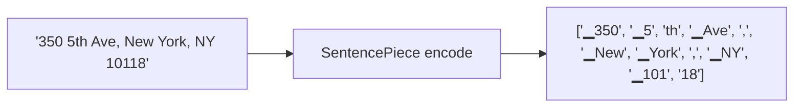

# Tokenization

Tokenization is the step that turns an input string into a list of small pieces called **tokens**. Every downstream component — rule classifiers, the neural classifier, the solver, the resolver — works with tokens, not with raw strings.

Mailwoman uses **two tokenizers** for two different jobs.

## Word-level tokenization (for rule classifiers)

The rule classifiers work with **words and punctuation marks**. The word tokenizer is straightforward:

```
"West 26th Street, New York, NYC, 10010"
        ↓
[West] [26th] [Street] [,] [New] [York] [,] [NYC] [,] [10010]
```

The output preserves enough metadata that the original string can be reconstructed: each token carries its character offset, its length, and what kind of separator (space, comma, tab, newline) came before it.

The character-offset preservation matters. When the parser says "10010 is a `postcode`", the consumer needs to know which 5 characters of the original string the parser was talking about. This becomes important when the address has multiple postcode-shaped numbers (rare) or when the consumer wants to highlight the parsed components in the original input.

The word tokenizer also pre-processes:

- **Lowercase normalization** — usually applied selectively. "NY" stays "NY", but "AVENUE" becomes "Avenue".
- **Punctuation splitting** — `"Apt.4B"` becomes `[Apt, ., 4B]` so each piece can be classified independently.
- **Abbreviation expansion** — optional. `"St."` can be expanded to `"Street"` for classification, then collapsed back for the output.

The word tokenizer is hand-written and lives in the v1 core code. It is fast (microseconds per address) and deterministic.

## Subword tokenization (for the neural classifier)

The neural classifier works with **subwords**. Instead of treating "New" and "Newport" as completely separate units, the subword tokenizer might split them into shared pieces: `["▁New"]` and `["▁New", "port"]`. The leading `▁` is a marker that says "this piece starts a new word".

Why subwords? Two reasons:

1. **Vocabulary size is bounded.** A word-level tokenizer trained on a multi-million-row corpus needs a vocabulary of millions of words. A subword tokenizer hits the same coverage with a 16,000-piece vocabulary by sharing pieces between words.
2. **Unseen words are handled gracefully.** "Pennsyvana" (a typo for "Pennsylvania") would be a complete unknown to a word-level tokenizer. A subword tokenizer breaks it into pieces it has seen — `["▁Penn", "syv", "ana"]` — and the model can still extract meaning.

Mailwoman uses [SentencePiece](https://github.com/google/sentencepiece), an open-source subword tokenizer library originally from Google. The specific algorithm is **unigram language model** tokenization, which tends to produce slightly more linguistically-aware splits than the BPE alternative.

Mailwoman's tokenizer was trained from scratch on the corpus. The current shipping version is **v0.1.0** (16K vocab); a new **A1 tokenizer** (48K vocab, multi-script) is validated and waiting for the CE-only classifier train to complete.

| Version           | Vocab  | Character coverage | Training data                                             | Status                                                         |
| ----------------- | ------ | ------------------ | --------------------------------------------------------- | -------------------------------------------------------------- |
| v0.1.0 (shipping) | 16,000 | 99.95%             | 1M US + 1M FR from `corpus-v0.1.1`                        | In production                                                  |
| A1 (validated)    | 48,000 | 99.99%             | 500K US + 500K FR + 73K multi-script from `corpus-v0.4.0` | Trained; byte-fallback 36.7%→18.2%; pending classifier weights |

- **Special tokens:** `[UNK]` (unknown), `[PAD]` (padding), `[BOS]` / `[EOS]` (beginning/end of sequence)
- **A1 additions:** 2,110 user-defined symbols (US state codes, postcode literal formats, country abbreviations) to prevent byte-fallback on known address tokens. See [`tokenizer-a0-baseline.md`](../plan/reference/tokenizer-a0-baseline.mdx) for the A0→A1 measurement story.



Each subword piece is mapped to an integer ID — that is what the model actually consumes. The mapping is fixed; the tokenizer is part of the model package (`tokenizer.model`).

## The span-realignment problem

Here is a subtle but important issue. The neural model outputs labels at the **subword level**. But the consumer wants labels at the **character level** of the original string. Translating between them is non-trivial.

Consider this input and its tokenization:

```
"350 5th Ave"   →   ['▁350', '▁5', 'th', '▁Ave']
```

The character offsets:

```
'350'  → chars 0..3
'5'    → chars 4..5
'th'   → chars 5..7
'Ave'  → chars 8..11
```

If the model labels `'▁5'` and `'th'` both as `B-house_number`, the consumer needs to know the combined span covers all of characters 4..7 of the original string, not either piece on its own.

Mailwoman's tokenizer wrapper handles this with `EncodeAsImmutableProto` (a SentencePiece API that returns piece-by-piece spans), then walks the pieces in order to compute the character range each label covers. The result is the consumer sees character spans, never has to know subword pieces exist.

This problem has bitten teams before. The agent who shipped v0.2.0 specifically called out the span-realignment as the most fragile part of the integration.

## Byte fallback

If the input contains a character the tokenizer has never seen, it falls back to **byte-level** encoding for that character. Each byte becomes a special token like `<0xF0>`, `<0x9F>`, etc.

This matters in two cases:

1. **Non-Latin scripts.** The tokenizer was trained on en-US and fr-FR text. Japanese kanji, Cyrillic, Arabic — all fall back to bytes. The model has not been trained on those scripts, so the output is unreliable, but the pipeline does not crash.
2. **Emoji.** Sometimes addresses contain stray emoji from text-message inputs. Byte fallback means the tokenizer does not fail.

The byte fallback comes from SentencePiece's `byte_fallback: true` setting in the tokenizer training script.

## Where this lives in the code

- **Word tokenizer (rules):** the v1 core, around `core/tokenize/`
- **Subword tokenizer (neural):** `neural/tokenizer.ts` + the trained model at `packages/neural-weights-en-us/tokenizer.model`
- **Training:** `corpus-python/scripts/train_tokenizer.py` (run once, output committed to `/data/models/tokenizer/v0.1.0/`)

## See also

- [What is an address?](../understanding/the-problem/what-is-an-address.mdx) — what tokens get labelled
- [BIO labels](./bio-labels.mdx) — how subword-level labels become character-level spans
- [Neural classification](./neural-classification.mdx) — what the model does with tokens
