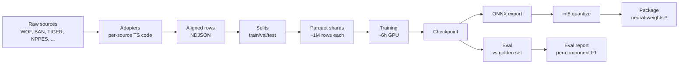

# Training pipeline

The training pipeline turns raw address data sources into a model file that ships on npm. This article walks through each stage end-to-end. The [Corpus construction](./corpus-construction.mdx) article digs into the first three stages in more detail.

## The full pipeline



We will walk through each box.

## Stage 1 — Adapters

Each raw data source has a **TypeScript adapter** that reads the source and emits `CanonicalRow` objects:

```ts
interface CanonicalRow {
	raw: string // the address string
	components: Partial<Record<ComponentTag, string>> // the labelled parts
	country: string
	locale: string
	source: string // 'usgov-nppes', 'ban', etc.
	source_id: string
	license: string
}
```

Adapters live under `corpus/src/adapters/`. Each one is responsible for:

- Reading its source's native format (CSV, NDJSON, JSON, shapefile).
- Mapping source-specific column names to Mailwoman's component vocabulary.
- Composing a plausible `raw` string from the components (when the source does not provide one).
- Stamping the correct licence on every row.

There are currently 14 adapters: WOF (admin + postcode), BAN (France), TIGER (US Census), NPPES (US healthcare), HRSA, IMLS, NAD (US DOT), three state notary/contractor sources, and a few others. `corpus-v0.3.0` enabled 11 of them, contributing 677 million aligned rows.

## Stage 2 — Alignment

The **alignment** step takes a `(raw, components)` pair from an adapter and produces a `(raw, tokens, BIO labels)` row.

The algorithm:

1. For each `(tag, value)` in `components`, find `value` inside `raw`. First try a verbatim substring match; if that fails, fall back to fuzzy match via Levenshtein distance with a tunable threshold.
2. If any component cannot be located in `raw`, **quarantine** the row with a reason like `component-not-found:locality`. Quarantined rows do not go to training; they pile up for later inspection.
3. Tokenize `raw`. Mark the first token in each component span as `B-tag`, subsequent tokens as `I-tag`, and unaffiliated tokens as `O`.

The quarantine pile catches data quality issues. `corpus-v0.3.0` quarantined 214,118 rows out of 677 million (0.03%) — mostly cases where the source's `components.region` was a name the source-side `raw` rendered as an abbreviation, or vice versa.

## Stage 3 — Splits

Aligned rows are split into three groups: **train** (about 90%), **val** (a few percent, used during training to monitor progress), and **test** (held out for the final eval).

The split is **locality-aware**: rows that share a locality stay in the same split. This prevents leakage — if "Brooklyn, NY" appears in training, no Brooklyn row appears in val or test. Without this, the model can memorize specific locality strings and look better on eval than it is.

The split assignment is written to `SPLIT_MANIFEST.json` so any later step can reproduce which rows went where.

## Stage 4 — Sharding

Once split, rows are written to **Parquet** files at 1 million rows per shard. Parquet is a columnar format that streams well: the training data loader can read row groups one at a time without loading the whole file into memory.

A v0.3.0 build produces about 30 train shards plus 1 val shard plus 1 test shard. Total size ~30 GB. The `intermediate/` directory (per-adapter raw NDJSON dumps, useful for debugging) takes another ~400 GB but gets garbage-collected after the next training run.

## Stage 5 — Training

Training runs in Python on the lab's GPU (AMD Radeon 780M). The training script:

1. Loads the tokenizer (`tokenizer.model`).
2. Builds the model architecture (`MailwomanCoarseEncoder` + `LinearChainCRF`).
3. Streams batches from the train shards (one Parquet row group at a time, 32 examples per batch, 4 gradient accumulation steps → effective batch 128).
4. Forward pass: encoder produces per-token emissions → CRF computes negative log-likelihood of gold sequence → loss is `CE(emissions, gold) + 0.05 × CRF_NLL`.
5. Backward pass: gradients flow through CRF + encoder + tokenizer embeddings.
6. Optimizer step (AdamW, learning rate 1.5e-4, cosine decay with 1,000-step warmup).
7. Every 250 steps: evaluate on the val shard, log val loss + macro F1.
8. Every 100 steps: save a full checkpoint (model + optimizer + scheduler + RNG state).

Save-every-100 is a defensive measure for the lab's GPU: it has a firmware quirk that fires a `GPU Hang` exception every 30–60 minutes under sustained load. The `train_with_resume.ts` wrapper auto-restarts on hang and resumes from the latest checkpoint. With this in place, training is robust to multiple hangs per session.

The v3.0.0 run trained for 1,800 steps (out of a planned 50,000) before the val metric peaked and started degrading. We early-stopped at 1,800 to ship the best checkpoint.

## Stage 6 — Eval

After training, the **eval** stage runs the model against the held-out golden set (`data/eval/golden/v0.1.2/`, 4,535 hand-labelled entries). For each entry:

- Tokenize the input.
- Run the model (with CRF Viterbi decode).
- Decode the BIO labels back into component strings (find the contiguous spans, slice out the original characters).
- Compare to the gold components.

The output is a markdown report and a JSON dump under `docs/articles/evals/`. Per-component precision, recall, F1, plus an overall "exact match" rate and a calibration histogram (does confidence match accuracy?).

The eval report is committed to git as part of the ship PR — see [the latest Tier 2 ship's eval report](../evals/model-versions/stage2-step-001800-eval.mdx) for the v3.0.0 numbers (filename preserves the historical "stage2" naming).

## Stage 7 — Export to ONNX

PyTorch's training graph is not directly portable to JavaScript or other runtimes. **ONNX** (Open Neural Network Exchange) is a standardized model format that runs in many runtimes (`onnxruntime-node`, `onnxruntime-web`, ONNXRuntime for mobile, etc.). The export step:

- Traces the model's forward pass with a sample batch.
- Records each operation as an ONNX node.
- Writes the result to `model-stage2-step-XXXXXX-fp32.onnx`.

A **parity check** then runs the same inputs through the original PyTorch model and the exported ONNX model and asserts the outputs agree to within 1e-4. Mismatches mean the export silently dropped or transformed an operation. v3.0.0's parity check showed max difference of 1.4e-5 — well within tolerance.

## Stage 8 — int8 quantization

ONNX models start in fp32 (32-bit floating point). For shipping, Mailwoman runs **dynamic int8 quantization**: each layer's weights get converted to 8-bit integers at load time. This:

- Cuts the model file from 37 MB to 25 MB.
- Speeds up inference on CPU (smaller arithmetic).
- Costs about 1–2% accuracy on the eval — measurable but acceptable.

Quantization is a built-in `onnxruntime.quantization` operation, applied once at ship time.

## Stage 9 — Package

The final step packages the model into the npm-publishable format:

```
packages/neural-weights-en-us/
├── model.onnx           # 25 MB int8 model
├── tokenizer.model      # 470 KB SentencePiece
├── model-card.json      # eval numbers + hardware metadata
├── README.md            # short usage doc
└── package.json
```

The `model-card.json` is the canonical record of what shipped: which corpus version, which checkpoint, what hparams, what eval metrics. `evals/scores-by-version.json` mirrors the same info but is keyed by run ID for cross-version comparison.

Both packages (en-us, fr-fr) get bumped to a new npm version (v3.0.0 for the Tier 2 ship) and published.

## See also

- [Corpus construction](./corpus-construction.mdx) — Stages 1–4 in more detail
- [Neural classification](./neural-classification.mdx) — what the model itself is
- [ONNX runtime](./onnx-runtime.mdx) — what happens after ship
