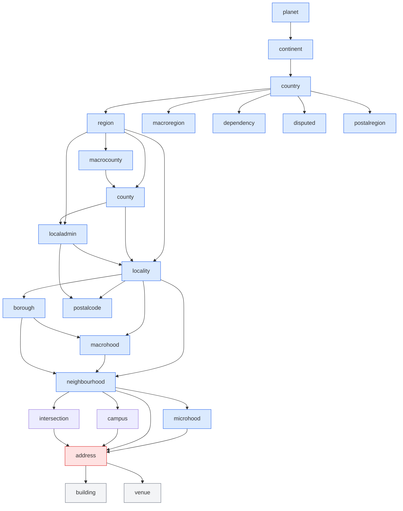
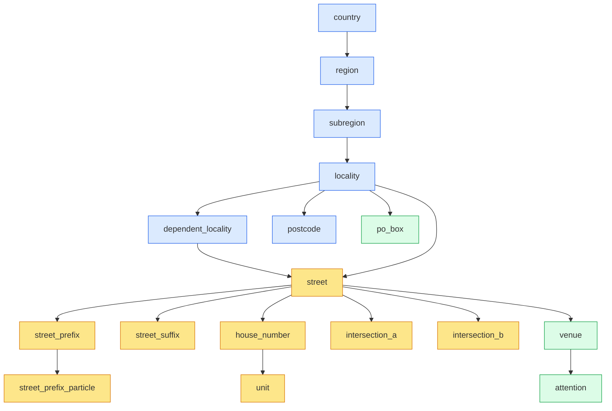

# The WOF hierarchy gap

Who's On First is a place gazetteer. Mailwoman is an address parser. The two are misaligned at one specific point in the hierarchy — and that misalignment shapes how the neural model fails on street-level inputs.

This article maps where WOF's hierarchy ends, where mailwoman's tag schema picks up, and the gap in between.

## What WOF's placetype graph actually looks like

WOF ships 35 placetypes. The graph is a DAG (most placetypes have multiple parents), but projected from `planet` outward, the relevant slice is:



The hierarchy goes administrative all the way down to `neighbourhood`/`microhood`, then jumps directly to `address`. Below `address` are building-interior subdivisions (`building`, `venue`, `arcade`, `concourse`, `wing`).

**There is no `street` node anywhere in this graph** — not as a child of locality, a sibling of neighbourhood, or a parent of address. The WOF DAG simply does not represent streets.

## Why WOF skips streets

The omission is principled, not an oversight:

1. **Streets are linear, not point or polygonal.** WOF stores geometries. A locality has a polygon, an address has a point. A street is a line — closer to OSM ways than to WOF places.
2. **Streets recur per-locality.** London has [seventeen different High Streets](../understanding/why-its-hard/falsehoods/falsehoods-streets.mdx). A unique identifier for "High Street" doesn't exist without disambiguation by parent locality. WOF assigns one ID per place; streets break that assumption.
3. **Streets are owned by different authorities.** Administrative places are governed by census bureaus, statistical offices, and political entities. Streets are governed by highway departments, postal services, and municipal planning. WOF concords with administrative authorities; street data lives elsewhere.
4. **Streets compose differently across locales.** US street grammars assume `[number] [name] [type]`. French addresses are `[number] [type] [name]`. Japanese addresses [skip streets entirely](../understanding/why-its-hard/falsehoods/falsehoods-streets.mdx#addresses-have-a-street-at-all). Mannheim uses a grid. A single hierarchical slot can't encode this.

WOF's decision to stop at `neighbourhood → address` is correct _for a place gazetteer_. It just leaves a gap _for an address parser_.

## What mailwoman's tag schema promises

Mailwoman's `ComponentTag` schema (in `core/types/component.ts`) declares a street layer that WOF's gazetteer doesn't back:

```
Universal coarse:    country / region / subregion / locality / dependent_locality / postcode / cedex
Street-level:        street / street_prefix / street_prefix_particle / street_suffix
                     house_number / unit / intersection_a / intersection_b
Venue-level:         venue / attention / po_box
JP-specific:         prefecture / municipality / district / block / sub_block / building_number / building_name
```

And the [containment rules](./containment-and-tree-projection.mdx) (`core/decoder/containment.ts`) wire those tags into a tree that _does_ have streets:



The orange `street_*` layer is the critical piece WOF doesn't have. Mailwoman's schema promises that `street_prefix` nests in `street`, and `street` nests in `dependent_locality`/`locality`. That promise is honored by the containment decoder at parse time. It is **not** reinforced by the gazetteer at inference time.

## Where the gap shows up at inference

The FST gazetteer prior ([concept doc](./fst-gazetteer-prior.mdx)) gives the neural model **two kinds of evidence** for every tag:

- **Positive evidence:** matched token sequence biases toward `B/I-{placetype}` for the matched placetype.
- **Negative evidence:** a token that walks off the FST trie tells the decoder "this is NOT an admin component" — likely a venue, street, or unrecognized name.

For administrative tags (`country`, `region`, `locality`, `postcode`), both kinds of evidence are present and the model uses them. For street tags (`street`, `street_prefix`, `street_suffix`), only the _negative_ signal is available — and only in the form "this token is not an admin place." There is no positive evidence that says "this token _is_ a street," because the FST has no street placetypes to match.

The empirical consequence shows up in [v0.6.1's error analysis](../evals/model-versions/v0.6.1-error-analysis.mdx). When training added a 100K-row synthetic street-decomposition corpus, the model learned to decompose subcomponents — but with no inference-time anchor for "this is a street," the decomposition energy leaked into `dependent_locality` (the schema's only labeled "below locality" slot). `dependent_locality` hallucinated 1066 times where v0.6.0 emitted zero.

This is the schema speaking. The model is doing the right thing under the wrong inputs: given that streets and dep_locality look structurally similar (both sit below locality in the containment tree) and only one has gazetteer backing, it picks the one with backing.

## Four layers that close the gap

The [supplement](./street-supplement-architecture.mdx) to WOF is not a single artifact. It's a stack:

```mermaid
flowchart TB
    subgraph LAYER1["Layer 1: Street morphology (token-shape evidence)"]
        L1a["~1.8K libpostal street_types affixes"]
        L1b["Street, Avenue, rue, Calle, Straße..."]
        L1c["Tells model: 'this token is street-type-affix'"]
    end

    subgraph LAYER15["Layer 1.5: Street candidacy (statistical evidence)"]
        L15a["Locality-adjacency prior: how many localities does this n-gram co-occur with?"]
        L15b["~1MB lookup table, corpus-derived"]
        L15c["Tells model: 'Piccadilly co-occurs with London adjacency; Health Clinic does not'"]
    end

    subgraph LAYER2["Layer 2: Street identity (name evidence)"]
        L2a["OSM way names per metro"]
        L2b["~200K-500K names/locale bundle"]
        L2c["Tells model: 'this token IS a specific known street'"]
    end

    subgraph LAYER3["Layer 3: Schema extensions (hierarchy evidence)"]
        L3a["Activate existing JP tags (block / sub_block / building_number)"]
        L3b["Add grid-block tags for Mannheim (v0.8+)"]
        L3c["Tells parser: 'streets aren't the only sub-locality structure'"]
    end

    LAYER1 -.~2h build, US+EU affix patterns.-> COVERAGE1["Closes the affix vacuum"]
    LAYER15 -.~1h build, suffix-less streets.-> COVERAGE15["Closes the candidacy vacuum"]
    LAYER2 -.per-metro sharding, FST Phase 2+.-> COVERAGE2["Closes the identity vacuum"]
    LAYER3 -.JP activation first, Mannheim/Nicaragua v0.8+.-> COVERAGE3["Closes the non-Western hierarchy gap"]
```

**Layer 1 (street-morphology FST)** handles the falsehoods that are _morphological_ — `Avenue`, `rue`, `Calle`, `Straße`. It does NOT handle Piccadilly (no suffix), Plein 1944 (number in name), or Mannheim grid (no street at all). For those, you need Layer 1.5 or Layer 2.

**Layer 1.5 (street candidacy)** sits between morphology and identity. Pre-compute over the corpus: for each n-gram, how many distinct localities does it appear adjacent to? `"Elm Avenue"` co-occurs with hundreds of localities → strong street-candidacy signal. `"Health Clinic"` co-occurs with zero → strong non-street signal. `"Piccadilly"` co-occurs with London-area postcodes consistently → moderate street-candidacy signal even without an affix. ~1MB compact lookup table. Solves suffix-less streets that morphology misses, without committing to OSM extraction.

**Layer 2 (street-identity FST)** is the missing WOF hierarchy node. It carries actual street names per metro, sourced from OSM ways or postal authorities. This is what makes `Piccadilly` resolvable: the FST contains `piccadilly` as a known street in London W1, with parent_chain `[London, England, UK]` — the same chain pattern WOF uses for admin places. Multi-shift work; first POC is NYC-only (~50K street names) to validate the pipeline before committing to per-metro sharding.

**Layer 3 (schema extensions)** addresses the cases where the hierarchy itself differs. Japan's chōme/banchi/gō chain, Mannheim's grid, Nicaragua's landmark-relative addressing. Mailwoman's JP-specific tags exist as placeholders (`block`, `sub_block`, `building_number`) and just need activation — corpus adapter, golden-set additions, JP model bundle. Mannheim and Nicaragua need new tags; v0.8+.

**The layers don't substitute — they compose.** A novel street like `"Piccadilly Lane"` gets:

- Layer 1 catches `"Lane"` as affix → bias adjacent `"Piccadilly"` toward `street`
- Layer 1.5 sees `"Piccadilly Lane"` co-occurs with London-adjacent tokens → reinforces street candidacy even if the full string isn't in OSM
- Layer 2 (if `"Piccadilly Lane"` exists in OSM) supplies parent_chain evidence directly

Each layer addresses a different vacuum. The cheapest layers don't subsume the more expensive ones.

## What this means for v0.6.x and beyond

- **Layer 1** is the polish-pass fix for v0.6.1's `dependent_locality` hallucinations on US-pattern addresses. ~2h to build. Solves the "model has nothing telling it `Avenue` is street-typing" problem. Conservative estimate: catches 600-800 of the 1066 dep_locality hallucinations from v0.6.1.
- **Layer 1.5** is the next-shift addition that extends Layer 1 to suffix-less streets. ~1h to build over the existing training corpus. Doesn't require new data sources.
- **Layer 2** is the v0.7+ architectural change. It's the FST roadmap's [Phase 2](../plan/reference/FST_GAZETTEER_LM.mdx) — "Streets would add ~3-5M unique names and require metro-area sharding for the browser." First POC is NYC-only.
- **Layer 3** is activation work for the JP-specific tags (which already exist in the schema) plus scope work for Mannheim/Nicaragua tags (v0.8+).

**Building Layer 1 is not sunk cost relative to Layer 2.** The integration infrastructure — `ParseOpts.fstStreetMorphology`, `street-morphology-prior.ts`, the second `addEmissionMatrix` call, `FstMatcherLike` — is the same plumbing Layer 2 flows through when it ships. Layer 1 builds the dual-FST pipeline that Layer 2 swaps a larger FST into. Skipping Layer 1 to "go straight to Layer 2" means building the same pipeline anyway, just with no intermediate signal to evaluate against.

## See also

- [FST gazetteer prior](./fst-gazetteer-prior.mdx) — the prior this article extends
- [FST gazetteer LM reference](../plan/reference/FST_GAZETTEER_LM.mdx) — Phase 2 (streets) is the layer 2 work
- [Falsehoods about street names](../understanding/why-its-hard/falsehoods/falsehoods-streets.mdx) — the catalog of edge cases each layer addresses
- [v0.6.1 error analysis](../evals/model-versions/v0.6.1-error-analysis.mdx) — the empirical regression that surfaced the gap
