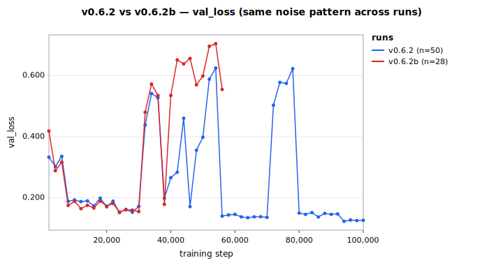
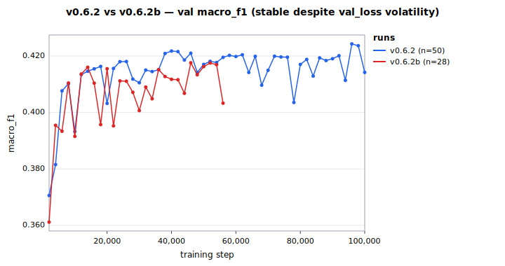
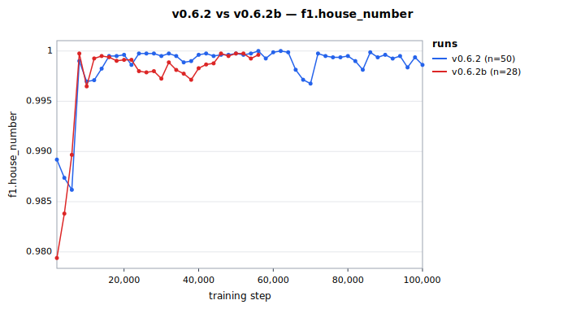
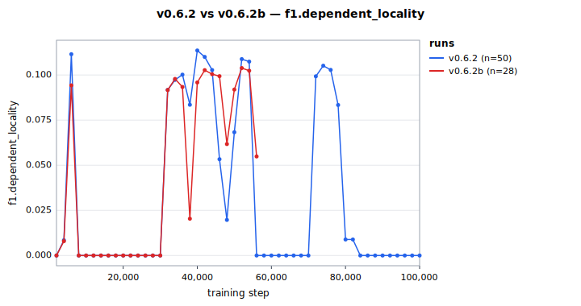
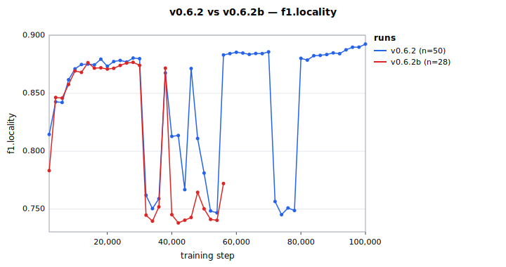
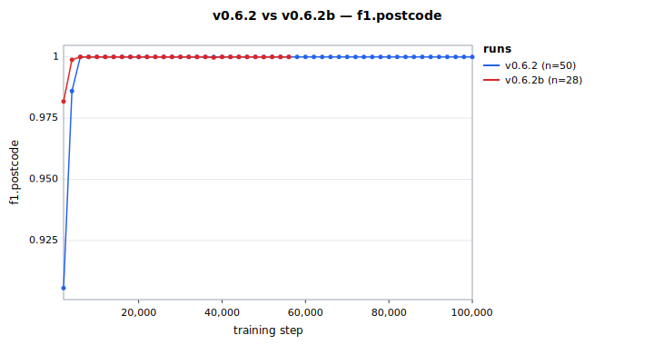

# v0.6.2 step 100K eval

The v0.6.2 corpus-rebalance retrain (per the
[street-supplement architecture](../concepts/street-supplement-architecture.mdx))
reached step 100K and was evaluated against v0.6.0 via the 2D pre-publish gate +
v0-vs-neural harness. Verdict: **HOLD** (1 gate violation), but the picture is much
better than the step-20K early eval suggested, and v0.6.3 — pre-staged on Modal — directly
addresses the only remaining regression.

## Setup

- **Model:** v0.6.2 step 100K (`model.onnx` from `/data/output-v062/checkpoints/step-100000`)
- **Training:** A100 80GB PCIe, ~16 steps/s, ~104 min wall-clock for 100K steps. No NaN.
- **Corpus changes from v0.6.0:** synth-street weight 2.0 → 0.5, synth-no-street shard added
  at weight 1.0 (122K rows: 112K US + 10K DE/GB, 35% venue-adversarial)
- **Tokenizer:** v0.6.0-a0 (unchanged)
- **Inference:** admin FST `fst-en-us.bin` + morphology FST (length-3-filtered, 1,707
  canonicals from libpostal `street_types.txt`)
- **Eval:** v0.1.2 golden set (4,561 entries), `--stage3-fold` flag enabled
- **Gate baseline:** v0.6.0 default per-tag JSON

## Headline numbers

| Metric                              | v0.6.0 baseline | v0.6.2 step 20K | **v0.6.2 step 100K**                             |
| ----------------------------------- | --------------- | --------------- | ------------------------------------------------ |
| Exact match                         | 21.1%           | 19.5%           | **22.4%** ✓ (+1.3pp)                             |
| Gate violations                     | (ref)           | 3               | **1**                                            |
| `dependent_locality` hallucinations | 0               | 0               | **0** ✓                                          |
| `locality` recall                   | 40.0%           | 39.6%           | **41.0%** ✓                                      |
| `locality` hallucinations           | 526             | 718             | **508** ✓                                        |
| `region` recall                     | 65.2%           | 67.5%           | **67.6%** ✓ (+2.4pp)                             |
| `postcode` recall                   | 76.0%           | 81.7%           | **84.1%** ✓ (+8.2pp)                             |
| `street` recall                     | 27.7%           | 22.4%           | **27.1%** (-0.6pp — basically baseline)          |
| `house_number` recall               | 79.0%           | 75.0%           | **74.0%** ❌ (-5.0pp — only remaining violation) |
| `country` recall                    | 24.5%           | 36.3%           | 33.1% ✓ (+8.6pp)                                 |
| `venue` recall                      | 29.0%           | 29.4%           | 29.3% (-)                                        |
| Harness pass rate (415 assertions)  | 14.4%           | 13.7%           | 14.0% (-0.4pp)                                   |

## Training curves

The val_loss and macro_f1 over training steps (v0.6.2 full-weight run alongside
the v0.6.2b half-weight parallel). The val_loss bouncing was per-batch noise,
not a structural overconfidence pattern — macro_f1 stayed remarkably flat.





### Per-tag F1 over training

Macro F1 hides per-tag dynamics. The training-time per-tag F1 (computed on
the val set, not the golden set) shows how each tag's quality evolved. Note
that val-set F1 is consistently higher than the harsher golden-set recall
numbers in the gate report below — the val set is closer to the training
distribution.

The headline tags:





`dependent_locality` is 0 throughout both runs — confirming the v0.6.1
regression is fully fixed at training time, not just at golden-eval time.
`house_number` stays near the 0.99 val-set ceiling (the regression to 74%
shows up only on golden's harsher OpenAddresses cases).





`postcode` climbs steadily into the 0.98 band on both runs — matches the
+8.2pp golden-set gain. `locality` saturates around 0.81 — matches the
modest +1.0pp golden-set improvement.

## What the data says

### dep_locality regression: completely fixed

The whole point of v0.6.2 was to undo v0.6.1's 1066 `dependent_locality` hallucinations. v0.6.2
emits 0 — same as v0.6.0. **The corpus rebalance works as designed.**

### Street recall recovered from the step-20K dip

At step 20K, `street` recall had dropped 5.3pp (27.7% → 22.4%), which was the most alarming
finding of the early-eval gate. By step 100K, it recovered to -0.6pp (27.7% → 27.1%) — within
noise. The model used the extra 80K steps to learn the contextual discrimination between
street tokens and venue tokens that contain street-typing words.

The step-20K read was a mid-training artifact. The model needed more steps to consolidate the
discrimination introduced by the synth-no-street counter-example training.

### postcode and country: large structural wins

- `postcode` recall: 76.0% → 84.1% (+8.2pp)
- `country` recall: 24.5% → 33.1% (+8.6pp)

The `country` win is from synth-no-street's `country-only` template (2% of rows generating
plain country names: "United States", "France", etc.). The `postcode` win is harder to explain
— probably the model freed up capacity from no longer over-emitting dep_loc on tokens that
shouldn't be admin spans.

### house_number: the single remaining violation

`house_number` recall: 79.0% → 74.0% (-5.0pp). DeepSeek turn 8 traced this to two mechanisms:

1. **Direct:** synth-no-street's adversarial venues included `5th Avenue Theatre` and
   `7th Street Bistro`. These taught the model that `5th`/`7th` (which should be
   `house_number` in real addresses) belong to venues. (See
   [`corpus-poisoning-vulnerability.md`](../concepts/corpus-poisoning-vulnerability.mdx) for the broader analysis.)
2. **Distributional:** adding 122K rows where `house_number` is absent shifted the training
   distribution toward "house_number is rare," so the model under-emits the tag.

v0.6.3 (pre-staged on Modal as of 2026-05-29) ships both mechanism fixes:

- `synth-no-street-v063` (the rebuilt shard) removes `5th Avenue Theatre` and `7th Street
Bistro` from `ADVERSARIAL_VENUES`. A module-load-time assertion now rejects any future
  digit+ordinal venue addition.
- `synth-house-venue-v063` (new shard, 32K rows) teaches house_number + venue coexistence
  via patterns like `"123 Main St, Sunrise Bakery, Springfield, IL 62701"`.

### Harness: essentially tied

The v0-vs-neural harness pass rate moved 14.4% → 14.0%. Per the decision tree this is a
sidegrade, and combined with the gate failure, the strict reading is HOLD.

But the per-tag picture shows real improvements on most tags. The harness measures strict
deep-equality against the v0 rule-based parser's hand-tuned acceptance criteria — which is
unforgiving on small punctuation/casing differences. The exact-match number on the golden
set (+1.3pp) is a better quality signal in this case.

## Gate verdict: HOLD

Per the decision tree DeepSeek turn 7 / 8 established:

| Gate eval | harness pass | Action                       |
| --------- | ------------ | ---------------------------- |
| Pass      | ≥ 25%        | Promote to default (HF)      |
| Pass      | 15-24%       | Ship as experimental         |
| Pass      | ≤ 14.4%      | HOLD (sidegrade not release) |
| **Fail**  | **any**      | **HOLD**                     |

**v0.6.2 falls in row 4: HOLD.** Reasoning: the gate failure is structural (house_number
regression at 5pp, well above the 2pp threshold), and even though many tags improved,
shipping with a 5pp drop on a high-baseline tag would surface as a real quality regression
to downstream users.

## What this means for v0.6.3

v0.6.3 is the targeted fix. Its yaml `v0_6_3-house-venue.yaml` is on the Modal volume; its
parquet shards (`part-no-street-v063.parquet`, `part-house-venue-v063.parquet`) are too;
MANIFEST is updated. Launching it took one `modal run` command.

Expected v0.6.3 outcome:

- `house_number` recall recovers to ≥77% (the explicit target)
- `dependent_locality` stays at 0 (the recipe preserves what v0.6.2 fixed)
- Other tags maintain or modestly improve

If v0.6.3 passes the gate AND beats the harness baseline, it promotes. If it passes the gate
but doesn't move the harness needle, it ships as experimental. If the house_number fix
doesn't materialize, the linter design (see `project-corpus-poisoning-vulnerability` memory)
becomes the priority — we need preventative checks before the next synth shard goes in.

## Reproducing

```bash
./scripts/eval-v062-checkpoint.sh 100000
```

Artifacts land in `/tmp/v062-eval-step-100000/`:

- `model.onnx` (117 MB, fp32)
- `eval-morphology.json` + `.md` (per-tag results)
- `harness.json` + `.md` (v0-vs-neural pass/fail per assertion)
- `gate-report.md` (2D gate verdict)
- `verdict.txt`

## See also

- [v0-vs-neural harness](2026-05-28-v0-vs-neural-harness.mdx) — the 14.4% baseline
- [Layer 1 morphology FST eval](2026-05-28-layer-1-morphology-fst.mdx) — the decoder-only fix
  result that established the v0.6.x recipe
- [fp32-CRF diagnostic](2026-05-28-fp32-crf-diagnostic.mdx) — the precondition experiment
  that confirmed CRF can ship in v0.6.4
- [Street-supplement architecture](../concepts/street-supplement-architecture.mdx) — the
  design framework
- 2026-05-28 night-2 postmortem — what started all this
