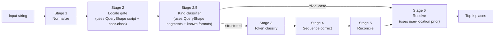

# Query Shape — Cheap Structural Priors

Captures the design intent for the `QueryShape` sub-system, a stage 2 + 2.5 addition to the runtime pipeline ([the-staged-pipeline](../../understanding/our-approach/the-staged-pipeline.mdx)). Bitter-lesson-safe because it recognizes _what shape an input has_, not _which strings are localities_.

## Status

- **Conceived:** 2026-05-22 design conversation.
- **Decision:** commit to the sub-system; bundle as `@mailwoman/query-shape`. Pure functions, no ML.
- **Implementation phase:** not yet opened. Will land alongside Stage 2 + Stage 2.5 work in the staged-pipeline rollout.
- **Cross-references:** [`concepts/the-staged-pipeline`](../../understanding/our-approach/the-staged-pipeline.mdx), [`concepts/addresses-that-break-geocoders`](../../understanding/why-its-hard/addresses-that-break-geocoders.mdx), [`reference/ARCHITECTURE`](./ARCHITECTURE.mdx).

## Bitter-lesson framing test

Mailwoman v1 (Pelias lineage) hit the long-tail trap by using rules to encode _place knowledge_: dictionaries of 50K city names, hand-curated state abbreviation tables, country-specific keyword sets. Every new locale meant a new dictionary, and the maintenance burden compounded.

The QueryShape sub-system intentionally avoids that trap by restricting itself to **universal structural patterns** — what character classes the tokens are, where the punctuation is, whether a substring matches a known postcode regex. The locale-test:

> Would this code change if Mailwoman added a 50th locale?

| Primitive                | Adds per new locale                  | Verdict   |
| ------------------------ | ------------------------------------ | --------- |
| Character class detector | Nothing                              | universal |
| Segmentation grammar     | ~5 lines of locale punctuation rules | bounded   |
| Known-format regex set   | ~1 postcode pattern                  | bounded   |
| User-location prior      | Nothing                              | universal |

Compare to v1's gazetteer-based locality classifier (~50K place names per locale). That is the long-tail explosion this sub-system explicitly does not bring back.

## `QueryShape` data structure

```ts
interface QueryShape {
	/** Dominant character class of the whole input. */
	characterClass: "numeric" | "alpha" | "alphanumeric" | "cjk" | "cyrillic" | "arabic" | "mixed"

	/** Per-token character class. */
	tokenClasses: TokenClass[]

	/** Punctuation-bounded segments, locale-aware. */
	segments: Segment[]

	/** Known-format regex hits (US ZIP, UK postcode, FR postcode, etc.). */
	knownFormats: KnownFormatHit[]

	totalLength: number
	whitespacePattern: "single" | "double" | "tab" | "mixed" | "none"
}

interface TokenClass {
	span: Span
	class: "digit" | "alpha" | "mixed" | "punct" | "cjk" | "cyrillic" | "arabic"
	length: number
}

interface Segment {
	span: Span
	body: string
	index: number // position in the segment list
	separator: "comma" | "newline" | "tab" | "whitespace" | "japanese-style" | null
}

interface KnownFormatHit {
	format:
		| "us_zip" // \d{5}
		| "us_zip4" // \d{5}-\d{4}
		| "uk_postcode" // SW1A 1AA pattern
		| "fr_postcode" // \d{5} with French context
		| "ca_postcode" // A1A 1A1 pattern
		| "de_postcode"
		| "jp_postcode" // \d{3}-\d{4}
		| "po_box" // PO Box / BP pattern
	span: Span
	confidence: number
}
```

Compute time: microseconds. No ML. Runs on every input before the encoder.

## Four primitives

### 1. Meta queries (character class)

Pure-character analysis of the input. Cheap, deterministic, language-agnostic. Examples:

| Input                               | Character class signal                             |
| ----------------------------------- | -------------------------------------------------- |
| `"10118"`                           | pure-digit, length 5 → strong postcode prior       |
| `"10118-1234"`                      | digit-hyphen-digit, length 10 → US ZIP+4 prior     |
| `"SW1A 1AA"`                        | letter-digit-letter pattern → UK postcode prior    |
| `"NYC NY"`                          | all-alpha, very short → likely locality-only query |
| `"東京駅"`                          | all CJK → script signal + likely landmark/venue    |
| `"دبي"`                             | all Arabic → script signal                         |
| `"350 5th Ave, New York, NY 10118"` | mixed alphanumeric + 3 commas → structured address |

These signals feed **Stage 2 (locale gate)** and **Stage 2.5 (kind classifier)** as priors.

### 2. Phrasification (segmentation)

Punctuation-bounded chunking. Currently the encoder re-learns segment structure from punctuation tokens; making it explicit gives downstream stages a free structural prior.

Three uses, in order of complexity:

1. **As encoder input feature** — segment-id per token concatenated to the input embedding. Cheap; no architecture change.
2. **As attention mask** — let tokens within a segment attend strongly to each other, weakly across. Modest architecture change.
3. **As per-segment kind hint** — `segment[3] is 5-digit-numeric → postcode-prior for this segment only`. Stage 2.5 emits per-segment QueryShape; encoder gets per-segment priors.

**Locale-dependence is bounded.** Commas segment in US/FR/UK; whitespace segments in JP; honorifics in Korean. The _punctuation grammar_ itself is locale-aware Stage-1 normalization, but the output is an abstract `Segment[]` that downstream stages consume uniformly. Each new locale adds ~5 lines of segmentation rules, not 50K dictionary entries.

### 3. Known-format detection

A bounded set of universal postcode and well-known-format regexes:

- US ZIP / ZIP+4
- UK postcode
- FR postcode (5 digits with French context)
- CA postcode (A1A 1A1)
- DE postcode
- JP postcode (\\d{3}-\\d{4})
- PO Box / BP variants

When a known-format pattern matches with high confidence AND the user-location prior agrees, Stage 2.5 can route directly to **Stage 6 (resolver)**, skipping the encoder entirely. This is a measurable browser-side win — ~5 ms encoder inference + ~25 MB model load saved per call for the trivial cases.

⚠ **Fast paths are advisory, not authoritative.** `"10118"` could be a partial typed input (`"10118 Maple St"` mid-keystroke). Every fast path must:

- Honor a `force_full_pipeline?: boolean` option (default false)
- Apply a conservative confidence floor before short-circuiting
- Still report alternatives in the result, not collapse to one answer

If autocomplete or streaming-input workflows ever break because fast-paths short-circuited prematurely, the confidence floor was too low.

### 4. User physical location

External signal joining the input-side priors. Goes into **Stage 6 (resolver)** scoring:

```
score(candidate) = match × population_prior × regional_prior_from_language × regional_prior_from_user_location
```

All four factors are **soft priors**. The TX-IP user typing `"Paris"` in French input gets a tie between Paris-FR and Paris-TX; structural cues (state abbreviation, postcode shape, etc.) break it. None of the priors hard-filter — that would violate the project's stated "possibilities, not constraints" principle ([`reference/CONTEXT.md`](./CONTEXT.mdx#the-confidence-as-trap-pattern)).

API shape (optional input):

```ts
interface ResolveOpts {
	userLocation?:
		| { lat: number; lon: number } // precise (GPS, IP-geolocated)
		| { country: string } // coarse (CDN region, user setting)
		| { region: string; country: string } // medium (US state)
}
```

## Where this lands in the pipeline



QueryShape is computed once, at the boundary between Stage 1 and Stage 2, and passed to the rest of the pipeline as additional context. It is not its own stage — it is a shared data structure that Stages 2, 2.5, 3 (optional), and 6 all consume.

## Packaging decision

Bundle as a single workspace package:

```
packages/query-shape/
├── src/
│   ├── character-class.ts        # token-level + input-level classification
│   ├── segmentation.ts           # punctuation-grammar-aware chunking
│   ├── known-formats.ts          # postcode + PO-box regex set
│   ├── compute.ts                # entry point: (input, locale?) → QueryShape
│   └── types.ts                  # the QueryShape interface
├── test/
└── package.json
```

Zero ML. Zero npm dependencies beyond what `@mailwoman/core` already pulls. Tiny (< 100 KB compiled). Reusable in browser and Node.

## Locality soft prior (v0.5.2 extension)

Added 2026-05-25 after diagnosing demo preset locality/region confusion ([`DEMO_PRESET_DIAGNOSIS.md`](./DEMO_PRESET_DIAGNOSIS.mdx)).

The existing `buildEmissionPriors` path applies logit boosts for known-format hits (e.g., postcode regex → `B-postcode`). The locality soft prior extends this: when an unambiguous 2-letter region abbreviation is detected (e.g., `DC`, `NY`, `CA`), preceding tokens that match a WOF locality entry at the detected locale receive a `+2.0` logit boost toward `B-locality` / `I-locality`.

New field on `QueryShape`:

```ts
regionAbbreviations?: Array<{ start: number; span: string }>
```

Detection is a single regex per locale (`/,\s*[A-Z]{2}\b/` for en-us), same cost as postcode-format detection. The WOF verification is the safety constraint — only bias tokens that are verified localities, not every preceding token.

This passes the bitter-lesson framing test: the regex is locale-bounded, not a gazetteer. The WOF check is a safety rail that prevents over-biasing non-locality tokens like "Pennsylvania" (street) in the same address.

## Open questions for implementation

These are decisions to make when the implementation phase opens; recording so they aren't re-derived from scratch.

1. **Where does `QueryShape` get computed?** Eagerly at parse-entry (always pay the microseconds cost), or lazily on first downstream consumer (some inputs may not need it)? Recommend eagerly — it's cheaper to compute than to threaded-lazy-evaluate.
2. **Known-format regex set extensibility?** Hardcoded vs. registerable. Recommend hardcoded for v1 (the postcode set rarely changes) and re-evaluate if community adapters want to register country-specific formats.
3. **Confidence threshold for fast-path routing?** Pick conservatively (~0.95) and tune from real-world data. Failure mode of too-low is catastrophic (wrong answer instead of full pipeline); failure mode of too-high is just slower inference.
4. **Segment-id as encoder feature — additive or concatenated?** Concatenated to input embeddings is simplest and avoids architecture change. Decide when the encoder retrain happens.
5. **How does `QueryShape` interact with `LocaleDetector`?** The detector probably uses `QueryShape.characterClass` + `QueryShape.tokenClasses` as input features. Suggests `LocaleDetector` runs _after_ `QueryShape.compute()`. Document this dependency.

## What this is not

- **Not the gazetteer.** Place-name lookup lives in Stage 6 / Resolver. QueryShape never asks "is this a city name?".
- **Not the kind classifier.** The kind classifier (Stage 2.5) consumes QueryShape but is itself a separate component that may or may not use ML.
- **Not a replacement for the encoder.** Trivial inputs short-circuit; structured inputs still hit the full pipeline.
- **Not free of locale concerns.** Segmentation grammar and the known-format set both grow per locale, but they grow at O(1) per locale rather than O(N place names).

## See also

- [`concepts/the-staged-pipeline`](../../understanding/our-approach/the-staged-pipeline.mdx) — the runtime stages this slots into
- [`concepts/addresses-that-break-geocoders`](../../understanding/why-its-hard/addresses-that-break-geocoders.mdx) — the failure-mode catalogue that motivated this
- [`reference/CONTEXT.md`](./CONTEXT.mdx) — the bitter-lesson framing and the "possibilities not constraints" principle
- [`reference/ARCHITECTURE.md`](./ARCHITECTURE.mdx) — the broader system shape; QueryShape fits between tokenization and classification
