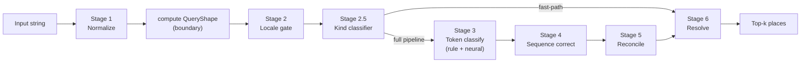

# Runtime Pipeline Stages

The formal contract for the six-stage runtime pipeline. Pairs with [`INTERFACES.md`](./INTERFACES.md) (classifier-level contracts) and [`SCHEMA.md`](./SCHEMA.md) (component vocabulary) — this document covers the **stage boundaries** that compose them into a working pipeline.

For the narrative / why-it-exists framing, read [`concepts/the-staged-pipeline`](../../concepts/the-staged-pipeline.md). For the bitter-lesson-safe sub-system used by stages 2 and 2.5, read [`QUERY_SHAPE.md`](./QUERY_SHAPE.md).

## Status

- **Source of truth:** this file is the canonical interface contract for the runtime pipeline. Any stage implementation must conform.
- **Last edited:** 2026-05-22.
- **Implementation state:** stages 3, half of 4, the solver portion of 5, and a thin 6 ship today. Stages 1, 2, 2.5, the span-re-reader piece of 4, and the candidate-list API on 6 are unbuilt. Each stage's section below has a **Today / Future** breakdown.

## The pipeline



The fast-path arrow is the optimization win: when the kind classifier identifies a trivial input (`postcode_only`, `locality_only`) AND the QueryShape's known-format match agrees, the coordinator skips stages 3-5 and goes straight to resolve. See [Fast-path routing](#fast-path-routing) below.

## Shared types

These types appear across multiple stages; defined here, used everywhere.

```ts
import type { Span } from "@mailwoman/core"
import type { ComponentTag, BioLabel } from "@mailwoman/core"

/** Optional locale hint from the caller. Stage 2 may override with a more-confident detection. */
export type LocaleTag = "en-US" | "fr-FR" | "ja-JP" | (string & {})

/** Optional user-location signal. Stage 6 uses it as a soft prior. */
export type UserLocation = { lat: number; lon: number } | { country: string } | { region: string; country: string }

/** Common opts threaded through every stage. Each stage may add its own. */
export interface PipelineOpts {
	locale?: LocaleTag
	userLocation?: UserLocation
	forceFullPipeline?: boolean // disable fast-path shortcuts
	signal?: AbortSignal
}
```

`ComponentTag` and `BioLabel` are defined in [`SCHEMA.md`](./SCHEMA.md). `ClassificationProposal` and `Classifier` are defined in [`INTERFACES.md`](./INTERFACES.md).

## Stage 1 — Normalize

**Purpose.** Deterministic preprocessing of the raw input string. Unicode NFC, case folding, abbreviation expansion, whitespace and punctuation normalization. Pure functions, no ML.

**Interface.**

```ts
// packages/normalize/src/types.ts

export interface NormalizedInput {
	/** The input as the user sent it. */
	raw: string

	/** Canonical form, all transforms applied. */
	normalized: string

	/** Ordered record of what was done. */
	transforms: NormalizationTransform[]

	/**
	 * Character-offset map: `normalized[i]` came from `raw[offsetMap[i]]`.
	 *
	 * Load-bearing: every downstream stage that emits spans uses this to translate normalized offsets
	 * back to raw offsets for the consumer.
	 */
	offsetMap: number[]

	/** The locale used for case-folding + abbreviation rules, if any. */
	appliedLocale?: LocaleTag
}

export type NormalizationTransform =
	| { kind: "nfc" }
	| { kind: "case_fold"; locale: LocaleTag }
	| { kind: "expand_abbreviation"; from: string; to: string; at: Span }
	| { kind: "collapse_whitespace"; at: Span }
	| { kind: "normalize_punctuation"; at: Span }

export interface NormalizeOpts {
	locale?: LocaleTag
	/** Skip abbreviation expansion (for debugging / round-trip tests). */
	skipAbbreviations?: boolean
}

export function normalize(raw: string, opts?: NormalizeOpts): NormalizedInput
```

**Today.** `@mailwoman/normalize` workspace shipped 2026-05-22 (Slice B of [PHASE_7](../phases/PHASE_7_stage_1_normalize_and_query_shape.md)). Public `normalize()` function with NFC + punctuation + whitespace (always) + abbreviation expansion + case-fold (opt-in). Load-bearing `offsetMap` composed across transforms. Small en-US + fr-FR abbreviation dictionaries.

**Future.** Share dictionaries with corpus synthesis (synthesis is the _inverse_ — canonical → variants; normalize is variants → canonical). Add per-locale case-folding edge cases (Turkish `İ`, Greek final sigma). Bidirectional offset lookup (`raw[i] → normalized[i]`).

**Failure classes owned.** Tokenization and whitespace traps (#3); Unicode/transliteration encoding half (#6). See [`addresses-that-break-geocoders`](../../concepts/addresses-that-break-geocoders.md).

**Open questions.**

- How much locale-specific case-folding (Turkish `İ`, Greek final sigma)? Recommend: cover the locales we ship; byte-fallback the rest.
- Should `NormalizedInput` carry the inverse map (`raw[i]` → `normalized[i]`) too? Recommend: yes — bidirectional offset lookup is cheap and prevents a class of off-by-one bugs.
- Where does language detection live — Stage 1 or Stage 2? Recommend: Stage 2 (it needs `QueryShape.characterClass` as input).

## Boundary — compute QueryShape

**Purpose.** Pure-function structural analysis of the normalized input. Microseconds-cheap, shared by Stages 2, 2.5, 3 (optional), and 6.

**Interface.** Defined in [`QUERY_SHAPE.md`](./QUERY_SHAPE.md). The entry point:

```ts
// query-shape/compute.ts

export function computeQueryShape(input: string | NormalizedInputLite, opts?: ComputeQueryShapeOpts): QueryShape
```

**Threading.** Once computed, `QueryShape` is threaded through every subsequent stage as additional context. It is not its own stage.

**Today.** `@mailwoman/query-shape` workspace shipped 2026-05-22 (Slice A of [PHASE_7](../phases/PHASE_7_stage_1_normalize_and_query_shape.md)). Pure functions, no ML, zero workspace dependencies. Detects character class, punctuation-bounded segments, known postcode formats (US ZIP/ZIP+4, UK, CA, JP + ambiguous 5-digit FR/DE/US), PO Box / BP. Hyphen / apostrophe / underscore are "connectors" so `"10118-1234"` and `"Saint-Denis"` stay one token. Accepts both `string` and `NormalizedInputLite` (structurally compatible with `@mailwoman/normalize`'s `NormalizedInput`).

## Stage 2 — Locale gate

**Purpose.** Decide which downstream weights to load based on script, language, and the caller's optional locale hint.

**Interface.**

```ts
// packages/locale-gate/src/types.ts

export interface LocaleHint {
	/** The detected locale tag. */
	locale: LocaleTag

	/** Detector's confidence, 0..1. */
	confidence: number

	/** Alternative locales with confidence — possibilities, not constraints. */
	alternatives: Array<{ locale: LocaleTag; confidence: number }>

	/** Detection source: caller hint took precedence, vs. detected from input. */
	source: "caller" | "detected" | "ensemble"
}

export interface LocaleGateOpts {
	/** If provided, takes precedence; detector may still emit alternatives. */
	hint?: LocaleTag

	/**
	 * Below this confidence, the gate emits an ensemble of likely locales instead of committing to
	 * one.
	 */
	confidenceFloor?: number // default 0.7
}

export interface LocaleGate {
	detect(input: NormalizedInput, shape: QueryShape, opts?: LocaleGateOpts): Promise<LocaleHint>
}
```

**Today.** Absent. The consumer's API call specifies the locale; if missing, all locales' classifiers run.

**Future.** Small character-level classifier (~100 KB) trained on the first 200 characters of input. Emits a locale tag + confidence + alternatives. Below the confidence floor, the gate signals an ensemble run downstream.

**Failure classes owned.** Unicode/transliteration script-handling (#6); language-switch hybrids (#7).

**Open questions.**

- Hand-rolled rule classifier vs trained model? Recommend: trained model — small, fast, and gets better with the corpus we already have (each row carries `locale`).
- Where do non-shipped locales fall back? Recommend: nearest-locale heuristic — a Polish input falls back to `en-US` weights with a low-confidence flag, not an error.

## Stage 2.5 — Kind classifier

**Purpose.** Categorize the input by query shape so downstream stages can route appropriately. Trivial inputs short-circuit to Stage 6; structured inputs run the full pipeline; specialist inputs route to dedicated heads (future).

**Interface.**

```ts
// packages/kind-classifier/src/types.ts

export type QueryKind =
	| "postcode_only" // "10118"
	| "locality_only" // "Paris"
	| "structured_address" // "350 5th Ave, New York, NY 10118"
	| "intersection" // "5th and Main"
	| "po_box" // "PO Box 1234"
	| "landmark" // "Behind gas station" — out of scope
	| "vague" // ambiguous; full pipeline + top-k

export interface QueryKindResult {
	kind: QueryKind
	confidence: number
	alternatives: Array<{ kind: QueryKind; confidence: number }>
}

export interface KindClassifier {
	classify(input: NormalizedInput, shape: QueryShape, locale: LocaleHint): Promise<QueryKindResult>
}
```

**Today.** Absent.

**Future.** Hybrid rule + tiny model. Rule path: when `QueryShape.knownFormats` has a single high-confidence hit, emit the matching kind. Model path: when no format dominates, use a small classifier trained on `(QueryShape, label)` pairs from a labelled corpus slice (Phase 5 Studio is the source of those labels).

**Failure classes owned.** Routes around the encoder for the trivial cases that don't need it (postcode-only, locality-only). Improves accuracy on intersection / PO box by routing to specialist heads when they exist (v0.6.0+).

**Open questions.**

- Should `kind` be exclusive (one label) or distributional (probability over kinds)? Recommend: distributional via `alternatives` — graceful failure on ambiguous cases.
- Specialist heads vs single multi-purpose encoder? Recommend: single encoder for v1; revisit when there's enough labelled `intersection` / `po_box` data to justify specialization.

## Stage 3 — Token classify

**Purpose.** Per-token BIO labelling. The current Mailwoman model (`@mailwoman/neural` + `@mailwoman/neural-weights-*`).

**Interface.** The `Classifier` interface from [`INTERFACES.md`](./INTERFACES.md), with `QueryShape` and `LocaleHint` threaded into `ClassifierContext`:

```ts
// extends the existing ClassifierContext in INTERFACES.md

export interface ClassifierContext {
	locale?: LocaleTag // existing
	prior?: ClassificationProposal[] // existing
	signal?: AbortSignal // existing

	/** Added by the staged pipeline. */
	queryShape?: QueryShape
	localeHint?: LocaleHint
	normalized?: NormalizedInput
}
```

**Today.** Shipped at v3.0.0. Both rule classifiers and `NeuralSequenceClassifier` implement `Classifier`. The neural model is the small encoder-only transformer documented in [`ARCHITECTURE.md`](./ARCHITECTURE.md). The Tier 2 vocabulary (21 BIO labels) is current.

**Future.** Larger context window (128 → 256 tokens), more locales, continued corpus expansion. Optional: use `QueryShape.segments` as an encoder input feature (segment-id per token concatenated to the input embedding) — cheap, no architecture change, gives the encoder a free structural prior.

**Failure classes owned.** Street/locality collisions (#4) via context-aware classification.

**Open questions.**

- Should `NeuralSequenceClassifier` consume `QueryShape.segments` as input today, or wait for v0.6.0? Recommend: v0.5.0+ — requires a retrain anyway.
- How do specialist heads (intersection, PO box) compose with the main encoder? Recommend: shared encoder + per-kind head; see ARCHITECTURE.md's multi-head extension section.

## Stage 4 — Sequence correct

**Purpose.** Structural validity + ambiguity resolution at the label-sequence level. Two sub-pieces.

### Stage 4a — CRF

Today's implementation. Linear-chain CRF over a frozen BIO transition mask. Eliminates orphan-`I` sequences ("Saint Petersburg → Petersburg" bug).

**Interface.**

```ts
// packages/neural/src/sequence-correct.ts

export interface CrfDecoder {
	/** Take per-token emissions, return the best label sequence under the CRF. */
	decode(emissions: Float32Array, seqLen: number, numLabels: number): BioLabel[]
}
```

**Today.** Used at training time and in the Python eval. JavaScript runtime ships Viterbi (2026-05-22) with the BIO structural mask — orphan-`I-*` sequences are structurally impossible at runtime, even without learned CRF transitions in the model bundle. Learned transitions will compose on top once a future weights release ships them via `crf-transitions.json` or the model card.

### Stage 4b — Span re-reader (future)

When Stage 3 emits a span with low confidence, or two overlapping high-confidence proposals, re-run the encoder on that span alone with extra structural conditioning. **Additive: only proposes new alternatives, never deletes existing ones.**

**Interface.**

```ts
// packages/neural/src/span-rereader.ts (future)

export interface SpanRereader {
	/**
	 * Re-classify an ambiguous span with extra structural context. Returns additional proposals; the
	 * orchestrator merges them into the candidate set.
	 */
	reread(
		span: Span,
		context: { neighborhood: BioLabel[]; queryShape: QueryShape },
		input: NormalizedInput
	): Promise<ClassificationProposal[]>
}
```

**Today.** Not built.

**Future.** v0.6.0+ at earliest. Needs a corpus slice of ambiguity-flagged spans (Studio can produce this).

**Failure classes owned.** Ambiguous locality names (#1), repeated admin names (#2), consistency portion of numeric chaos (#5).

**Open questions.**

- CRF should run on rule proposals too, or only neural? Recommend: only neural for now (rule proposals don't have a sequence structure to enforce); revisit if mixed-source ambiguity becomes a hot path.
- Span re-reader: same encoder + extra positional conditioning, or a separate specialist model? Recommend: same encoder first (cheap, reuses training pipeline); specialist model only if the eval justifies it.

## Stage 5 — Cross-component reconcile

**Purpose.** Pick the best self-consistent set of components from the union of all classifier proposals.

**Interface.** The `PolicyRegistry` from [`INTERFACES.md`](./INTERFACES.md), plus the existing `ExclusiveCartesianSolver` from `@mailwoman/core`. The composition:

```ts
// packages/core/src/reconcile.ts

export interface Reconciler {
	/**
	 * Filter proposals through the policy, then solve for the best self-consistent set. Returns
	 * components in canonical shape.
	 */
	reconcile(proposals: ClassificationProposal[], policy: PolicyRegistry, locale: LocaleHint): Promise<Components>
}

export interface Components {
	/** Component tag → final value, with confidence + source attribution. */
	[tag: string]: ComponentValue | undefined
}

export interface ComponentValue {
	value: string
	confidence: number
	span: Span
	source: "rule" | "neural" | "merged"
	source_id: string
	alternatives?: ComponentValue[] // top-k for this slot, when ambiguous
}
```

**Today.** Solver shipped. `Components` shape doesn't fully exist — current code uses a flat dictionary. Promoting it to a typed shape with `alternatives` is a small refactor.

**Future.** Add `alternatives` so the resolver can see runner-up candidates. Optional: replace the rule-based solver with a learned reranker (lower priority — current implementation is not the bottleneck).

**Failure classes owned.** Consistency portion of numeric chaos (#5); the hybrid-policy decision in general.

**Open questions.**

- Should `Components` carry a "global confidence" (probability the whole parse is correct)? Recommend: yes — used by callers to gate downstream actions.
- Solver replacement with learned reranker — when, if ever? Recommend: defer indefinitely; rule-based solver is explainable and fast.

## Stage 6 — Resolve with candidates

**Purpose.** Take the final component bundle and query the gazetteer. Return a ranked list of candidate places — not a single point.

**Interface.**

```ts
// packages/resolver-wof-sqlite/src/types.ts (extends today's Resolver)

export interface Resolver {
	resolve(components: Components, opts?: ResolveOpts): Promise<Resolution[]>
}

export interface ResolveOpts {
	locale?: LocaleHint
	userLocation?: UserLocation
	maxResults?: number // default 5
	minConfidence?: number // default 0.1
}

export interface Resolution {
	place: WofPlace
	confidence: number

	/** Per-factor breakdown of the score for debugging. */
	scoreBreakdown: {
		match: number
		populationPrior: number
		regionalPriorFromLanguage?: number
		regionalPriorFromUserLocation?: number
	}
}
```

**Today.** Shipped through Phase 4.3.x. Each resolved `AddressNode` now carries `alternatives: ResolvedPlace[]` (added 2026-05-23) — the runner-up candidates the backend returned for that node. Surfaces failure mode #8 (Springfield-class ambiguity) without changing the `resolveTree` return type.

**Future.** Add `regionalPriorFromLanguage` and `regionalPriorFromUserLocation` factors (today's scoring uses only match + population).

**Failure classes owned.** Administrative nightmares (#8).

**Open questions.**

- Default `maxResults`: 5 vs 10? Recommend: 5 — most consumers want top-1; callers wanting more can ask.
- Should the resolver expose alternatives for each component (e.g. multiple plausible `locality` matches)? Recommend: no — that's the reconciler's job; resolver returns place candidates only.
- Multiple gazetteer sources (WOF + BAN + others) — how to compose? Recommend: separate `Resolver` impls per source, composed by a `CompositeResolver` that merges candidates. Defer until BAN integration lands.

## The coordinator

The orchestration function that composes all stages. Lives in `@mailwoman/core/pipeline` (shipped 2026-05-23). Generic over its stage implementations — each stage is structurally typed, injected via the `RuntimePipelineStages` record. Keeps core free of dependencies on the concrete neural / normalize / query-shape / resolver packages. The user-facing convenience factory `createRuntimePipeline()` lives in the `mailwoman` workspace and pre-wires the defaults.

```ts
// packages/core/src/pipeline.ts

export interface PipelineResult {
	input: string
	normalized: NormalizedInput
	queryShape: QueryShape
	locale: LocaleHint
	kind: QueryKindResult
	components: Components
	resolutions: Resolution[]
	timing: PipelineTiming
}

export interface PipelineTiming {
	[stage: string]: number // ms per stage
}

export async function runPipeline(raw: string, opts?: PipelineOpts): Promise<PipelineResult> {
	const t = startTiming()

	const normalized = await normalize(raw, opts)
	t.mark("normalize")

	const queryShape = computeQueryShape(normalized, opts?.locale)
	t.mark("query-shape")

	const locale = await localeGate.detect(normalized, queryShape, { hint: opts?.locale })
	t.mark("locale-gate")

	const kind = await kindClassifier.classify(normalized, queryShape, locale)
	t.mark("kind-classifier")

	// Fast path — see "Fast-path routing" below.
	if (canShortCircuit(kind, queryShape, opts)) {
		const components = fastPathComponents(kind, queryShape)
		const resolutions = await resolver.resolve(components, { ...opts, locale })
		t.mark("resolve")
		return { input: raw, normalized, queryShape, locale, kind, components, resolutions, timing: t.snap() }
	}

	// Full pipeline.
	const ruleProposals = await runRuleClassifiers(normalized, locale, queryShape)
	const neuralProposals = await neuralClassifier.classify(normalized, { locale, queryShape, normalized })
	t.mark("token-classify")

	const correctedNeural = await sequenceCorrect(neuralProposals, queryShape)
	t.mark("sequence-correct")

	const components = await reconciler.reconcile([...ruleProposals, ...correctedNeural], policy, locale)
	t.mark("reconcile")

	const resolutions = await resolver.resolve(components, { ...opts, locale })
	t.mark("resolve")

	return { input: raw, normalized, queryShape, locale, kind, components, resolutions, timing: t.snap() }
}
```

**Constraints.**

- Every stage is async (matches existing `Classifier.classify` shape).
- `PipelineTiming` is exposed for caller diagnostics — fast paths show up as missing `token-classify` / `sequence-correct` / `reconcile` entries.
- The function never throws on a stage failure; degraded stages emit empty results and the pipeline continues. Caller decides whether to retry / surface to user / fall back.

## Fast-path routing

The coordinator skips stages 3-5 when **all** of the following hold:

1. `kind.kind` is one of `postcode_only` or `locality_only`.
2. `kind.confidence` ≥ `kindClassifier.fastPathFloor` (default 0.95, configurable).
3. `queryShape.knownFormats` contains a matching high-confidence hit.
4. `opts.forceFullPipeline` is not set.

The match between `kind` and `knownFormats` is the safety check — a `postcode_only` kind without a matching postcode regex hit is suspicious and falls through to the full pipeline.

```ts
function canShortCircuit(kind: QueryKindResult, shape: QueryShape, opts?: PipelineOpts): boolean {
	if (opts?.forceFullPipeline) return false
	if (kind.confidence < 0.95) return false
	if (kind.kind === "postcode_only") {
		return shape.knownFormats.some((f) => f.format.endsWith("_zip") || f.format.endsWith("_postcode"))
	}
	if (kind.kind === "locality_only") {
		return shape.totalLength <= 30 && shape.characterClass === "alpha"
	}
	return false
}
```

⚠ **Fast paths are advisory.** A `postcode_only` shortcut returns a single ambiguous-when-no-location result (the postcode resolved against the gazetteer). If the consumer wanted to disambiguate via additional input (mid-typed autocomplete), they pass `forceFullPipeline: true`. See [`QUERY_SHAPE.md`](./QUERY_SHAPE.md#3-known-format-detection) for the broader rationale.

## Packaging map

Each stage lives in its own workspace where possible. Existing workspaces extend; new ones are net-new.

| Stage                          | Workspace                                                         | Status                           |
| ------------------------------ | ----------------------------------------------------------------- | -------------------------------- |
| 1 Normalize                    | `@mailwoman/normalize`                                            | new                              |
| Boundary QueryShape            | `@mailwoman/query-shape`                                          | new                              |
| 2 Locale gate                  | `@mailwoman/locale-gate` + `@mailwoman/locale-gate-weights`       | new                              |
| 2.5 Kind classifier            | `@mailwoman/kind-classifier`                                      | new (small)                      |
| 3 Token classify               | `@mailwoman/neural` + `@mailwoman/neural-weights-*`               | shipped                          |
| 4 Sequence correct (CRF)       | `@mailwoman/neural` (sequence-correct submodule)                  | half-shipped                     |
| 4 Sequence correct (re-reader) | `@mailwoman/neural` (span-rereader submodule)                     | new                              |
| 5 Reconcile                    | `@mailwoman/core` (existing solver, formalize `Components` shape) | shipped                          |
| 6 Resolve                      | `@mailwoman/resolver-wof-sqlite`, `@mailwoman/resolver-wof-wasm`  | shipped (candidate-list API new) |
| Coordinator                    | `@mailwoman/core`                                                 | new (composes the above)         |

The packaging is intentional: a consumer can pull just `@mailwoman/core` + `@mailwoman/normalize` + `@mailwoman/query-shape` for cheap parsing without the neural runtime. Browser-side, the locale-gate weights and the kind-classifier together should fit under 1 MB so a fast-path-only deployment is feasible.

## Versioning rules

- **Stage interfaces** (this file): semver-major bump on any breaking change. The `Components` shape change from flat dict to typed `{ value, confidence, span, … }` will be a breaking change.
- **Stage implementations**: independently versioned per workspace. Weights packages get major bumps on label-vocabulary changes (Tier 1 → Tier 2 was the v2 → v3 bump).
- **Pipeline coordinator**: lives in `@mailwoman/core`; semver-major on any change to `PipelineResult` shape.
- **Adding a new stage**: requires editing this file with new interface + Today/Future block + failure classes + open questions, then a contract test in `@mailwoman/core` proving the new stage composes with the existing ones.
- **Removing a stage**: requires the operator's written sign-off in `DECISIONS.md`. Don't.

## Open questions across the pipeline

These don't belong to one stage; they affect composition.

1. **Cancellation.** Every stage accepts an `AbortSignal`. Should partial results be returned on abort, or just `undefined`? Recommend: partial results (a normalized + locale-detected + kind-classified input is useful even if classification was cancelled).
2. **Caching.** `QueryShape` and `LocaleHint` are cheap but not free. Should they be cached keyed by `(raw, locale)`? Recommend: yes, in-memory LRU at the coordinator; configurable size.
3. **Telemetry.** `PipelineTiming` is per-call. Should we also expose per-stage success rates and per-stage error counters? Recommend: yes, but as a plug-in observability hook, not baked into the core interface.
4. **Streaming.** Today the pipeline is request/response. For autocomplete workflows, would a streaming variant ever ship? Recommend: not in v1. The fast path covers most of the autocomplete case via cheap repeated calls.
5. **Server vs browser parity.** Every stage must run in both. The locale gate and kind classifier should be small enough to bundle; the encoder is already isomorphic. Document each stage's bundle-size budget when implementations land.

## How this relates to existing files

- [`INTERFACES.md`](./INTERFACES.md) defines the **classifier-level** contracts (`Classifier`, `ClassificationProposal`, `PolicyRegistry`, etc.). This file is the **stage-level** contract that composes them.
- [`SCHEMA.md`](./SCHEMA.md) defines the **component vocabulary** (`ComponentTag`, `BioLabel`). Both files key off it.
- [`ARCHITECTURE.md`](./ARCHITECTURE.md) describes the **existing system shape** narratively. Some of its diagrams predate this staging picture; reconcile gradually.
- [`QUERY_SHAPE.md`](./QUERY_SHAPE.md) defines the **`QueryShape` sub-system** in detail. This file references it but does not duplicate.
- [`concepts/the-staged-pipeline`](../../concepts/the-staged-pipeline.md) is the **public-facing narrative** version. This file is the implementer's contract.

## What's next

The staging picture is now formalized. Implementation order, in suggested priority:

1. **Stage 1 + boundary QueryShape together.** Cheap to build, unlocks every downstream improvement.
2. **Stage 6 candidate-list API.** Small change, big win for failure mode #8.
3. **Stage 2 + Stage 2.5 together.** Enables fast paths AND informs the encoder.
4. **JS Viterbi for Stage 4a.** Already on the v0.4.0 list.
5. **Stage 4b span re-reader.** Wait for v0.6.0 corpus support.

Each item gets its own `phases/PHASE_*.md` doc when work opens.
