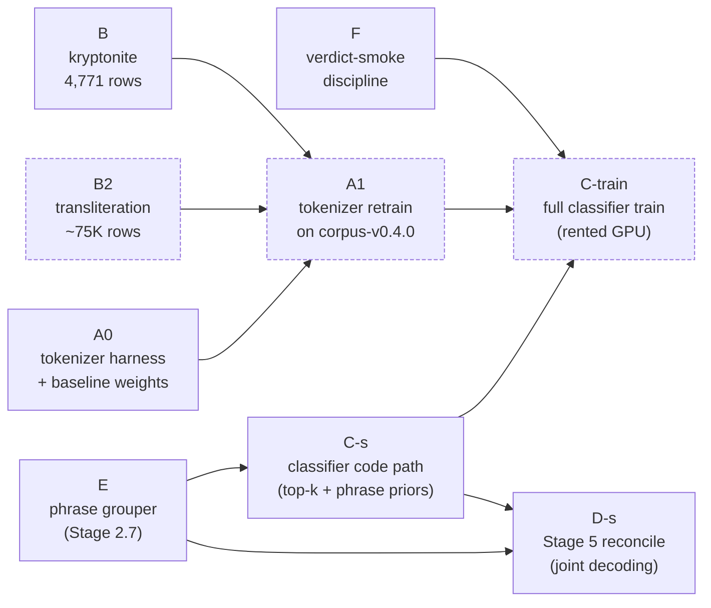

# v0.5.0 — as shipped

A single landing page for anyone catching up on the v0.5.0 fresh-slate work.

The v0.5.0 plan ([`PHASE_8_v0_5_0_fresh_slate.md`](./phases/PHASE_8_v0_5_0_fresh_slate.md)) split the work into six threads (A through F). Five of the six landed in `main` on 2026-05-23; the sixth (B2, transliteration pairs) is still generating data. This article catalogues what is now in the tree, how the pieces fit together, and what is still cooking.

## Why v0.5.0 exists

The [v0.4.0 ablation campaign retrospective](../retrospectives/v0-4-0-ablation-campaign.md) ended with three structural ceilings that small recipe tweaks could not clear:

1. The v0.1.0 tokenizer's byte-fallback rate on non-Latin scripts (the cause of 92% of country FN in the golden eval).
2. The classifier doing boundary discovery and type classification at the same time via BIO labels (the cause of the bio_slip slice on `", 22220"` for `22220`).
3. Stage 5 reconcile only sorting spans — it could not catch joint-incoherent parses like `NY-NY Steakhouse, Houston, TX`.

Patching each ceiling individually meant three medium iterations. v0.5.0 bundles them into one **fresh-slate** ship — pay the cost once, clear all three at once.

The "fresh-slate" framing is described in the operator's [sharpen-the-axe note](../concepts/the-knowledge-ladder.md#what-v040-taught-us-about-the-missing-rungs) — it is the right shape when several improvements share a common cost (a retrain, an interface change) and bundling avoids paying that cost three times.

## The six threads

| Thread | Name | What it adds | PR |
|---|---|---|---|
| **A0** | Tokenizer harness + A0 weights | SentencePiece training pipeline; A0 trained on `corpus-v0.3.0` as a byte-fallback baseline. **A1** will retrain on `corpus-v0.4.0` once B + B2 are both in. | [#129](https://github.com/sister-software/mailwoman/pull/129) |
| **B** | Kryptonite catalogue | 4,771 adversarial address rows generated via DeepSeek — `NY-NY Steakhouse`, `Paris, Texas`, `Saint Petersburg, FL`, etc. Each annotated with the correct parse. | [#130](https://github.com/sister-software/mailwoman/pull/130) |
| **B2** | Transliteration pairs | (Still cooking — see below.) ~75K US/FR addresses transliterated into Cyrillic / Japanese / Hangul / Han / Armenian script, for the A1 multi-script tokenizer training. | — |
| **C-s** | Classifier code path | Top-k inference (returns ranked sequences, not just argmax) + phrase-prior input features that condition on Stage 2.7's proposed spans. **No training run** in this PR — that lands once A1 + corpus-v0.4.0 are ready. | [#128](https://github.com/sister-software/mailwoman/pull/128) |
| **D-s** | Stage 5 reconcile | `reconcile.ts` joint decoder — beam search over (span × tag × resolver candidate) with concordance scoring via WOF parent-id chains. Catches the kryptonite cases at runtime. | [#131](https://github.com/sister-software/mailwoman/pull/131) |
| **E** | Phrase grouper | New `@mailwoman/phrase-grouper` workspace — Stage 2.7 proposes coherent input spans (street, postcode, locality, …) before Stage 3 runs. Rule-based v1 only; learned span proposer scoped for v0.5.1 ([PHASE_8_E](./phases/PHASE_8_E_learned_span_proposer.md)). | [#126](https://github.com/sister-software/mailwoman/pull/126) |
| **F** | Verdict-smoke discipline | New [`VERDICT_SMOKES.md`](./reference/VERDICT_SMOKES.md) + `--smoke-mode {constant,long-tail}` flag, so the cosine-LR mask that hid v0.4.0's divergence cannot reoccur. | [#125](https://github.com/sister-software/mailwoman/pull/125) |

## How the threads compose

The threads were designed to be parallel where possible and stacked where unavoidable. The actual data dependencies look like this:

Solid boxes are merged. Dashed boxes are still ahead (B2 in flight, A1 + C-train waiting on B2).

The single biggest schedule reframe was **A0** — the plan originally said "A is blocked by B" because the tokenizer trains on the same corpus as the classifier. We split that into:

- **A0** trains on `corpus-v0.3.0` immediately to validate the harness and establish a byte-fallback baseline.
- **A1** retrains on `corpus-v0.4.0` (= v0.3.0 + B + B2) when the corpus is complete.

That way A0 could ship in parallel with B + E + the scaffolds, instead of waiting for B + B2 to finish.

The other parallel-friendly move was **C-s and D-s as scaffolds**. The plan had C and D as serial training/integration work that needed real classifier output to validate. We pulled the *code* portion to t0 (forward-pass tests against stub data, mocked top-k for Stage 5) and deferred only the actual training run. That left the only mandatory serial portion as `B → A1 → C-train`.

## What is still cooking

| Item | State | ETA |
|---|---|---|
| **B2 transliteration generation** | Generator running (`PID 1102`, container `mailwoman-m-ship-v0-experienced-little-chrome`). Currently 520 / 1500 batches done — ~25,700 rows on disk at 5.5 rps. | ~2.5 hours from 2026-05-23T22:18Z. |
| **A1 tokenizer retrain** | Blocked on B2. Same harness as A0 (PR #129) — just re-invoke against `corpus-v0.4.0`. Tokenizer training takes ~1-2 h. | After B2 lands. |
| **C-train full classifier run** | Blocked on A1 + `corpus-v0.4.0`. Estimated single H100-day on rented compute per the plan. | After A1 lands. |

Three smaller follow-ups carried over from postmortems:

- **Wire `reconcileSpans` as the default Stage 5** in `runPipeline` (currently behind an explicit call). Lands once the classifier emits real top-k. Tracked in D-s's PR body.
- **Learned phrase-grouper variant** (1-2M-param span proposer). Scope written in [`PHASE_8_E_learned_span_proposer.md`](./phases/PHASE_8_E_learned_span_proposer.md). v0.5.1 stretch.
- **Reservoir-sampling parallelisation** in the tokenizer harness (~5× speedup possible per A0's session notes). Out-of-scope until A1 turnaround time becomes a real cost.

## Where to read next

If you are catching up on the architecture, read in this order:

1. [The knowledge ladder](../concepts/the-knowledge-ladder.md) — the conceptual framing for why the two new layers (Stage 2.7 phrase grouper, expanded Stage 5 reconcile) exist.
2. [The staged pipeline](../concepts/the-staged-pipeline.md) — the runtime composition end-to-end.
3. [`STAGES.md`](./reference/STAGES.md) — formal per-stage type contracts.
4. [`VERDICT_SMOKES.md`](./reference/VERDICT_SMOKES.md) — the process discipline that kept v0.5.0 from repeating v0.4.0's cosine-LR mask bug.

If you want the line-by-line technical history, the v0.4.0 retrospective ([`retrospectives/v0-4-0-ablation-campaign.md`](../retrospectives/v0-4-0-ablation-campaign.md)) is what motivated v0.5.0; this article is the bookend.
