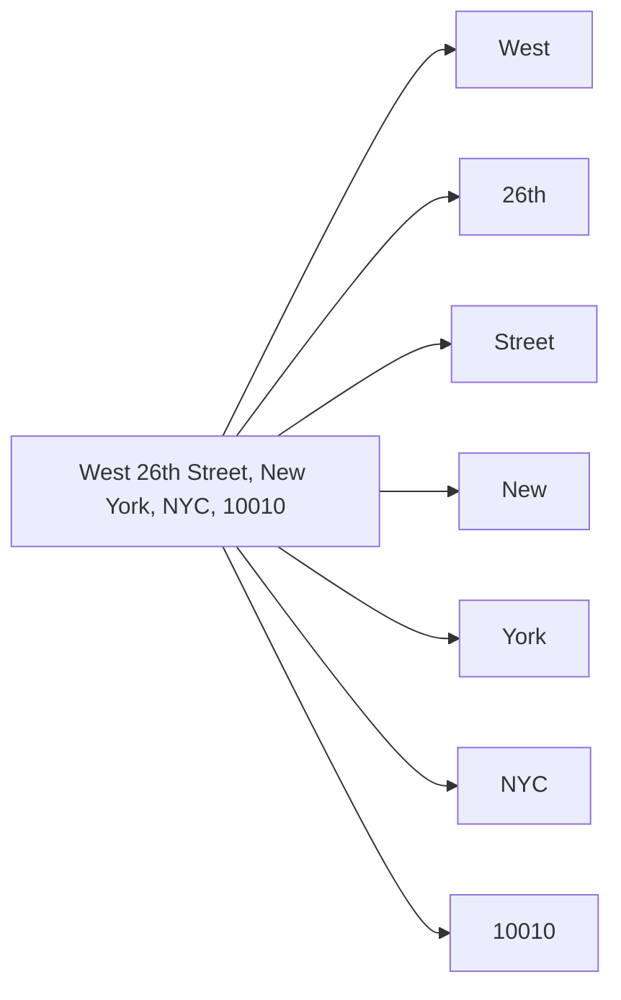

# How it used to work — Mailwoman v1

Mailwoman v1 (the pre-2026 version, still living on as the rule classifiers inside v2) parses an address in four steps. This article walks through each one with a concrete example.

The input we will use:

```
West 26th Street, New York, NYC, 10010
```

## Step 1 — Tokenization

The input string is split into **tokens** — single words or punctuation marks. Tokenization is more than `string.split(" ")` because Mailwoman keeps track of where each token came from in the original string.



Each token carries metadata: its character position in the original string, what kind of separator came before it (`comma`, `space`, `tab`, `newline`), and what other tokens it is grouped with. The grouping idea — Mailwoman calls these **sections** — is important: tokens that are separated by commas usually belong to different address components, so the solver treats them differently.

Tokenization is also the place where pre-processing happens: lowercase normalization, abbreviation expansion (`St.` → `Street`), and accent handling for non-English input.

Deep dive: [`concepts/tokenization.md`](../concepts/tokenization.md).

## Step 2 — Rule classifiers vote

Each token is shown to **every rule classifier** in parallel. A rule classifier is a small piece of code that tries to label a token as one address component type.

Examples of rule classifiers in Mailwoman v1:

- `house_number` — does this token look like a number (with optional letter suffix like `123A`)?
- `postcode` — does this token match a country-specific postcode pattern? (`10010` matches the US 5-digit pattern; `75008` matches the FR 5-digit pattern.)
- `street_prefix` — is this token a known direction (`North`, `West`, `SE`) or a known street-type prefix (`Avenue`, `Rue`, `Boulevard`)?
- `whos_on_first` — is this token (or this short phrase) found in the Who's On First gazetteer as the name of a country, region, locality, or neighbourhood?

Each classifier produces zero or more **classifications** for each token. A classification is a triple:

```ts
{ component: "postcode", confidence: 0.95, source: "rule:postcode" }
```

A single token can collect multiple classifications. For our example, `New` might collect:

- `{ component: "locality", confidence: 0.4, source: "rule:whos_on_first" }` (because "New" alone matches a few WOF entries)
- `{ component: "street_prefix", confidence: 0.1, source: "rule:street_prefix" }` (because "New" sometimes precedes a street name)

This is intentional: rule classifiers are allowed to be **uncertain and contradictory**. The next step resolves the contradiction.

Deep dive: [`concepts/rule-based-classifiers.md`](../concepts/rule-based-classifiers.md).

## Step 3 — The solver picks a winning combination

The **solver** looks at all the classifications produced for all the tokens and tries to find a self-consistent interpretation. "Self-consistent" means:

- Each address component appears at most once (you can have one `locality`, not two).
- Components do not overlap on the same tokens.
- The combination obeys soft preferences (a US-style postcode after a region is more likely than a postcode at the start, for example).

Mailwoman v1's solver is an `ExclusiveCartesianSolver` with filters and augmenters. In plain terms: it generates every plausible combination, filters out the ones that violate the hard rules, scores the rest, and returns them ranked.

For our example, a top-ranked output looks like:

```json
[
	{ "component": "street_prefix", "value": "West", "confidence": 0.85 },
	{ "component": "house_number", "value": "26th", "confidence": 0.6 },
	{ "component": "street", "value": "Street", "confidence": 0.4 },
	{ "component": "locality", "value": "New York", "confidence": 0.9 },
	{ "component": "locality", "value": "NYC", "confidence": 0.7 },
	{ "component": "postcode", "value": "10010", "confidence": 1.0 }
]
```

Notice the two `locality` candidates. The solver returns multiple ranked solutions; the consumer (the CLI, the API) picks the top one or shows all of them.

## Step 4 — Resolve

Parsing answered "what kind of thing is each part of this string?". Resolving answers "where is the resulting place?". The parsed components are looked up in a gazetteer — Who's On First, in Mailwoman's case — and the gazetteer returns coordinates, a stable place ID, and optionally a bounding box.

The resolver is a separate concern from the parser. Read about it in [`concepts/resolver-and-wof.md`](../concepts/resolver-and-wof.md).

## What this approach is good at

- **Determinism.** A rule classifier produces the same answer on the same input every time. No retraining, no randomness.
- **Explainability.** When the parser is wrong, you can read the rule and see why.
- **Fast iteration on a single bug.** "The postcode pattern misses Canadian H1A-X9X" is a one-line code change.

## What this approach is bad at

- **The long tail.** Every new address shape needs a new rule or a tweak to an existing one. The list of rules grows forever.
- **Words that look like multiple things.** "Buffalo" is a US locality, a venue name (Buffalo Wild Wings), and an animal. Rules can declare all three; only data can rank them.
- **Multi-word components.** "Saint Petersburg" is one locality, not two. A rule that recognises common multi-word names is brittle.
- **Languages other than English.** Every locale needs its own rule set, hand-written, by someone who reads that language well.

These weaknesses are why Mailwoman v2 brought in the neural classifier. Continue with [`how-it-works-now.md`](./how-it-works-now.md).
