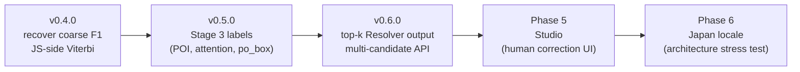

# How it will work — the near future

This article describes where Mailwoman is heading. The work is tracked in GitHub issues and the [`plan/`](../plan/README.md) directory; here we sketch the direction at a level that does not require reading source code.

## The next iteration — v0.4.0

The v0.3.0 ship (the current `@mailwoman/neural-weights-{en-us,fr-fr}@3.0.0` release) gave us a Stage 2 model — it can now emit `venue`, `street`, and `house_number` labels in addition to the four coarse components. But it shipped with two known issues: coarse F1 regressed against the v0.2.0 baseline, and the training loss was unstable enough that we stopped early at step 1,800 of a planned 50,000.

v0.4.0 targets both. The plan is tracked in [issue #116](https://github.com/sister-software/mailwoman/issues/116) and broken into six work areas:

1. **Per-token CRF NLL normalization.** Today the dual loss term (cross-entropy + CRF negative-log-likelihood) requires a hand-tuned weight (`crf_loss_weight = 0.05`) to keep the two gradients comparable. Normalizing the CRF loss per token makes the two terms naturally comparable. This is what AllenNLP and FLAIR do by default.
2. **Train longer.** Step 1,800 is 3.6% of the planned 50K. Many of the regressed metrics will recover on their own with more training.
3. **Class-weighted cross-entropy.** The 21-label vocabulary pulled softmax mass off the four coarse classes. Weighting the CE loss toward coarse classes during training compensates.
4. **Source-weight rebalance.** The US DOT National Address Database (NAD) adapter contributed 57.9 million rows of fine-label-heavy data. Rebalancing the per-source weights so coarse-rich sources are sampled more often re-prioritizes the coarse signal.
5. **JS-side Viterbi decoding.** The CRF was used at training time and evaluation time; the production runtime still uses per-token argmax. Bringing Viterbi to the browser closes the eval-vs-production gap on multi-word components.
6. **JS-side label vocabulary loaded from the model card.** Today the label list is hardcoded in JavaScript. Reading it from the model card removes a silent failure mode where a new model version's new labels would be misrouted.

All six are small, focused changes. The corpus does not need to be rebuilt unless source weights change significantly.

## Aspirational targets for v0.4.0

| Component                    | v3.0.0 | v0.4.0 target |
| ---------------------------- | ------ | ------------- |
| `region`                     | 0.18   | ≥ 0.6         |
| `locality`                   | 0.27   | ≥ 0.5         |
| `postcode`                   | 0.76   | ≥ 0.8         |
| `venue`                      | 0.39   | ≥ 0.5         |
| `street`                     | 0.27   | ≥ 0.4         |
| `house_number`               | 0.78   | hold          |
| confidence > 0.9 calibration | 0.60   | ≥ 0.75        |

These are stretch targets, not pass-fail gates. The v0.4.0 ship metric is "clear progress on at least two of \{coarse F1, fine F1, calibration, training stability\}".

## Beyond v0.4.0 — the longer arc

The implementation plan ([`plan/README.md`](../plan/README.md)) lays out six phases. Phases 0 through 4.3 have shipped substantially. The remaining direction:

Each ship is small on purpose. We learned from v0.1.0 → v0.2.0 → v0.3.0 that "ship at every iteration, even if below targets, with the eval honestly reported" is a much better cadence than "wait for the perfect run".

## What stays the same

Reading the implementation plan, you might notice we are not planning to:

- **Replace the rule classifiers.** They will stay. They are deterministic, fast, and reliable for the components they cover. The neural classifier earns each component one at a time.
- **Build a giant model.** The transformer is staying small (9 million parameters, give or take). The win comes from better training data and better decoding, not from scaling the model up. Address parsing is not a problem where bigger LLMs help.
- **Drop browser support.** The whole pipeline must remain browser-runnable. The 60 MB cold-load budget is a hard constraint.
- **Tie the neural runtime to a specific Mailwoman-internal type.** The packages can ship standalone for users who want only the parser.

## What we are watching

A few risks the team is tracking:

- **The Saint-Petersburg-class bugs.** Multi-word component spans are where rule classifiers fail and where the CRF helps. v0.4.0's JS-side Viterbi is the first proper fix on the runtime side.
- **The training-data licence boundary.** Mailwoman trains on permissive open data only (public domain federal sources, Pelias-friendly licences). The corpus build pipeline filters by per-row licence on ingest. If a source's terms change, we drop it. See [`plan/reference/CONTEXT.md`](../plan/reference/CONTEXT.md) for the policy.
- **Locale parity.** The fr-fr model has not had the focused attention en-us has had. Closing that gap is on the Phase 6 list, possibly sooner.

## What we are not doing

- **Multi-language understanding.** We are not training a model that can read prose in 50 languages. We are training one that can label tokens in addresses for the locales we ship.
- **Generative output.** The neural classifier does not write text. It labels existing tokens.
- **Replacing OpenStreetMap, Pelias, libpostal, or any upstream.** Mailwoman uses many of these as data sources or inspiration, and contributing improvements upstream where they fit is welcome.

## Continue

- [Glossary](./glossary.md) — every technical term in one place
- [`concepts/`](../concepts/README.md) — deeper, per-topic articles
