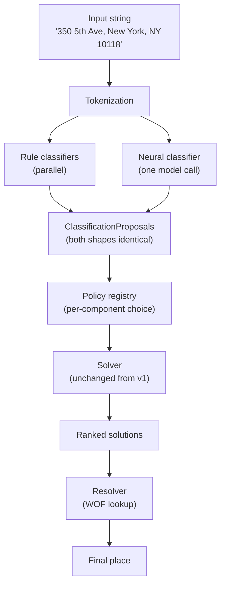

# How it works now — the hybrid

Mailwoman v2 (shipped through 2026) keeps **every rule classifier from v1** and adds a **neural classifier** that runs alongside them. Both kinds of classifier produce the same shape of output, and a small per-component **policy registry** decides whose vote wins for each address component.

This article assumes you have read [How it used to work](./how-it-used-to-work.md).

## The two-track flow



Both classifiers write into the same **`ClassificationProposal`** shape:

```ts
interface ClassificationProposal {
	span: Span // which characters in the input
	component: ComponentTag // 'house_number' | 'street' | 'locality' | …
	confidence: number // 0..1
	source: "rule" | "neural" | "merged"
	source_id: string // 'rule:postcode' or 'neural-v3-en-us'
	penalty: number
	metadata?: Record<string, unknown>
}
```

The solver does not know or care whether a proposal came from a rule or from the neural model. This is what makes the hybrid safe: we can turn the neural classifier off for a single component by changing one policy line, and the system keeps working with only rules for that component.

## What "neural classifier" means here

The neural classifier is a small **transformer** model. ("Transformer" is a kind of neural network architecture popularised by the 2017 paper _Attention Is All You Need_; we explain it in [`concepts/neural-classification.md`](../concepts/neural-classification.md).) Its job is the same as a rule classifier: look at the input and emit labelled spans.

The current model has:

- About **9 million parameters** — small by 2026 standards, large enough to do this job well.
- A **6-layer encoder** with 4 attention heads and 256 hidden dimensions.
- A **21-class output head** that emits one BIO label per token. BIO labels are how the model marks span boundaries; see [`concepts/bio-labels.md`](../concepts/bio-labels.md).
- A **linear-chain CRF decoder** on top that fixes up structurally-invalid label sequences (the "Saint Petersburg → Petersburg" clipping bug that v1 had). See [`concepts/crf-decoder.md`](../concepts/crf-decoder.md).

The model ships as an **ONNX** file (a portable model format that runs in both Node.js and the browser). The full neural runtime — model + tokenizer + decoder — is about 25 MB compressed, small enough to ship in a web page. See [`concepts/onnx-runtime.md`](../concepts/onnx-runtime.md).

## The Ship-of-Theseus dial

Each address component has a policy:

```ts
interface ClassifierPolicy {
	component: ComponentTag
	mode: "rule_only" | "neural_only" | "both" | "neural_preferred" | "rule_preferred"
	confidence_threshold?: number
	locale?: string
}
```

Default mode is `rule_only`. The neural classifier is turned on for a component only after its golden-set metrics beat the rule classifier. This way, the migration is gradual and reversible. If a neural model regresses, flipping the policy back to `rule_only` is a one-line change with no retraining.

As of v3.0.0 (the current shipped weights), the neural classifier is strongest on `house_number` (F1 ≈ 0.78) and adds capability for `venue` and `street` that the rule classifiers do not provide. The coarse components (`country`, `region`, `locality`, `postcode`) are still better served by the rules because of a training-side regression we are recovering in v0.4.0 — see [How it will work](./how-it-will-work.md).

## What the demo shows

The live demo at [mailwoman.sister.software/demo](https://mailwoman.sister.software/demo) runs the **entire stack in the browser**:

- The neural model (about 25 MB) loads via `@mailwoman/neural-web` on top of `onnxruntime-web`.
- The Who's On First gazetteer (about 35 MB, a slim subset for the top 1,000 US localities + all US postcodes) loads via `@mailwoman/resolver-wof-wasm` on top of `sqlite-wasm`.
- After the initial download (about 60 MB), the browser caches everything and subsequent visits are instant.

This is a useful demonstration that the neural pipeline is small enough to be portable. It also means the demo has no server costs — it is a static site.

## How a parse + resolve goes today

Using the demo's `"Wrigley Field, 1060 W Addison St, Chicago, IL 60613"` example:

1. **Tokenize.** Split into `[Wrigley, Field, 1060, W, Addison, St, Chicago, IL, 60613]`.
2. **Rule classifiers** mark `1060` as `house_number` (high confidence), `IL` as `region` (high confidence), `60613` as `postcode` (very high confidence).
3. **Neural classifier** runs once over the whole token sequence and emits BIO labels: `B-venue, I-venue, B-house_number, B-street, I-street, I-street, B-locality, B-region, B-postcode`.
4. **Policy registry** merges: `house_number` from rules (higher confidence), `venue` from neural (rules have no `venue` classifier), `street` from neural, `locality`/`region`/`postcode` from whichever scored higher.
5. **Solver** picks the best self-consistent combination.
6. **Resolver** takes the resulting `locality + region + postcode` and looks up Chicago in WOF — returns ID, coordinates, and a bounding box.
7. The demo renders a marker on the map at the resolved coordinates and shows the parse table to the side.

## What is honest to admit about today

- **Coarse F1 regressed in v3.0.0.** The neural classifier shipped with `region` F1 of 0.18 (down from v2.x's 0.83 on the same eval data). v0.4.0 is specifically targeting this. Today, the rule classifiers for the coarse components are doing most of the work in practice.
- **JS-side decoder is per-token argmax, not Viterbi.** The CRF transition mask was used during training and during the evaluation script, but the production browser path does not run the CRF Viterbi loop yet. v0.4.0 will fix this. In the meantime, the visible improvement on "Saint Petersburg" comes from training, not from runtime decoding — close, but not the same.
- **The model is small.** Nine million parameters is enough for the address-parsing task but not enough for free-text understanding. We are not building a chatbot.

Continue with [How it will work](./how-it-will-work.md) for the near-future plan.
