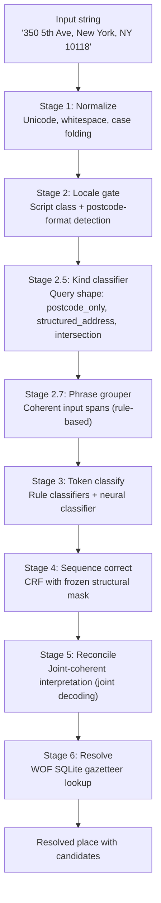

# How it works now — the staged pipeline

Mailwoman v2 (current as of May 2026) runs addresses through a **six-stage pipeline.** Each stage adds one kind of knowledge the stages below it cannot easily derive. Rule classifiers and a neural classifier coexist. A **policy registry** decides whose vote wins for each address component.

This article assumes you have read [How it used to work](./how-it-used-to-work.mdx). For the design principles behind the staged decomposition, read [The knowledge ladder](./the-knowledge-ladder.mdx).

## The staged pipeline



## The stages in detail

### Stage 1 — Normalize

Unicode normalization (NFD-decomposed accents → composed), locale-aware case folding, whitespace collapsing. Knows nothing about address structure. Cleans bytes so downstream layers see canonical text.

### Stage 2 — Locale gate

Detects whether input is en-US, fr-FR, ja-JP, etc. Rule-based today: script-class detection (CJK → ja-JP, Cyrillic → ru, Arabic → ar) plus known-format hits (5-digit ZIP → en-US, FR postcode → fr-FR). The `@mailwoman/locale-gate` workspace ships the logic; it exists as a workspace but the factory default still falls back to caller-trust. Wiring it as the default is a near-term TODO.

### Stage 2.5 — Kind classifier

Classifies the query shape: bare postcode? single locality? full structured address? PO box? landmark? intersection? Pure structural cues — no place-name dictionaries. The kind decision enables fast-path routing (a bare postcode skips the neural classifier and goes straight to the resolver).

### Stage 2.7 — Phrase grouper

Proposes coherent input spans _before_ the classifier runs. Shipped in v0.5.0 as `@mailwoman/phrase-grouper` (rule-based, Thread E). The grouper uses structural cues — punctuation, capitalization, numeric patterns, token proximity — not dictionaries:

```
Input:  "350 5th Ave, New York, NY 10118"
Spans:  [{text:"350", kind:NUMERIC}, {text:"5th Ave", kind:STREET_PHRASE},
         {text:"New York", kind:LOCALITY_PHRASE}, {text:"NY", kind:REGION_ABBREVIATION},
         {text:"10118", kind:POSTCODE}]
```

The grouper does not know what the spans _mean_. It only knows where the _boundaries_ are. This moves boundary discovery out of the classifier — the classifier now answers "what type is this proposed span?" instead of "where do spans start AND what type are they?"

A learned phrase-grouper variant (1-2M-param span proposer) is scoped for v0.5.1 or later.

### Stage 3 — Token classify

Two kinds of classifier run in parallel:

**Rule classifiers** (from Mailwoman v1): `house_number`, `postcode`, `whos_on_first`, `street_prefix`, `street_suffix`, and others. Deterministic, dictionary/regex-based. Correct for the bounded cases they cover.

**Neural classifier**: a 9-million-parameter encoder-only transformer trained from scratch on Mailwoman's corpus. Emits per-token BIO labels using a 21-class vocabulary (country, region, locality, postcode, street, house_number, venue, and associated `I-` and `B-` variants). See [Neural classification](../../concepts/neural-classification.mdx).

The v0.5.0 classifier (Thread C-s) adds two architectural changes gated behind config flags:

- **Phrase-prior conditioning.** The input layer takes per-token features from the Stage 2.7 phrase grouper (BIE markers + `PhraseKind` one-hot), concatenated onto the token+position embedding. The classifier conditions on proposed boundaries rather than discovering them from scratch.
- **Top-k inference.** The inference path emits the K most-probable tag sequences with calibrated log-probability scores, rather than the single argmax. Stage 5 reconcile consumes these as the classifier's belief over candidate parses.

Both are scaffolded and tested in `main`. The full training run that exercises them (C-train) is in progress as of May 2026 — see the [v0.5.0 C-train blog post](pathname:///blog/2026-05-24-v0-5-0-c-train-bisect).

### Stage 4 — Sequence correct

A CRF with a frozen structural transition mask enforces BIO sequence validity. The mask forbids orphan `I-*` sequences (no `I-locality` without preceding `B-locality` or `I-locality`). This is the fix for the "Saint Petersburg → Petersburg" clipping: the CRF transition `O → I-locality` is structurally impossible with the frozen mask.

The CRF is applied at inference time via Viterbi decode (JS-side, shipped in v0.4.0). It was used at training time in v0.4.0's dual-loss recipe (CRF-NLL + CE). The May 2026 training experiments are testing whether removing the CRF loss term (CE-only training, CRF at inference only) stabilizes training — see [the v0.5.0 retrospective](pathname:///blog/2026-05-24-v0-5-0-c-train-bisect).

### Stage 5 — Reconcile

Picks the joint-coherent interpretation from the classifier's top-K candidates. Shipped in v0.5.0 as `core/pipeline/reconcile.ts` (Thread D-s). The reconciler performs beam search over `(span × tag × resolver candidate)` triples, scoring each beam with:

```
score = phrase_conf × classifier_score × resolver_score × concordance_bonus
```

The concordance bonus rewards parent-chain consistency in the WOF gazetteer. A fully-consistent WOF parent chain contributes `+concordanceWeight` in log-space. An explicit contradiction (`region=NY` when the locality's parent is Illinois) is a hard veto.

Joint decode is **opt-in** behind a feature flag in the runtime as of May 2026. The argmax fallback path (sort spans by start position) is still the default until the classifier's top-k contract lands. Wiring joint decode as the default is the next integration step — tracked in the v0.5.0 ship PR.

### Stage 6 — Resolve

Looks up parsed components against the WOF SQLite gazetteer. Returns place IDs, coordinates, parent chains, and alternate names. The resolver surfaces top-K candidates per administrative span (locality, region) so downstream systems can handle ambiguity.

## The Ship-of-Theseus dial

Each address component has a policy:

```ts
interface ClassifierPolicy {
	component: ComponentTag
	mode: "rule_only" | "neural_only" | "both" | "neural_preferred" | "rule_preferred"
	confidence_threshold?: number
	locale?: string
}
```

Default mode is `rule_only`. The neural classifier earns each component one at a time, gated on golden-set metrics. If a neural model regresses, flipping back to `rule_only` is a one-line config change with no retraining.

As of the v0.4.0-shipped weights (the current production model), the neural classifier is strongest on `house_number` (F1 ≈ 0.79) and `street` (F1 ≈ 0.30). Coarse components (`country`, `region`, `locality`, `postcode`) are still better served by rules in practice.

## Try it live

import { DemoEmbedProvider } from "@site/src/contexts/DemoEmbed"
import { PipelineExplorer } from "@site/src/components/PipelineExplorer/PipelineExplorer"

<DemoEmbedProvider sqljsBaseUrl="/mailwoman/sqljs">
  <PipelineExplorer />
</DemoEmbedProvider>

## What is honest to admit about today (May 2026)

- **CE-only training resolved the divergence problem.** The v0.5.2 model ships from a stable 100K-step CE-only training run on an A100. The dual-loss CRF-NLL + CE divergence that blocked v0.4.0 and v0.5.0 was resolved by setting `crf_loss_weight: 0.0` — CRF is used at inference only, not training. v0.5.3 diagnostic training is in progress with per-tag F1 visibility.
- **The FST gazetteer prior is shipped but not yet in the browser.** The FST builder, Wikipedia importance scoring, and emission prior compose with the QueryShape soft prior in the Node.js pipeline. The browser `/demo` page runs the neural classifier directly without the FST — it would need a browser-compatible FST loader (Phase 4).
- **Joint decode is still opt-in.** The reconciler produces single-token spans when phrase-grouper proposals don't cover multi-word streets/localities. It stays behind `forceJointReconcile` until the grouper proposes multi-word phrases.
- **Locality/region confusion persists on some inputs.** "New York, NY" is fixed (region-aware guard). "Washington, DC" is partially fixed (FST correctly biases locality) but the model's high B-street confidence for "Washington" after a street phrase resists the prior. Fix is in training data, not more priors.
- **The model is small.** 29M parameters (h384, 6 layers, 6 heads). Runs in ~10ms per address on CPU via ONNX Runtime. The int8 quantized model is 17 MB.

Continue with [How it will work](./how-it-will-work.mdx) for the near-future roadmap.
