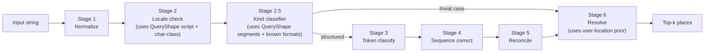

# Query Shape — Cheap Structural Priors

This page records the design intent for the `QueryShape` sub-system, an addition to stages 2 and 2.5 of the runtime pipeline ([the-staged-pipeline](../../records/site-2026-08/understanding/our-approach/the-staged-pipeline.mdx)). The design is consistent with the bitter lesson because it recognizes _what shape an input has_ rather than _which strings are localities_.

## Status

- **Conceived:** 2026-05-22 design conversation.
- **Decision:** commit to the sub-system and bundle it as `@mailwoman/query-shape`, built from pure functions without ML.
- **Implementation phase:** not yet started. It will land alongside the Stage 2 and Stage 2.5 work in the staged-pipeline rollout.
- **Cross-references:** [`concepts/the-staged-pipeline`](../../records/site-2026-08/understanding/our-approach/the-staged-pipeline.mdx), [`concepts/addresses-that-break-geocoders`](../../records/site-2026-08/understanding/why-its-hard/addresses-that-break-geocoders.mdx), [`reference/ARCHITECTURE`](./ARCHITECTURE.mdx).

## Bitter-lesson framing test

Mailwoman v1 (Pelias lineage) used rules to encode _place knowledge_: dictionaries of 50K city names, hand-curated state abbreviation tables, and country-specific keyword sets. Every new locale needed a new dictionary, and the maintenance burden grew with each one.

The QueryShape sub-system avoids that trap by restricting itself to **universal structural patterns**: the character classes of the tokens, the position of the punctuation, and whether a substring matches a known postcode regex. The locale test asks:

> Would this code change if Mailwoman added a 50th locale?

| Primitive                | Adds per new locale                  | Verdict   |
| ------------------------ | ------------------------------------ | --------- |
| Character class detector | Nothing                              | universal |
| Segmentation grammar     | ~5 lines of locale punctuation rules | bounded   |
| Known-format regex set   | ~1 postcode pattern                  | bounded   |
| User-location prior      | Nothing                              | universal |

By comparison, v1's gazetteer-based locality classifier needed ~50K place names per locale. This sub-system is designed to avoid that per-locale growth.

## `QueryShape` data structure

```ts
interface QueryShape {
	/** Dominant character class of the whole input. */
	characterClass: "numeric" | "alpha" | "alphanumeric" | "cjk" | "cyrillic" | "arabic" | "mixed"

	/** Per-token character class. */
	tokenClasses: TokenClass[]

	/** Punctuation-bounded segments, locale-aware. */
	segments: Segment[]

	/** Known-format regex hits (US ZIP, UK postcode, FR postcode, etc.). */
	knownFormats: KnownFormatHit[]

	totalLength: number
	whitespacePattern: "single" | "double" | "tab" | "mixed" | "none"
}

interface TokenClass {
	span: Span
	class: "digit" | "alpha" | "mixed" | "punct" | "cjk" | "cyrillic" | "arabic"
	length: number
}

interface Segment {
	span: Span
	body: string
	index: number // position in the segment list
	separator: "comma" | "newline" | "tab" | "whitespace" | "japanese-style" | null
}

interface KnownFormatHit {
	format:
		| "us_zip" // \d{5}
		| "us_zip4" // \d{5}-\d{4}
		| "uk_postcode" // SW1A 1AA pattern
		| "fr_postcode" // \d{5} with French context
		| "ca_postcode" // A1A 1A1 pattern
		| "de_postcode"
		| "jp_postcode" // \d{3}-\d{4}
		| "po_box" // PO Box / BP pattern
	span: Span
	confidence: number
}
```

Computing a `QueryShape` takes microseconds and uses no ML. It runs on every input before the encoder.

## Four primitives

### 1. Meta queries (character class)

This primitive analyzes only the characters of the input. It is cheap, deterministic, and language-agnostic. Examples:

| Input                               | Character class signal                             |
| ----------------------------------- | -------------------------------------------------- |
| `"10118"`                           | pure-digit, length 5 → strong postcode prior       |
| `"10118-1234"`                      | digit-hyphen-digit, length 10 → US ZIP+4 prior     |
| `"SW1A 1AA"`                        | letter-digit-letter pattern → UK postcode prior    |
| `"NYC NY"`                          | all-alpha, very short → likely locality-only query |
| `"東京駅"`                          | all CJK → script signal + likely landmark/venue    |
| `"دبي"`                             | all Arabic → script signal                         |
| `"350 5th Ave, New York, NY 10118"` | mixed alphanumeric + 3 commas → structured address |

These signals feed **Stage 2 (`locale-hint`)** and **Stage 2.5 (kind classifier)** as priors.

### 2. Phrasification (segmentation)

This primitive splits the input into chunks bounded by punctuation. Currently the encoder re-learns segment structure from punctuation tokens. Making the structure explicit gives downstream stages a structural prior at almost no cost.

Segments have three possible uses, in order of complexity:

1. **As an encoder input feature:** a segment id per token, concatenated to the input embedding. This is cheap and needs no architecture change.
2. **As an attention mask:** tokens attend strongly to other tokens within their segment and weakly across segments. This needs a modest architecture change.
3. **As a per-segment kind hint:** `segment[3] is 5-digit-numeric → postcode-prior for this segment only`. Stage 2.5 emits a per-segment QueryShape, and the encoder receives per-segment priors.

**Locale dependence is bounded.** Commas mark segments in US/FR/UK addresses, whitespace marks them in JP, and honorifics mark them in Korean. The _punctuation grammar_ is part of locale-aware Stage-1 normalization, but its output is an abstract `Segment[]` that downstream stages consume the same way for every locale. Each new locale adds ~5 lines of segmentation rules rather than 50K dictionary entries.

### 3. Known-format detection

A bounded set of universal postcode and well-known-format regexes:

- US ZIP / ZIP+4
- UK postcode
- FR postcode (5 digits with French context)
- CA postcode (A1A 1A1)
- DE postcode
- JP postcode (\\d{3}-\\d{4})
- PO Box / BP variants

When a known-format pattern matches with high confidence and the user-location prior agrees, Stage 2.5 can route directly to **Stage 6 (resolver)** and skip the encoder. In the browser, this saves ~5 ms of encoder inference and a ~25 MB model load per call for the trivial cases.

⚠ **Fast paths are advisory rather than authoritative.** `"10118"` could be partially typed input (`"10118 Maple St"` mid-keystroke). Every fast path must:

- Honor a `force_full_pipeline?: boolean` option (default false).
- Apply a conservative confidence floor before short-circuiting.
- Still report alternatives in the result instead of collapsing to one answer.

If autocomplete or streaming-input workflows break because fast paths short-circuited too early, the confidence floor is too low.

### 4. User physical location

The user's location is an external signal that joins the input-side priors. It feeds **Stage 6 (resolver)** scoring:

```
score(candidate) = match × population_prior × regional_prior_from_language × regional_prior_from_user_location
```

All four factors are **soft priors**. A user with a Texas IP address who types `"Paris"` in French input gets a tie between Paris-FR and Paris-TX, and structural cues such as a state abbreviation or postcode shape break the tie. None of the priors acts as a hard filter, because a hard filter would violate the project's "possibilities rather than constraints" principle ([`reference/CONTEXT.md`](./CONTEXT.mdx#the-confidence-as-trap-pattern)).

API shape (optional input):

```ts
interface ResolveOpts {
	userLocation?:
		| { lat: number; lon: number } // precise (GPS, IP-geolocated)
		| { country: string } // coarse (CDN region, user setting)
		| { region: string; country: string } // medium (US state)
}
```

## Where this lands in the pipeline



QueryShape is computed once, at the boundary between Stage 1 and Stage 2, and passed to the rest of the pipeline as additional context. It is a shared data structure rather than a separate stage, and Stages 2, 2.5, 3 (optional), and 6 all consume it.

## Packaging decision

The sub-system ships as a single workspace package:

```
packages/query-shape/
├── src/
│   ├── character-class.ts        # token-level + input-level classification
│   ├── segmentation.ts           # punctuation-grammar-aware chunking
│   ├── known-formats.ts          # postcode + PO-box regex set
│   ├── compute.ts                # entry point: (input, locale?) → QueryShape
│   └── types.ts                  # the QueryShape interface
├── test/
└── package.json
```

The package uses no ML and adds no npm dependencies beyond those `@mailwoman/core` already pulls in. It is small (< 100 KB compiled) and runs in both the browser and Node.

## Locality soft prior (v0.5.2 extension)

This extension was added on 2026-05-25 after diagnosing the demo preset locality/region confusion ([`DEMO_PRESET_DIAGNOSIS.md`](./DEMO_PRESET_DIAGNOSIS.mdx)).

The existing `buildEmissionPriors` path applies logit boosts for known-format hits (e.g., postcode regex → `B-postcode`). The locality soft prior extends this. When an unambiguous 2-letter region abbreviation is detected (e.g., `DC`, `NY`, `CA`), the preceding tokens that match a WOF locality entry at the detected locale receive a `+2.0` logit boost toward `B-locality` / `I-locality`.

The extension adds a field to `QueryShape`:

```ts
regionAbbreviations?: Array<{ start: number; span: string }>
```

Detection uses a single regex per locale (`/,\s*[A-Z]{2}\b/` for en-us), at the same cost as postcode-format detection. The WOF verification is the safety constraint: the prior biases only the preceding tokens that are verified localities.

This design passes the bitter-lesson framing test, because the regex is locale-bounded rather than a gazetteer. The WOF check prevents the prior from over-biasing non-locality tokens in the same address, such as "Pennsylvania" in a street name.

## Open questions for implementation

These decisions need to be made when implementation starts. They are recorded here so they do not have to be worked out again.

1. **Where is `QueryShape` computed?** It could be computed eagerly at parse entry, which always pays the microsecond cost, or lazily for the first downstream consumer, because some inputs may not need it. The recommendation is eager computation, because computing it costs less than threading lazy evaluation through the pipeline.
2. **Should the known-format regex set be extensible?** The options are hardcoded or registerable. The recommendation is hardcoded for v1, because the postcode set rarely changes. Re-evaluate if community adapters want to register country-specific formats.
3. **What confidence threshold should fast-path routing use?** Choose a conservative value (~0.95) and tune it from real-world data. A threshold that is too low returns wrong answers instead of running the full pipeline, which is severe. A threshold that is too high only slows inference.
4. **Should the segment id be an additive or a concatenated encoder feature?** Concatenating it to the input embeddings is simplest and avoids an architecture change. Decide when the encoder is retrained.
5. **How does `QueryShape` interact with `LocaleDetector`?** The detector will probably use `QueryShape.characterClass` and `QueryShape.tokenClasses` as input features, which means `LocaleDetector` runs _after_ `QueryShape.compute()`. Document this dependency.

## What this is not

- **Not the gazetteer.** Place-name lookup lives in Stage 6 / Resolver. QueryShape never asks "is this a city name?".
- **Not the kind classifier.** The kind classifier (Stage 2.5) consumes QueryShape, but it is a separate component that may or may not use ML.
- **Not a replacement for the encoder.** Trivial inputs short-circuit, and structured inputs still run through the full pipeline.
- **Not free of locale concerns.** The segmentation grammar and the known-format set both grow per locale, but they grow by O(1) per locale rather than O(N place names).

## See also

- [`concepts/the-staged-pipeline`](../../records/site-2026-08/understanding/our-approach/the-staged-pipeline.mdx) — the runtime stages this slots into
- [`concepts/addresses-that-break-geocoders`](../../records/site-2026-08/understanding/why-its-hard/addresses-that-break-geocoders.mdx) — the failure-mode catalogue that motivated this
- [`reference/CONTEXT.md`](./CONTEXT.mdx) — the bitter-lesson framing and the "possibilities not constraints" principle
- [`reference/ARCHITECTURE.md`](./ARCHITECTURE.mdx) — the broader system shape; QueryShape fits between tokenization and classification
