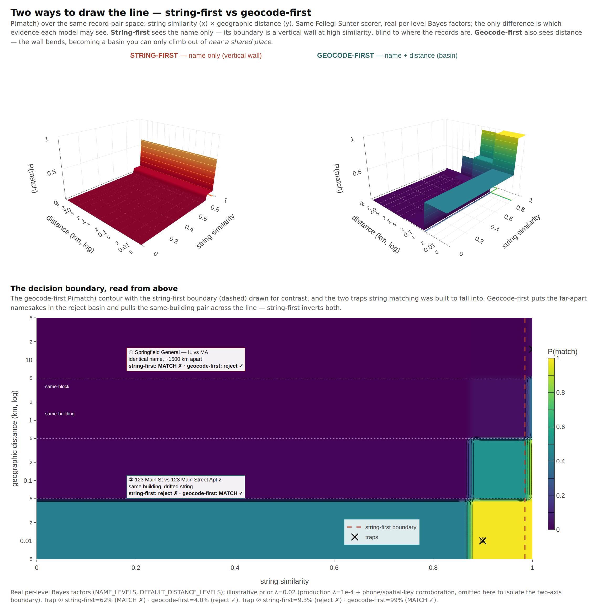

# Geocode-first record matching — the thing that imploded, and why it won't again

Mailwoman started as a record-matching project. The original job involved a set of clinics that receive federal and state funding. Their records arrived as SQLite dumps, CSV exports, and hand-keyed spreadsheets. The question was _which of these registered entities already got money, which are eligible and didn't, and which are the same clinic typed three different ways?_ The plan was to normalize and geocode the records, load them into QGIS, check coverage, and build a lead list.

The pipeline failed at the matching step. Pelias and libpostal parsed the addresses too poorly, which led to mailwoman's v0 TypeScript rewrite and then to the neural parser. The parser was only the first step, though. We never shipped the matcher, which is the part that decides whether two messy records describe the same real-world entity. This page describes the plan for building it and the change that makes it feasible now.

## What it is

The matcher is **a calibrated, geocode-first entity-resolution layer**. It first resolves every record to a coordinate and a hierarchy. It then links records by _where they are_ and _who they are_, instead of by how their address strings are spelled.

Each term in that description has a specific meaning:

- **Entity resolution.** This is the classical problem of blocking, pairwise matching, and clustering into canonical entities. The field is old and well theorized (Fellegi & Sunter, 1969).
- **Geocode-first.** The address becomes a point before it becomes a match feature. This is the central design choice, and it addresses the cause of the earlier failure.
- **Calibrated.** Every link carries a probability, and every threshold states its precision/recall tradeoff. The matcher sends ambiguous pairs to review instead of guessing. The geocoder follows the same practice.

## Why it imploded — and what changed under it

The v0 matcher was **string-first**. It classified the address into components, placed them in templates, and compared the strings. Strings are the wrong key for addresses. `Jyllandsgade 15` and `Jyllandsgade 75` differ by one character, with a Levenshtein similarity of **0.963**, and they are **650 meters apart** (Isaj et al., SSTD 2019). String similarity has the wrong _topology_. It pulls different buildings together and pushes different spellings of the same building apart. A matcher built on it produces many false pairs and misses real ones, and ours did.

_Both surfaces plot `P(match)` over the same record-pair space, with string similarity on x and geographic distance on y. The **same** Fellegi-Sunter model ([below](#the-foundation-fellegi-sunter-without-labels)) scores both, using the **real** per-level Bayes factors (`NAME_LEVELS`, `DEFAULT_DISTANCE_LEVELS`). The surfaces differ only in which evidence each model sees. **String-first** sees only the name, so its boundary is a vertical line at high similarity that ignores location. It merges namesakes 1500 km apart (① `Springfield General` IL vs MA) and splits a same-building pair whose strings differ (② `123 Main St` vs `123 Main Street Apt 2`). **Geocode-first** also sees distance. Its match region is confined to pairs near a shared place, and it corrects both of those decisions. The geography levels carry the most evidence by design (±9.45 bits at the same-building grain vs ±6.32 for an exact name), so the boundary bends with distance rather than with spelling. The prior λ here is illustrative, chosen to keep the boundary visible. Production runs λ=1e-4 with phone and spatial-key corroboration, which this two-axis view omits. Generator: `scripts/record-matcher/viz/geocode-first-surface.ts`._

The change since then is that mailwoman is now a **geocoder with calibrated confidence.** Every record can become a rooftop coordinate (± calibrated meters), a Who's-on-First hierarchy, and structured components, each with a confidence. Those outputs give the matcher keys with the _right_ topology:

- **The coordinate, situs point, or H3 cell.** The same building gets the same key regardless of how the street was abbreviated.
- **The WOF ancestry.** Blocking by locality and region ignores spelling because it keys on resolved IDs rather than text.
- **Structured components with confidence.** The matcher compares field by field and _knows which fields to trust_.

The matcher never compares formatted strings. It compares resolved places, so the information lost by string templates no longer affects matching.

## Entity resolution is three problems rather than one

Entity resolution projects often fail because they treat it as one large problem. It is three problems, and the architecture follows from separating them (Binette & Steorts, 2022; Papadakis et al., 2021):

1. **Block.** Generate candidate pairs cheaply. Comparing all pairs is O(n²), and a million records produce a trillion comparisons. Geography does most of the work in this stage.
2. **Match.** Score each candidate pair on whether both records are the same entity. This is the calibrated decision layer.
3. **Cluster.** Pairwise scores are _not transitive_: A~B at 0.6 and B~C at 0.6 do not make A~C a match. A separate stage therefore closes pairs into canonical entities. Without it, the output entities split or merge incorrectly (Dedupe treats non-transitivity as a core concern).

A **canonicalize** step runs before all three. It parses the name, sanitizes the org name, geocodes the address, and normalizes the phone and email. Most of this code is reused from the old `isp-nexus` contact, organization, and postal modules, now pointed at mailwoman's geocoder.

## The foundation: Fellegi-Sunter, without labels

The matcher's core is the classical probabilistic-linkage model. It suits this job because **it trains without labeled data.** Learning the model seems to require known matches, and finding matches is the problem being solved. Expectation-Maximization resolves this by alternating between predicting which pairs match and re-estimating the parameters from those predictions. It relies on true matches agreeing on most fields while non-matches do not (Winkler 1988; Splink).

This property addresses why the first attempt failed. Messy clinic CSVs come with **no ground truth**, so a supervised matcher has no examples to learn from at the start. Fellegi-Sunter still produces a _calibrated_ matcher, and its scores are interpretable. A total match weight is a prior plus a sum of per-field log-Bayes-factors (`M = M_prior + Σ log₂(mᵢ/uᵢ)`), so each decision can be traced to the fields that drove it. The match-weight threshold is the single precision/recall setting. A clerical-review band between the thresholds holds the ambiguous pairs, and the matcher abstains on them, as the geocoder does when its radius grows too large.

## Geography is the blocking key — the bet, and its tax

Geographic proximity as the _primary_ block is documented production practice. Spatial cell joins (geohash, H3, S2) or distance-bounded quadtrees group co-located records so that only plausible pairs are scored. Grab reduced ~30 trillion candidate pairs to a tractable set with a single level-6 geohash join (Gao & Widdows, 2020). Geo-ER blocks on `name-sim ≥ 0.6 AND distance ≤ 2 km`. Its distance bound is deliberately loose so that large entities with imprecise registered coordinates, such as parks, campuses, and airports, still reach scoring (Balsebre et al., WWW 2022).

Distance enters again at the **scoring** stage in two forms, and both help:

- **Bucketed**, as ordinary Fellegi-Sunter comparison levels ("within X m", "within Y m", "farther"), each with its own learned m/u (Splink's `DistanceInKMAtThresholds`). This form is the simplest to calibrate and is the established default.
- **Continuous**, as a numeric feature. This form is measurably stronger. Geo-ER beats text-only matching by 2.7–7.2% F1, with the _largest_ gains where the address text is sparse, and it generalizes across regions far better than a text model.

Our approach, which we have not seen published, runs this on a parser and geocoder we _own and calibrate_. The matcher can then condition on the geocode's stated uncertainty. That uncertainty has a cost. Geocoder error is large, heavy-tailed, and non-Gaussian, with a steep urban-to-rural gradient (street-interpolation median ~38 m urban, ~201 m rural; Cayo & Talbot, Zimmerman et al.). Two rules follow:

1. **Distance buckets are density-aware.** A 50 m "same building" bucket fits downtown and is far too tight in the country. Mailwoman knows the density context, and the matcher uses it.
2. **Geocode quality weights the evidence.** Two records at the same _rooftop_ point agree strongly. Two at the same _interpolated street centroid_ agree weakly. Two at the same _PO-box or multi-unit_ coordinate barely agree on location. NAACCR's cancer-registry geocoder already propagates this information: interpolation type, feature-match geography, PO-box and rural-route flags, and a Match/Review/Non-Match triage. It maps directly onto our situs → interp → admin tier cascade and conformal radii. The geocoder already reports the quality class, and the matcher has to use it.

Calibrate the thresholds against mailwoman's _own_ measured error distribution rather than the published constants from older geocoders. Our rooftop tier is tighter. The published shape of the error distribution still applies, but we have to measure the numbers ourselves.

## Where a model warrants its place

The classical core is v1. Models are added selectively where the evidence shows they help, and none of them replaces the core:

- **Org-name embeddings** for fuzzy blocking and similarity. A regex cannot match `Comcast Cable Communications LLC` to `Xfinity` (a DBA) or tolerate OCR noise, and an embedding with an ANN index can. Embedding and ANN blocking helps _specifically_ on noisy text fields and is not a general replacement (DeepBlocker).
- **A gradient-boosted matcher** over the comparison vector once labels exist. A tree over `{distance, name-sim, street-sim}` already reaches ~90% matched-class F1 in production (Grab). It is a strong, interpretable upgrade from hand-set weights that needs no neural model. **This scorer is shipped and on by default.** It is a pure-Node gradient-boosted tree over the agreement pattern plus the over-merge interaction (co-located × name-disagree), trained on the NPPES NPI-truth set. It beat the Fellegi-Sunter core by ~5pp dedup F1 on held-out data within a state and by ~+22pp on states it never trained on (TX→CA, TX→NY), and it reduced co-located over-merges. It therefore ships as the default with a calibrated link threshold, because its logit is not in FS-weight units. The model is trained on US NPPES data. For a very different domain, A/B test it or fall back to the hand-weighted core with `resolveEntities({ learnedScorer: false })`. We measured one important limitation. The GBT is calibrated for **dedup**, where "same address, different name" means distinct co-located providers, so it is trained to _reject_ that pattern. **Cross-dataset link discovery has the opposite objective.** Across sources, the same pattern typically indicates one facility under different operating names. The cross-dataset and reconciliation flows therefore pin the FS core (`learnedScorer: false`), because recall matters more there than over-merge precision. Choose the scorer according to the question being asked.
- **An LLM for the gray zone, never for the easy 95%.** When the task is framed as in-context _clustering_ rather than all-pairs classification, an LLM uses ~5× fewer API calls and improves quality (LLM-CER, 2025). Use it only on the clerical-review band where the calibrated scorer abstained.
- **An LLM for ingest.** Source data often arrives in awkward forms such as a SQLite dump, and an LLM handles this cheaply and well. It reads a header row and a few samples, infers the column-to-field mapping, and caches it. That is one call per _source schema_ rather than one per row, and it removes the most painful onboarding step.

## Four rules, carried over

The matcher follows the same four rules as the geocoder:

- **Configuration matters more than the model.** Across ~40,000 pipeline configs, F1 spans nearly the full [0,1] range, and cheap sampling-based auto-tuning recovers >95% of an exhaustive search in under 100 trials (AutoER, 2025). We therefore build a _tunable_ matcher and a small tuner instead of searching for one perfect model.
- **Calibrate, then abstain.** A link is a probability, and ambiguous pairs go to review.
- **Grade the full pipeline against truth, never a stage in isolation.** The reconcile regression showed why. Match quality is measured on linked entities against reality. A scorer's pairwise F1 does not measure it.
- **Report every cap.** When blocking drops a region or a tier, the matcher says so. If it silently skips a comparison, the result reads as "no match found", which is the most misleading output an ER system can give.

## The address-frequency change needs a corpus

Two records at the same address might be the same clinic, or two of the forty providers on a hospital campus. The matcher's strongest precision feature is [inverse-address-frequency](./spatial-expectation-and-density.mdx). It down-weights a shared address by the number of distinct entities at it, so a rarely used address is strong evidence of identity and a crowded one is weak evidence. It is on by default.

Rarity is only meaningful against a population. The feature counts how often each address appears in the records it receives. When you dedupe a _whole_ dataset, the input is the corpus and the feature works. With a thin sample, every address looks unique, the signal flattens, and the feature degrades to baseline without a warning. The fix is cheap. Building the frequency table is a string scan without parsing or geocoding. When matching a subset, build the table over the full source and pass it in. A single record with no comparison set cannot provide a rarity signal.

## The layers

| Workspace               | Job                                                                                   |
| ----------------------- | ------------------------------------------------------------------------------------- |
| `@mailwoman/formatter`  | The inverse of the parser: components → idiomatic localized string + a canonical key. |
| `@mailwoman/record`     | The record schema (person / organization / address) + per-field normalizers.          |
| `@mailwoman/match`      | Block (geo-first) → score (Fellegi-Sunter) → cluster (centroid-linkage).              |
| `@mailwoman/address-id` | A resolved address → a stable `state.cell.hash` primary key — the deterministic join. |
| _the application_       | Ingest → normalize → geocode → match → cluster → export to GeoJSON / QGIS / leads.    |

The formatter is the small base layer. This work started with the formatter, before we understood that it was one component of a matcher. The record layer is reused code. The match layer is the part that failed last time, now built on coordinates instead of strings. The address-id layer adds a deterministic path beside the probabilistic match. When two records resolve to the same place _and_ share a canonical address, they merge on a deterministic key without scoring or a threshold. The matcher then spends its effort only on the remaining messy records.

## Why you can't find the comparable project

Spatial entity resolution, calibrated probabilistic linkage, and neural address parsing appear in the literature as three separate fields with separate citation graphs. We have not found a system that owns the parser and the geocoder, calibrates both, and feeds the calibrated location and its uncertainty into a Fellegi-Sunter matcher as a quality-weighted feature. That gap could be an opportunity or a sign that the approach fails. The way to find out is to build the matcher and grade it against real clinic data.

## See also

- [Record-matcher data catalog](./record-matcher-data-catalog.md): what each source dataset is, where it lives, and how its columns map into the matcher
- [Record-matcher sources (reference)](https://github.com/sister-software/mailwoman/blob/main/docs/engineering/reference/record-matcher-sources.md): the machine-readable source registry that the catalog describes
- [Choosing the dedup yardstick](./dedup-entity-truth.mdx): why org-name rather than NPI grades the matcher's decision surface
- [Case study: cross-registry linking](./cross-registry-linking.mdx): the same doctor in two federal registries, matched through the geocode
