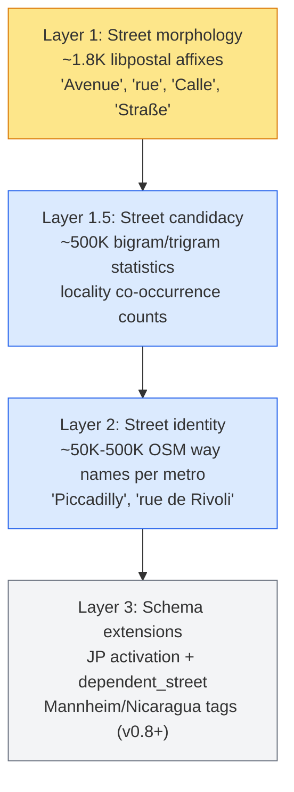

# Street-supplement architecture

This is the design reference for the work that fills the [WOF hierarchy gap](./wof-hierarchy-gap.mdx). It collects the architectural decisions from the v0.6.1 postmortem and the design consult that followed. Code in `neural/`, `resolver-wof-sqlite/`, and `core/` refers back to this page, which explains why each piece is designed the way it is.

WOF's placetype hierarchy stops at `address` and has no street node. Mailwoman's tag schema includes a street layer, but the inference-time prior (the FST gazetteer) has no street data to support it. Four layers fill the gap, and two more pieces sit beside them: a brand FST and locality-conditional blocking. Each layer covers a different missing signal, so none of them can replace another.

## Four layers



The layers' contributions add up without overlapping. Examples:

| Input string              | Layer 1 (morphology)                             | Layer 1.5 (candidacy)                             | Layer 2 (identity)         |
| ------------------------- | ------------------------------------------------ | ------------------------------------------------- | -------------------------- |
| `Elm Avenue`              | matches "Avenue" affix → adjacent "Elm" → street | "elm_avenue" has high locality co-occurrence      | (not needed)               |
| `Piccadilly Lane` (novel) | matches "Lane" affix → "Piccadilly" → street     | "piccadilly_lane" has moderate co-occurrence      | (not in OSM)               |
| `Piccadilly` (no suffix)  | no signal                                        | "piccadilly" has London co-occurrence             | direct match in London FST |
| `Plein 1944`              | no signal                                        | "plein_1944" has Nijmegen co-occurrence           | direct match in NL FST     |
| `Health Clinic`           | matches no street affix                          | zero locality co-occurrence → strongly not street | (not in OSM as a street)   |

Layer 4 (brand FST for franchise venues) runs in parallel with the others rather than below them. Layer 5 (locality-conditional hierarchy blocking) controls the other layers by selecting which ones are active per country.

## Schema storage: flat ComponentTag rather than WOF emulation

Mailwoman's tag schema lives in two files:

- `core/types/component.ts`: the `ComponentTag` TypeScript discriminated union
- `core/decoder/containment.ts`: the `PARENT_OF: Partial<Record<ComponentTag, ComponentTag[]>>` child→parent map

**These files remain the authoritative schema.** One alternative would store our extensions in WOF placetype JSON format (`wof:id`, `wof:name`, `wof:role`, `wof:parent`), so that tooling that reads WOF placetypes would work unchanged. We rejected that alternative for four reasons:

1. **Ontology mismatch.** WOF placetypes describe what kind of geographical feature something is. Mailwoman component tags describe the role a span plays in an address. `street` is a linear feature without a WOF identity, and WOF has no placetype for it. `house_number` is not a place at all. `unit` is a building subdivision rather than a geographic feature.
2. **ID-space fragility.** WOF issue #246 explored adding `lane`, `block`, and `parish`. Any "private" ID range could collide with a future WOF allocation.
3. **TypeScript exhaustiveness.** With the `ComponentTag` discriminated union, the compiler flags every code path that does not handle every tag. Runtime-loaded JSON has no such check, and the schema will change.
4. **DAG direction.** WOF's `wof:parent_id` and mailwoman's `PARENT_OF` both encode child→parent. The WOF format has no native "valid children" field, so you would compute children from parents anyway, which `PARENT_OF` already does.

When tooling needs WOF-format output, such as the `wof tree` command or external consumers, use a serialization shim:

```ts
function toWOFPlacetypeProjection(tag: ComponentTag): {
	wof_id: number // Mailwoman-reserved 2_000_000_000+ range
	wof_name: string
	wof_role: PlacetypeRole // common / common_optional / optional
	wof_parent_ids: number[]
}
```

The shim converts in one direction only. WOF placetype JSON never feeds back into the schema definition. The `2_000_000_000+` ID range is within 32-bit unsigned space and above any realistic WOF allocation.

## Component containment decisions

The current containment map (`core/decoder/containment.ts`) was built incrementally, before the WOF gap was identified. The design consult settled three changes:

### Intersection restructure (deferred — not zero-risk after all)

Current: `street → [intersection_a, intersection_b]`. Both intersection_a and intersection_b have street as their direct parent.

Proposed: `street → intersection → [intersection_a, intersection_b]`, mirroring WOF's `intersection` placetype.

**The design consult initially called this change zero-risk. Verification showed two problems:**

1. **BIO dimension coupling.** `ComponentTag` is the BIO label space. Adding `intersection` extends `BIO_LABELS` from 33 to 35 entries, which no longer matches the v0.6.0/v0.6.1 weight output dimension. Tail-append avoids this part of the problem, using the same method as `STAGE1_BIO_LABELS` → `STAGE2_BIO_LABELS`. Existing 33-dim weights still align by index with the first 33 labels, and the new B-intersection/I-intersection labels at the tail are never the argmax.
2. **Rewiring PARENT_OF breaks current behavior, even with tail-append.** If `intersection_a/b` no longer have `street`/`locality` as parents, and the model cannot emit `intersection` proposals because it has no training labels for them, then `intersection_a/b` fall through to root. The existing containment encodes parsing behavior that the rewrite would lose.

The decision is to defer the intersection restructure to v0.7+, when the new tag can be added to the training corpus, the golden set, and a retrained model bundle. Until then, the current flat `intersection_a/b → street` containment stays. It is a known limitation, and keeping it causes no regression.

Schema changes that look like one line in PARENT_OF also affect the model output dimension and the labeled corpus. Writing the architecture doc first, then the code, then verifying caught this issue before any code landed.

### Private mailbox folds into unit

`#PMB 456` has the same structure as `#Apt 4`: a designator inside a delivery address. It needs no new tag. The synthesizer that produces po-box training data already covers PMB variants in its surface forms.

### Dependent street is a real gap

The current schema cannot express `6 Elm Avenue, Runcorn Road, Birmingham`, which uses the Royal Mail dependent-street format. Adding `dependent_street` is v0.7+ scope and is blocked on the availability of a UK PAF corpus. Containment: `street → dependent_street` (a street contains an optional dependent street).

### Venue + po_box stay as siblings

In `CULLEN INSULATION INC, POBOX 3211 FARGO ND 58108`, the venue is the addressee and the po_box is the delivery endpoint. The containment should not make the venue a parent of the po_box. Both remain siblings under locality, and the resolver cross-references them at lookup time.

## Locality-conditional hierarchy blocking

Countries use mutually incompatible address grammars:

- US/UK/AU: `[number] [street] [city] [state] [postcode]`
- FR/DE/IT: `[number] [street-type] [street-name] [postcode] [city]`, with the street type before the name
- JP: `[prefecture] [municipality] [district] [block] [sub_block]`, without streets
- NL compact: `Gondel 2695`, with street and number joined
- Mannheim grid: `R 5, 6-13`, a block-row-range without a street

The model must condition its tagging on the grammar that applies. **The mechanism combines admin FST country resolution with an `addressing-conventions.json` data file.**

The admin FST already resolves the country at Viterbi time, because `PlaceEntry.parentChain` includes the country. The convention lookup is a per-country mask applied to emission and transition biases:

```json
{
	"JP": {
		"primary_tags": ["prefecture", "municipality", "district", "block", "sub_block"],
		"street_tags": [],
		"building_tags": ["building_number", "building_name"],
		"postcode_position": "before_city"
	},
	"US": {
		"primary_tags": ["street", "house_number"],
		"street_tags": ["street_prefix", "street", "street_suffix"],
		"building_tags": ["unit"],
		"postcode_position": "after_state"
	},
	"default": "..."
}
```

When the convention's `street_tags` is empty (Japan), the transition mask suppresses `B/I-street_prefix`, `B/I-street`, and `B/I-street_suffix`. When the convention specifies `postcode_position: "before_city"`, the transition probabilities are biased to expect postcode tokens before locality tokens.

Rejected alternatives:

- **Multi-hot locale flag on input.** A country flag is too coarse, because "US" includes urban street, rural route, and PO-only conventions.
- **Speculative parsing**, which tries the JP grammar, then the US grammar, and compares scores. Latency multiplies with each grammar: 50ms × 10 candidates = 500ms/address.
- **Hierarchy data in PlaceEntry.** The FST would then carry two ontologies, place identity and address grammar, which belong in separate structures.

Country-level granularity is the right v0.7 scope. Variation within a country (US urban vs rural) is v0.8+.

## Layer specifications

### Layer 1: Street morphology FST

**Data source:** `core/data/libpostal/dictionaries/{60 locales}/street_types.txt`, with pipe-delimited surface forms on each line (e.g. `avenue|av|ave|aven|avenu|avn|avnu|avnue`).

**Schema:** Extend `PlacetypeId` in `resolver-wof-sqlite/fst-types.ts` with `"street_affix"`. Update `PLACETYPE_ORDER` in both `resolver-wof-sqlite/fst-serialize.ts:38` and `resolver-wof-sqlite/fst-deserialize-web.ts:23`. The two copies are duplicated by design, and updating only one silently corrupts the data.

**Build:** `resolver-wof-sqlite/street-morphology-fst-builder.ts` walks all `street_types.txt` files, normalizes each variant token, and inserts it into a trie. The existing FST builder primitives determinize and minimize the trie. Output: `fst-street-morphology.bin` (~100KB).

**Inference:** `neural/street-morphology-prior.ts` is a two-pass bias function:

1. **Pass 1.** For each token that matches an affix entry, bias toward `B/I-street_prefix` if the locale puts the affix before the name, or `B/I-street_suffix` if the locale puts it after.
2. **Pass 2.** For each matched affix span, find the adjacent name token: the preceding token for a suffix, the following token for a prefix. Bias that token toward `B/I-street` and **away from** `B/I-dependent_locality`. The negative bias is the most important part, because it fills the missing street signal identified in the v0.6.1 failure analysis.

**Wiring:** Add `fstStreetMorphology?: FSTMatcherLike` to `ParseOpts` in `neural/classifier.ts`. Apply it with `addEmissionMatrix` after the existing admin FST bias, using the same 3.0-logit cap.

**Locale handling:** Build one combined FST for all locales. The morphology data is small enough (60 locales × ~30 affix lines × ~5 variants = ~9K entries) that per-locale extract routing is unnecessary. The `PlaceEntry` payload encodes the position (prefix vs suffix), so it is not derived per entry at query time.

### Layer 1.5: Street candidacy lookup

**Data source:** The existing training corpus (OpenAddresses + WOF + synth extracts), not external OSM data. Consistency with the model's training distribution matters more than an independent data source.

**Build:** One pass over the training corpus's bigrams and trigrams. For each n-gram, count the distinct localities where the n-gram appears next to a labeled locality span. Localities are keyed by WOF `wof_id` so that places sharing a name, such as the many Springfields, are counted separately.

**Output format:** A flat `(ngram → count)` lookup table in compact binary or compressed JSON, ~500K entries.

**Inference:** `neural/street-candidacy-prior.ts` looks up the count for each bigram and trigram in the input token sequence and scales it to a bias magnitude (sigmoid or log-scale). It applies the result as a third emission-bias matrix through `addEmissionMatrix`, in the same way as the morphology prior.

**Cold-token fallback:** An unknown n-gram produces no candidacy signal, and the Layer 1 heuristics apply alone.

**Status:** Specified but not built. It will be built if Layer 1 results show that candidacy could add further improvement.

### Layer 2: Street identity FST

**Data source:** OSM way names. The first POC covers only NYC (~50K street names) to validate the pipeline:

- Extract `(name, parent_locality_id)` pairs from OSM ways
- Dedup across boroughs (Brooklyn and Manhattan have streets with the same name)
- Assign parent chains from WOF locality IDs

**Build:** Reuse the existing `fst-builder.ts` infrastructure and extend `PlacetypeId` with `"street"`. Entries use the same `PlaceEntry` shape as admin places, with `wof_id` synthesized from the OSM way ID and `parentChain` pointing to the WOF locality.

**Inference:** Layer 2 reuses Layer 1's `fstStreetMorphology` integration point, with the same `addEmissionMatrix` call and a different binary. Layer 2 replaces Layer 1 for streets the FST knows. Layer 1 stays active for new street names whose suffixes the FST does not cover.

**Scoping:** Extracts are routed per metro. The NYC POC validates the approach, and metro expansion waits on its results.

**Status:** v0.7+. The work spans several shifts: OSM extraction, dedup, parent-chain assignment, and metro packaging.

### Layer 3: Schema extensions

**For Japan (activation rather than addition):** `core/types/component.ts` and `PARENT_OF` already declare `prefecture`, `municipality`, `district`, `block`, `sub_block`, `building_number`, and `building_name`. These tags are inactive because they have no golden-set entries and no training data. The work is:

1. JP corpus adapter (ingest Japanese address data, likely from OpenAddresses-JP or government sources)
2. JP golden-set entries (~200-500 labeled JP addresses)
3. JP model training (likely a separate `@mailwoman/neural-weights-ja-jp` bundle)
4. JP-specific FST (Japanese place names + Japanese block-level data)

No new tags are needed. The locality-conditional blocking described above activates these tags at inference.

**For Mannheim grid, Nicaragua landmarks, dependent_street:** These need new tags. v0.8+ scope.

### Layer 4: Brand FST (franchise venues)

**Status:** This work belongs to the resolver. The parser does not change. The parser keeps classifying brand-name spans as `venue`. A brand FST, structurally identical to the street identity FST, maps known brand names to venue-confidence boosts at resolver lookup time.

**Brand-alias problem:** McDonald's = Macca's = マクド = McDo = Mek. These names are co-referential aliases rather than translations. The brand FST entries should encode alias equivalence at build time so the resolver matches any variant.

**No `venue_chain` tag.** A chain location is a specific venue. It fits the existing `venue` component type, so the schema is unchanged.

See [`docs/records/site-2026-08/understanding/exotic-poi/franchise-queries.mdx`](../understanding/exotic-poi/franchise-queries.mdx) for the user-facing problem statement.

### Human-factor confidence penalty

**Status:** This work is independent of all the FST work and runs after Viterbi.

**Module:** `neural/confidence-penalty.ts` is a pure function `(span, rawText) → penalty`. It penalizes these patterns:

- Missing comma between city/state
- Inconsistent casing within a span
- Ambiguous abbreviations (`CA` for California vs `ca.` for "circa")
- Mixed scripts within a span

The penalty applies only to span-level confidence scores. It leaves the emission and transition layers and the model's logits unchanged, so it affects calibration without changing classification.

## Sequencing

| Phase            | Layers                                                            | Time horizon          |
| ---------------- | ----------------------------------------------------------------- | --------------------- |
| v0.6.x polish    | Layer 1 build + golden-set eval                                   | 1 shift (done)        |
| v0.6.2 retrain   | Negative-example corpus augmentation + Layer 1 prior at inference | 1-2 shifts            |
| v0.6.x continued | Layer 1.5 if v0.6.2 leaves residual hallucinations                | 1 shift               |
| v0.7.0           | Locality-conditional blocking + JP activation + Layer 2 NYC POC   | 3-4 shifts            |
| v0.7.x           | Layer 2 metro expansion, Layer 4 brand FST                        | per-metro / per-brand |
| v0.8+            | Mannheim grid, Nicaragua landmarks, dependent_street              | scope work            |

**Caveat from the 2026-05-28 Layer 1 eval:** Layer 1 alone, applied as a decoder-only fix on v0.6.1 weights, does not suppress v0.6.1's 1066 dep_locality hallucinations. Hallucinations drop monotonically as the dep_locality penalty is strengthened. The model is so overconfident on predictions induced by synthetic streets, though, that no practical decoder-time bias flips them. **Layer 1 should be deployed together with a v0.6.2 retrain that includes O-tagged street slots in the corpus.** The prior then adds inference-time bias on top of a better-trained base. The infrastructure added during v0.6.x polish supports that retrain. Full eval data: [Layer 1 eval (2026-05-28)](https://github.com/sister-software/mailwoman/blob/main/docs/records/evals/experiments/2026-05-28-layer-1-morphology-fst.mdx).

The intersection restructure is independent of the layers and can land in any shift.

## See also

- [WOF hierarchy gap](./wof-hierarchy-gap.mdx): the original observation that motivated this design
- [FST gazetteer prior](./fst-gazetteer-prior.mdx): the existing admin FST infrastructure that Layers 1, 1.5, and 2 extend
- [FST gazetteer LM reference](https://github.com/sister-software/mailwoman/blob/main/docs/engineering/reference/FST_GAZETTEER_LM.mdx): its Phase 2 (streets) is the Layer 2 implementation plan
- [Falsehoods about street names](../understanding/why-its-hard/falsehoods/falsehoods-streets.mdx): a catalog of the edge cases each layer addresses
- [Franchise and brand queries](../understanding/exotic-poi/franchise-queries.mdx): user-facing context for Layer 4
- [v0.6.1 error analysis](https://github.com/sister-software/mailwoman/blob/main/docs/records/evals/model-versions/v0.6.1-error-analysis.mdx): the measured regression that revealed the gap
- 2026-05-28 night-shift postmortem: the postmortem that started this design consult
