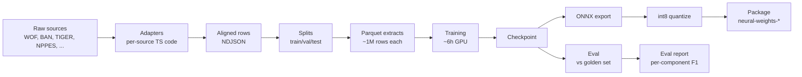

# Training pipeline

The training pipeline turns raw address data sources into a model file that ships on npm. This article describes each stage in order. The [Corpus construction](./corpus-construction.mdx) article covers the first three stages in more detail.

## The full pipeline



The sections below describe each box.

## Stage 1 — Adapters

Each raw data source has a **TypeScript adapter** that reads the source and emits `CanonicalRow` objects:

```ts
interface CanonicalRow {
	raw: string // the address string
	components: Partial<Record<ComponentTag, string>> // the labelled parts
	country: string
	locale: string
	source: string // 'usgov-nppes', 'ban', etc.
	source_id: string
	license: string
}
```

Adapters live under `corpus/src/adapters/`. Each adapter:

- Reads its source's native format (CSV, NDJSON, JSON, shapefile).
- Maps source-specific column names to Mailwoman's component vocabulary.
- Composes a plausible `raw` string from the components when the source does not provide one.
- Sets the correct license on every row.

There are currently 14 adapters: WOF (admin + postcode), BAN (France), TIGER (US Census), NPPES (US healthcare), HRSA, IMLS, NAD (US DOT), three state notary/contractor sources, and a few others. `corpus-v0.3.0` enabled 11 of them, which contributed 677 million aligned rows.

## Stage 2 — Alignment

The **alignment** step takes a `(raw, components)` pair from an adapter and produces a `(raw, tokens, BIO labels)` row.

The algorithm:

1. For each `(tag, value)` in `components`, find `value` inside `raw`. First try a verbatim substring match. If that fails, fall back to a fuzzy match by Levenshtein distance with a tunable threshold.
2. If any component cannot be found in `raw`, **quarantine** the row with a reason such as `component-not-found:locality`. Quarantined rows are excluded from training and kept for later inspection.
3. Tokenize `raw`. Mark the first token in each component span as `B-tag`, the following tokens as `I-tag`, and tokens outside any component as `O`.

Quarantine catches data quality issues. `corpus-v0.3.0` quarantined 214,118 rows out of 677 million (0.03%). Most were rows where the source's `components.region` was a full name and the source's `raw` used an abbreviation, or the reverse.

## Stage 3 — Splits

Aligned rows are split into three groups: **train** (about 90%), **val** (a few percent, used to monitor progress during training), and **test** (held out for the final eval).

The split is **locality-aware**, so rows that share a locality stay in the same split. This prevents leakage. If "Brooklyn, NY" appears in training, then val and test contain no Brooklyn rows. Without this rule, the model could memorize specific locality strings and score better on eval than its real accuracy.

The split assignment is written to `SPLIT_MANIFEST.json`, so any later step can reproduce which rows went where.

## Stage 4 — Extracting

After splitting, rows are written to **Parquet** files at 1 million rows per extract. Parquet is a columnar format that streams well. The training data loader reads one row group at a time without loading the whole file into memory.

A v0.3.0 build produces about 30 train extracts, 1 val extract, and 1 test extract, totaling ~30 GB. The `intermediate/` directory holds per-adapter raw NDJSON dumps for debugging. It takes another ~400 GB and is deleted after the next training run.

## Stage 5 — Training

Training runs in Python on the lab's GPU (AMD Radeon 780M). The training script:

1. Loads the tokenizer (`tokenizer.model`).
2. Builds the model architecture (`MailwomanCoarseEncoder` + `LinearChainCRF`).
3. Streams batches from the train extracts (one Parquet row group at a time, 32 examples per batch, 4 gradient accumulation steps → effective batch 128).
4. Forward pass: encoder produces per-token emissions → CRF computes negative log-likelihood of gold sequence → loss is `CE(emissions, gold) + 0.05 × CRF_NLL`.
5. Backward pass: gradients flow through CRF + encoder + tokenizer embeddings.
6. Optimizer step (AdamW, learning rate 1.5e-4, cosine decay with 1,000-step warmup).
7. Every 250 steps: evaluate on the val extract, log val loss + macro F1.
8. Every 100 steps: save a full checkpoint (model + optimizer + scheduler + RNG state).

The script saves every 100 steps because the lab's GPU has a firmware bug that raises a `GPU Hang` exception every 30–60 minutes under sustained load. The `train_with_resume.ts` wrapper restarts training after a hang and resumes from the latest checkpoint. With the wrapper, training survives multiple hangs per session.

The v3.0.0 run trained for 1,800 steps (out of a planned 50,000) before the val metric peaked and started degrading. We stopped early at 1,800 to ship the best checkpoint.

## Stage 6 — Eval

After training, the **eval** stage runs the model against the held-out golden set (`data/eval/golden/v0.1.2/`, 4,535 hand-labeled entries). For each entry, it:

- Tokenizes the input.
- Runs the model with CRF Viterbi decoding.
- Decodes the BIO labels back into component strings by finding the contiguous spans and extracting the original characters.
- Compares the result to the gold components.

The output is a markdown report and a JSON dump under `docs/records/evals/`. They contain per-component [precision, recall, F1](./quality-and-evaluation.mdx), an overall "exact match" rate, and a calibration histogram that shows whether confidence matches accuracy.

The eval report is committed to git as part of the ship PR. See [the latest Tier 2 ship's eval report](https://github.com/sister-software/mailwoman/blob/main/docs/records/evals/model-versions/stage2-step-001800-eval.mdx) for the v3.0.0 numbers. The filename keeps the historical "stage2" naming.

## Stage 7 — Export to ONNX

PyTorch's training graph does not run directly in JavaScript or other runtimes. **ONNX** (Open Neural Network Exchange) is a standardized model format that runs in several runtimes (`onnxruntime-node`, `onnxruntime-web`, ONNXRuntime for mobile, etc.). The export step:

- Traces the model's forward pass with a sample batch.
- Records each operation as an ONNX node.
- Writes the result to `model-stage2-step-XXXXXX-fp32.onnx`.

A **parity check** then runs the same inputs through the original PyTorch model and the exported ONNX model and asserts that the outputs agree within 1e-4. A mismatch means the export silently dropped or changed an operation. v3.0.0's parity check showed a maximum difference of 1.4e-5, well within tolerance.

## Stage 8 — int8 quantization

ONNX models start in fp32 (32-bit floating point). For shipping, Mailwoman applies **dynamic int8 quantization**, which converts each layer's weights to 8-bit integers at load time. Quantization:

- Reduces the model file from 37 MB to 25 MB.
- Speeds up CPU inference, because 8-bit arithmetic is cheaper.
- Costs about 1–2% accuracy on the eval, which is measurable but acceptable.

Quantization is a built-in `onnxruntime.quantization` operation, applied once at ship time.

## Stage 9 — Package

The final step packages the model in the format published to npm:

```
packages/neural-weights-en-us/
├── model.onnx           # 25 MB int8 model
├── tokenizer.model      # 470 KB SentencePiece
├── model-card.json      # eval numbers + hardware metadata
├── README.md            # short usage doc
└── package.json
```

`model-card.json` is the canonical record of what shipped: the corpus version, checkpoint, hyperparameters, and eval metrics. `evals/scores-by-version.json` holds the same information keyed by run ID, for comparison across versions.

Both packages (en-us, fr-fr) are bumped to a new npm version (v3.0.0 for the Tier 2 ship) and published.

## See also

- [Corpus construction](./corpus-construction.mdx): Stages 1–4 in more detail
- [How the model reasons](./how-the-model-reasons.mdx): what the trained model does with a token
- [ONNX runtime](./onnx-runtime.mdx): how the shipped model runs
