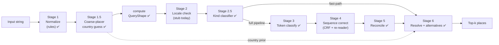

# The staged pipeline

[Addresses that break geocoders](../why-its-hard/addresses-that-break-geocoders.mdx) shows that no single model handles every failure class well. Different failures need different fixes. Some need preprocessing rules, some need a small classifier, some need a transformer, and some need a resolver that returns candidates instead of pretending to be sure.

This article sketches the runtime as **six stages**. Three are learned (ML) and three are deterministic. As of 2026-05-23, Mailwoman ships stages 1, 2.5 (kind classifier), 3, 4a (Viterbi + structural mask), 5, and 6 with candidate-list output, plus the coordinator that composes them. Stage 2 (locale check beyond the caller's hint) and Stage 4b (span re-reader) are not built yet. A small **coarse-placer** model (Stage 1.5, #244) was added after this sketch. It runs right after normalization, guesses the country, and hands that guess to the resolver as a soft prior. It never feeds the classifier.

## The picture

✅ marks stages with shipped implementations as of 2026-05-23.

The interfaces between stages matter as much as the stages themselves. Each handoff is a typed boundary that can be evaluated, versioned, and rolled back independently.

## Stage 1 — Normalize (deterministic)

**What it does.** Takes the raw input string and applies a fixed sequence of normalization rules: Unicode NFC, case folding (locale-aware where applicable), abbreviation expansion, whitespace collapse, punctuation normalization.

**Failures it owns.**

- Tokenization and whitespace traps ([#3 in the failure catalogue](../why-its-hard/addresses-that-break-geocoders.mdx#3-tokenization-and-whitespace-traps)): `"12 1/2 Main St"` and `"12½ Main St"` collapse to a canonical form before the tokenizer sees them.
- The encoding half of Unicode/transliteration traps ([#6](../why-its-hard/addresses-that-break-geocoders.mdx#6-unicode-and-transliteration-traps)): NFC ensures the resolver does not miss `"São"` because the input was NFD-encoded.

**Today.** The `@mailwoman/normalize` workspace shipped 2026-05-23. Its public `normalize(raw, opts?)` function always applies NFC, punctuation normalization, and whitespace collapse, and optionally applies case folding and abbreviation expansion. The output carries an `offsetMap` so downstream stages can map normalized spans back to raw characters.

**Future.** Share dictionaries with corpus synthesis, which runs in the inverse direction. Add locale-aware case folding for Turkish `İ` and Greek final sigma. Make the offset map bidirectional.

## Stage 2 — Locale check (small ML)

**What it does.** Looks at the normalized input and decides which downstream weights to load and which normalization rules to keep applying. The decision could be a tiny character-level classifier ("Latin / Cyrillic / CJK / Arabic / mixed?") followed by a per-script locale guess.

**Failures it owns.**

- The script-handling half of Unicode/transliteration traps ([#6](../why-its-hard/addresses-that-break-geocoders.mdx#6-unicode-and-transliteration-traps)): the check picks the right tokenizer and weights for the script.
- Language-switch hybrids ([#7](../why-its-hard/addresses-that-break-geocoders.mdx#7-language-switch-hybrids)): when the input mixes scripts, the check either picks a hybrid-trained weights package or falls back to a multi-locale ensemble.

**Today.** Stage 2 is a caller-trust stub. The runtime coordinator accepts the caller's locale hint at confidence 1.0, or `und` with confidence 0.0 if the caller gives none. The companion **QueryShape sub-system** (`@mailwoman/query-shape`) shipped 2026-05-23. It provides character-class detection, punctuation-bounded segmentation, and known postcode/PO-box format hits, which are the structural priors a future locale detector would consume. The **kind classifier** (Stage 2.5, `@mailwoman/kind-classifier`) also shipped. It categorizes inputs as `postcode_only` / `locality_only` / `structured_address` / `intersection` / `po_box` / `landmark` / `vague` and drives fast-path routing in the coordinator.

**Future.** A small fast model (~100 KB) would read the first 200 characters of input and emit a locale tag plus a confidence. Below a threshold, the stage would fall back to ensembling across multiple locales' weights, which is expensive but correct.

## Stage 3 — Token classify (transformer encoder)

**What it does.** This stage is the current Mailwoman model: a subword tokenizer, a 6-layer transformer encoder, and a 21-class BIO output head per token. [How the model reasons](../../concepts/how-the-model-reasons.mdx) describes it in detail.

**Failures it owns.**

- Street/locality collisions ([#4](../why-its-hard/addresses-that-break-geocoders.mdx#4-streetlocality-collisions)): the encoder sees the whole sequence and learns that `"Paris"` near `"Cafe"` is part of a venue, while `"Paris"` between `","` and `"Ontario"` is a locality.

**Today.** Shipped at v3.0.0. The model is small (~9M parameters) and that is by design. Address parsing is not a problem where bigger LLMs help.

**Future.** The planned changes are a larger context window (128 tokens today; 256 would cover longer addresses without truncation), more locales, and continued corpus expansion. The model itself does not need to change fundamentally. It needs better data and better decoding.

## Stage 4 — Sequence correct (CRF + span re-reader)

**What it does.** This stage has two parts:

- **CRF** ([CRF decoder](../../concepts/crf-decoder.mdx)) enforces BIO structural validity at decode time. It ships today.
- **Span re-reader** is future work. When stage 3 emits a low-confidence span or two overlapping high-confidence proposals, the re-reader would re-run the encoder on that span alone with extra structural conditioning, using the neighboring labels as additional context. It adds new alternatives rather than narrowing existing ones, so a failure leaves the earlier alternatives intact.

**Failures it owns.**

- Ambiguous locality names ([#1](../why-its-hard/addresses-that-break-geocoders.mdx#1-ambiguous-locality-names)): the re-reader gives the model a second look at `"Paris"` with structural priors that the next token is a region/country.
- Repeated admin names ([#2](../why-its-hard/addresses-that-break-geocoders.mdx#2-repeated-admin-names)): BIO structure and the re-reader together handle `"New York, New York"` as two adjacent localities.
- Numeric chaos ([#5](../why-its-hard/addresses-that-break-geocoders.mdx#5-numeric-chaos)): the CRF prevents structurally impossible label combinations, and the re-reader can revisit `"12345 123rd St"` after the rest of the sequence is labeled.

**Today.** The Viterbi decoder shipped to the JavaScript runtime on 2026-05-23 as `neural/viterbi.ts`, with the BIO structural transition mask. Orphan-`I-*` sequences are now structurally impossible in the JS runtime, even on the v3.0.0 weights, because the structural mask is built from the labels list without retraining. The mask composes additively with learned CRF transitions when a future weights release ships them. The span re-reader is not built and is a v0.6.0 candidate.

**Future.** The re-reader can be a fine-tuned head on the same encoder (cheap) or a small dedicated model (more expensive, higher ceiling). Either way it stays additive. It can only propose new alternatives and never deletes existing ones.

## Stage 5 — Cross-component reconcile (solver, deterministic today)

**What it does.** This stage takes the union of proposals from the rule classifiers and the neural classifier and picks the best **self-consistent set of components**. A set is self-consistent when spans don't overlap, components agree where they should (the postcode hint matches the region hint), and the total confidence is maximised.

**Failures it owns.**

- The consistency portion of numeric chaos ([#5](../why-its-hard/addresses-that-break-geocoders.mdx#5-numeric-chaos)): when `"12345"` could be a house number or a postcode, the solver picks the reading that keeps the rest of the sequence consistent.
- The hybrid-policy decision in general ([Rule-based classifiers](../../concepts/rule-based-classifiers.mdx#how-rule-classifiers-and-the-neural-classifier-coexist)): for each component, the policy registry decides whose proposal wins.

**Today.** The v1 solver implements this stage in hand-coded TypeScript, and it works fine.

**Future.** This stage could be learned (a tiny reranker) but probably should not be. Rule-based solvers are explainable and easy to debug, and the current implementation is not the bottleneck.

## Stage 6 — Resolve with candidates (deterministic + retrieval)

**What it does.** This stage takes the final component bundle, queries the WOF gazetteer, and returns a ranked list of candidates rather than a single point.

**Failures it owns.**

- Administrative nightmares ([#8](../why-its-hard/addresses-that-break-geocoders.mdx#8-administrative-nightmares)): `"Springfield"` without a region produces 41 candidates. The resolver should surface the list rather than pretend one is correct.

**Today.** The [Resolver and Who's On First](../../concepts/resolver-and-wof.mdx) decorates each resolved `AddressNode` with the top candidate (placeId / lat / lon) and surfaces runner-ups in the `alternatives` field, which shipped 2026-05-23. Consumers can now see Springfield-class ambiguity without any change to the `resolveTree` return type.

**Future.** Add language-prior and user-location-prior factors to the candidate scoring, which today uses only match × population. The scoreBreakdown reserves `regionalPriorFromLanguage` and `regionalPriorFromUserLocation` slots for them.

## Why six stages and not one

A monolithic model that does everything would be:

- harder to evaluate (one number to track instead of six)
- harder to debug (a regression somewhere is a regression everywhere)
- harder to roll back (one model version without per-stage fall-backs)
- harder to ship to constrained environments (every consumer pays the full cost)

Six stages give us a different shape:

- Each stage owns one or two failure classes, so eval reports can attribute regressions.
- Each stage has its own model card, or a rule list if the stage is deterministic.
- Each stage can be rolled back independently. A bad stage-4 release doesn't force a stage-3 rollback.
- Smaller stages can run in environments that cannot host the encoder. A CLI normalizer takes microseconds, and the encoder takes milliseconds.

Staging has a cost. Each handoff can drop signal, and each interface needs versioning and has to stay compatible across model upgrades. Six stages mean six model cards, six eval reports, and six rollback controls.

## Mapping stages to Mailwoman versions

| Stage                                 | What ships in…                                                                                                                                       |
| ------------------------------------- | ---------------------------------------------------------------------------------------------------------------------------------------------------- |
| 1 — Normalize                         | Shipped 2026-05-23 (`@mailwoman/normalize`). Future: shared dicts with corpus synthesis, locale-aware case folding.                                  |
| 2 — Locale check                      | Caller-trust stub today. QueryShape sub-system + kind classifier (Stage 2.5) shipped. Future: small detector model (v0.6.0+).                        |
| 3 — Token classify                    | v3.0.0 today. v0.4.0 improves CE/CRF balance; v0.5.0 expands vocabulary.                                                                             |
| 4 — Sequence correct (CRF)            | Viterbi shipped to JS runtime 2026-05-23 (structural mask). Learned transitions pending a future weights release.                                    |
| 4 — Sequence correct (span re-reader) | Future. Earliest v0.6.0; needs an ambiguity-annotated corpus recipe.                                                                                 |
| 5 — Cross-component reconcile         | Shipped in v1.                                                                                                                                       |
| 6 — Resolve with candidates           | Alternatives shipped 2026-05-23 (`AddressNode.alternatives`). Coordinator (`@mailwoman/core/pipeline` + `createRuntimePipeline`) shipped 2026-05-23. |

The table shows that each of several future releases adds **one stage** rather than a whole new model. That release cadence is what makes the staging investment pay off.

## See also

- [Addresses that break geocoders](../why-its-hard/addresses-that-break-geocoders.mdx) — the failure catalogue this article responds to
- [How it works now](./how-it-works-now.mdx) — the current pipeline in plainer language
- [How it will work](./how-it-will-work.mdx) — the v0.4.0 work in plainer language
- [The pipeline interface](../../concepts/staged-pipeline-interface.mdx) — the runtime mechanics behind this narrative sketch
- [Implementation plan](https://github.com/sister-software/mailwoman/blob/main/docs/records/plan/README.mdx) — phase-by-phase development plan
