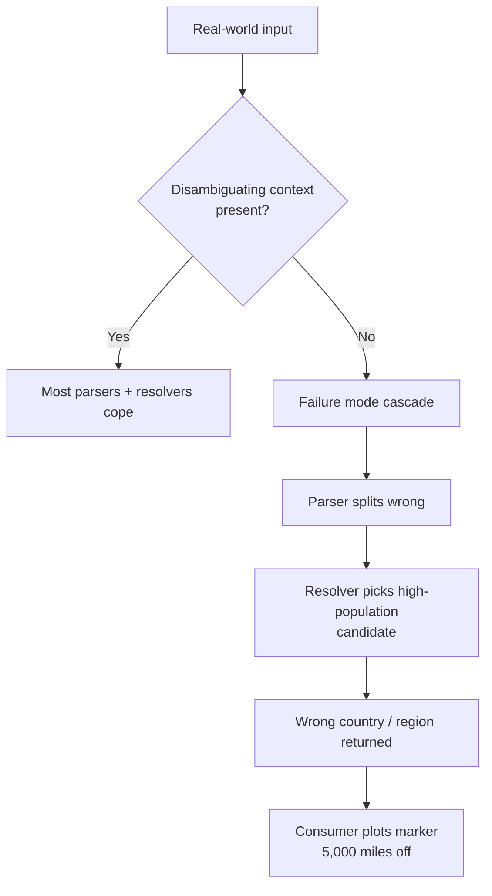

# Addresses that break geocoders

[What is an address?](../the-problem/what-is-an-address.mdx) covered the data model. This article catalogues address shapes that consistently break parsers and resolvers, with concrete examples for each. If you are building or evaluating a geocoder, keep this catalogue next to your test suite.

The categories overlap, and several real-world addresses hit two or three at once. That compounding is part of the difficulty.

## 1. Ambiguous locality names

Several city names are reused across regions. The string `"Paris"` could plausibly mean Paris, France or Paris, Texas. A parser cannot disambiguate it without a region or country signal, and a resolver cannot disambiguate it without a population prior.

```
Paris, Texas
Shanghai, Illinois
Lebanon, Kansas
Moscow, Idaho
Ontario, California
Georgia, Vermont
Mexico, New York
Jordan, Minnesota
Cairo, Georgia
Rome, Georgia
Palestine, Texas
Delhi, New York
Peru, Indiana
Norway, Maine
Athens, Texas
Manchester, Vermont
Dublin, Ohio
Hollywood, Florida
Memphis, Texas
Birmingham, Michigan
```

What breaks: the parser may correctly identify `"Paris"` as a locality, but a resolver that lacks the `"Texas"` qualifier or was trained without a "US bias" will return Paris, France.

Mailwoman's defence: the parser does not resolve. It hands `locality=Paris, region=Texas` to the resolver, which scores candidates with `(locality match) × (region agreement) × (population prior)`. Paris, Texas wins because the region matches, even though Paris, France has a higher population. The risk comes when the region is missing. `"Paris"` alone resolves to France because population dominates.

## 2. Repeated admin names

This is a subclass of #1 in which the locality and one of its parent admins share a name. The repetition is frequently legitimate, because the city is the namesake of the country, state, or province. It still confuses both regex-based parsers and naive resolvers that deduplicate by string match.

```
New York, New York
Luxembourg, Luxembourg
Singapore, Singapore
Panama City, Panama
Quebec, Quebec
Kuwait City, Kuwait
Oklahoma City, Oklahoma
Guatemala City, Guatemala
Ho Chi Minh City, Ho Chi Minh
Tunis, Tunis
```

What breaks: a parser that deduplicates "this token is already labeled" may drop the second `"New York"` because it already saw the first. A resolver that joins `locality + region` for ranking may double-count.

Mailwoman's defence: both rule and neural classifiers can emit multiple proposals on the same token sequence, because the solver expects spans rather than unique strings. The BIO sequence `B-locality I-locality , B-region I-region` handles this case.

## 3. Tokenization and whitespace traps

Some strings look like one token to a human but multiple tokens to a tokenizer, or the reverse.

```
12 1/2 Main St
12½ Main St
0007 Bond St
One Infinite Loop
4-6-8 King Rd
101A½ Elm St
Apt #000B
Basement Rear Unit C
Rear Rear House
Lot 0 County Road 00
No Fixed Address
Corner of 5th and Main
Opposite old post office
Behind gas station
```

What breaks: regex-based house-number classifiers expect `\d+`. They miss `One`, `12½`, `12 1/2`, `4-6-8`. Leading zeros (`0007`) may match a postcode regex by accident. "No Fixed Address" and "Behind gas station" are legitimate inputs in some workflows, but they describe locations rather than state addresses.

Mailwoman's defence: the subword tokenizer ([Tokenization](../../concepts/tokenization.mdx)) does not require numeric tokens, so the neural classifier can learn that `"One"` in `"One Infinite Loop"` is a `B-house_number`. The "Corner of 5th and Main" case maps to the `intersection_a` / `intersection_b` tags in the component vocabulary ([What is an address?](../the-problem/what-is-an-address.mdx#the-data-model)). The "Behind gas station" landmark case has no good answer, because it is a reverse-geocoding problem rather than a parsing problem.

## 4. Street/locality collisions

These strings contain a famous locality name that is used as part of a venue or street name rather than as the locality itself.

```
New York, New York Steakhouse, Las Vegas
Paris Cafe, Paris, Ontario
London Drugs, Calgary
Berlin Cafe, Berlin, Connecticut
Tokyo Sushi, Sydney
Manhattan Apartments, Kansas City
Broadway at Times Square Apartments, Reno
Chinatown Mall, Mexico City
Oxford Commons, Oxford, Mississippi
Quebec Grill, Quebec City
```

What breaks: a dictionary-based locality classifier (the standard Pelias approach) fires on `"London"` in `"London Drugs"` and on `"Paris"` in `"Paris Cafe"`. The parser then has two locality proposals, one for the venue's name and one for the actual locality, and the solver may pick the wrong one.

This is the [bitter-lesson case](../our-approach/why-a-neural-parser.mdx) for address parsing. A rule classifier cannot tell the difference, because telling them apart requires context. A transformer encoder ([How the model reasons](../../concepts/how-the-model-reasons.mdx)) sees the whole sentence and can learn that `"Paris"` followed by `"Cafe"` is part of a `venue` span, while `"Paris"` preceded by a comma and followed by `"Ontario"` is a `locality` span. The "Buffalo, NY / Buffalo Wild Wings, Buffalo, NY" pair is in Mailwoman's adversarial eval set for exactly this reason.

A conference attendee in Paris contributed four field examples in July 2026. All four are real venues, and in each one the toponym points to the wrong place:

| venue name              | actual address                             | the trap                                                                      |
| ----------------------- | ------------------------------------------ | ----------------------------------------------------------------------------- |
| `COMER parís.méxico`    | 96 Rue d'Hauteville, 75010 Paris           | two toponyms, Spanish orthography, dot-joined — and neither is the answer     |
| `2Ne1 Paris Bubble Tea` | 89 Rue Beaubourg, 75003 Paris              | digit-leading brand + "Paris" as decoration rather than location              |
| `Shinjuku Pigalle`      | 52 Rue Condorcet, 75009 Paris              | a Tokyo ward and a Paris district in one name; the address contains neither   |
| `Shinjuku`              | 166 Bd de Stalingrad, 94200 Ivry-sur-Seine | a bare foreign toponym as the whole venue name — the hardest call of the four |

We ran these against our own live endpoint the day we received them. Three of the four resolved confidently to the wrong continent. One resolved to Comer, Georgia, USA, a namesake nobody in the conversation had predicted, because the Spanish verb "comer" is also a town name. The release gauntlet now tracks these cases as improvement targets. The bare-`Shinjuku` case is annotated as irreducibly ambiguous. A lone toponym query plausibly _does_ mean Tokyo, and only conversational context says otherwise, so the correct output is a low-confidence result rather than a guessed coordinate.

## 5. Numeric chaos

These house numbers and street numbers violate the assumptions built into regex classifiers.

```
1 Infinite Loop
0 Avenue des Champs-Élysées
00 County Road 000
404 Not Found Ln
65535 State Hwy 65535
12345 123rd St
7 Seven St
42 Wallaby Way
1600 Pennsylvania Ave NW
221B Baker St
742 Evergreen Terrace
```

What breaks:

- `0`, `00`, `0000`: several house-number classifiers reject zero, but `"0 Avenue des Champs-Élysées"` is the literal address of the Place de la Concorde end of the avenue.
- `221B`: the trailing letter breaks `^\d+$` regexes.
- `12345 123rd St`: five-digit numbers are postcode-shaped, so a postcode classifier would fire on the house number.
- `65535 State Hwy 65535`: the same five-digit number appears twice, in two different roles.
- `404 Not Found Ln`: this real street name happens to be a software meme, and tokenizers and downstream consumers should not treat it as an error code.

Mailwoman's defence: rule classifiers emit proposals with confidence, and the solver picks self-consistent combinations. A `"12345 123rd St"` with the postcode classifier firing on `"12345"` AND `"123rd"` will lose to the solution where `"12345"` is the house number and `"123rd St"` is the street, because the latter is more internally consistent.

## 6. Unicode and transliteration traps

Non-Latin scripts, diacritics, and mixed encodings. These break tokenizers that assume ASCII and resolvers that compare strings without normalization.

```
ul. Łódzka 12, Łódź
Straße des 17. Juni, Berlin
İstanbul Cd. No:1, İzmir
São João del-Rei
Nguyễn Huệ, Hồ Chí Minh City
Kraków, Małopolskie
Beograd / Белград
東京駅1-9-1
서울특별시 중구 세종대로 110
دبي، شارع الشيخ زايد
```

What breaks:

- **Case folding.** `"İstanbul"` lowercased in Turkish locale gives `"i̇stanbul"` (with a combining dot above). In en-US locale it gives `"i̇stanbul"` as well, but a naive `String.toLowerCase()` may strip the dot. A resolver comparing the lowercased input to its index may miss the match.
- **NFC vs NFD normalization.** `"São"` can be encoded as one codepoint (`S + ã + o`) or two (`S + a + ̃ + o`). The two encodings render identically but differ in bytes. Resolvers that index in one form and query in the other miss matches.
- **Dual scripts.** `"Beograd / Белград"` is the same place written twice. WOF (and Mailwoman's resolver) carries multi-language names so both spellings resolve to the same WOF ID.
- **Right-to-left scripts.** Arabic addresses written in RTL plus mixed Latin numerals create renderer and tokenizer headaches even when the underlying data is clean.

Mailwoman's defence: the subword tokenizer falls back to byte-level encoding for unknown characters ([Tokenization](../../concepts/tokenization.mdx#byte-fallback)), so the pipeline does not crash. The model, however, was trained on en-US and fr-FR data. Non-Latin scripts pass through the tokenizer, but the model has no signal to label them. Per-locale weights packages are how this scales, and Japan and Korea each need their own training run.

## 7. Language-switch hybrids

These addresses mix two languages mid-string. The cause is frequently a translation artifact, and sometimes a bilingual city (Montreal, Brussels) or an expat community re-translating names.

```
Calle Ocho Street
Rue de Main Street
Avenida Avenue 9
Via Roma Road
Strada Street 5
улица Pushkin 10
Avenida de la Constitución Blvd
Rue King George
Callejón Dead End Rd
طريق الملك Fahd Rd
```

What breaks: `"Calle Ocho Street"` has both `"Calle"` (street prefix in Spanish) and `"Street"` (street suffix in English). A street classifier that looks for either may emit two overlapping proposals, and one that requires exactly one may emit none. `"улица Pushkin 10"` mixes a Cyrillic prefix, a Latin street name, and a number.

Mailwoman's defence: the neural classifier sees the whole string and can learn that the pattern `[street-prefix] [proper-noun] [street-suffix]` is a single `street` span regardless of language. In practice this requires training examples in the corpus. Today's en-US and fr-FR coverage handles English/French hybrids reasonably, but not Spanish/English or Arabic/English.

## 8. Administrative nightmares

Some place names are popular enough to exist in dozens of jurisdictions. Even with a region qualifier, ambiguity frequently remains.

```
Springfield
San José
Santa Maria
Georgetown
Franklin
Fairview
Mount Pleasant
Clifton
Salem
Newport
```

What breaks: there are 41 Springfields in the United States alone. `"Springfield"` with no qualifier is undecidable. `"Springfield, MA"` narrows it to one, but `"Springfield, IL"` and `"Springfield, MO"` are equally valid. A running joke on The Simpsons is that the show never identifies its Springfield's state.

A resolver that picks the most populous candidate when no region is provided will pick Springfield, MO (~170K residents). That may not be what the consumer wanted. Fixing this requires more context, such as IP geolocation, a user-supplied country, or prior place mentions.

## How these failure modes compound



The compounding is what makes geocoding hard. A small parser error becomes a large resolver error because the resolver has several places to choose from. A small resolver error becomes a large consumer-visible error because coordinates are precise.

Geocoders that report their failures openly are easier to work with than ones that always return a confident point. Such geocoders surface low confidence, return candidate lists instead of a single answer, and expose the disambiguating context they used. Mailwoman's demo includes a `FailureDiagnostic` panel that explains why a result is empty or wrong, because otherwise the miss would go unnoticed.

## Summary — what mostly defeats geocoders

| Failure class                           | Pattern                         | Mailwoman's situation today                                          |
| --------------------------------------- | ------------------------------- | -------------------------------------------------------------------- |
| Locality/business ambiguity             | "Paris Cafe in Paris"           | neural classifier learns context; needs more training                |
| Duplicate names across countries/states | "Springfield"                   | unfixable without context; the answer is a candidate list            |
| Multilingual scripts                    | CJK, Arabic, Cyrillic           | byte-fallback prevents crash; per-locale weights needed for accuracy |
| Inconsistent abbreviations              | "Avenue" vs "Ave" vs "Av"       | synthesis pass in corpus build covers common cases                   |
| Whitespace/punctuation variance         | "12 1/2 Main St"                | subword tokenizer is resilient; CRF helps span recovery              |
| Unofficial landmarks                    | "Behind gas station"            | out of scope for parsing; reverse-geocoding only                     |
| Nested POI names                        | "New York, New York Steakhouse" | neural classifier can learn; rule classifiers cannot                 |
| Missing admin hierarchy                 | "Springfield" alone             | resolver returns top-k; consumer disambiguates                       |
| Unicode normalization                   | NFC vs NFD                      | resolver normalizes before lookup                                    |
| Transliteration drift                   | "Beograd / Белград"             | WOF carries multi-language names; resolves to same ID                |

A geocoder that handles half of these well is already useful, and no geocoder handles all of them.

## See also

- [What is an address?](../the-problem/what-is-an-address.mdx) — the data model these failure modes operate against
- [Rule-based classifiers](../../concepts/rule-based-classifiers.mdx) — what regex-and-dictionary approaches can and cannot do
- [How the model reasons](../../concepts/how-the-model-reasons.mdx) — why a transformer encoder helps with the context-dependent cases
- [Resolver and Who's On First](../../concepts/resolver-and-wof.mdx) — how the candidate-search side handles ambiguity
